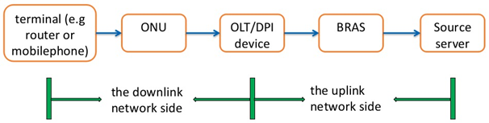
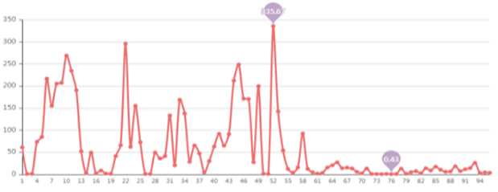
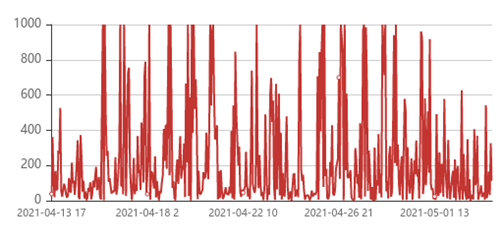
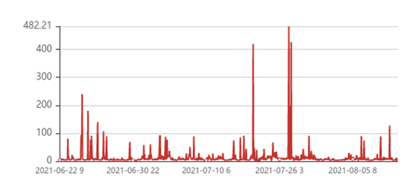
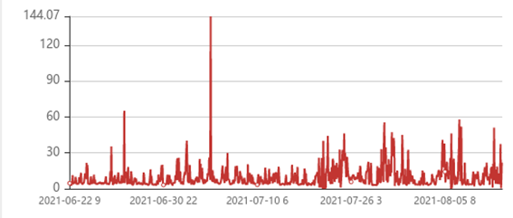

# Broadband User Experience Classification

## Description

**Introduction:**

With the rapid development of mobile Internet, home broadband has been integrated into people’s daily life, and the market has become increasingly saturated. User experience and broadband quality have become the key factors determining market competitiveness. How to find network quality problems and improve user experience in time has become the focus of increasing attention of operators.

There are many factors that affect the user’s online experience. The DPI probe can divide the broadband end-to-end network into two parts: the uplink network side and the downlink network side. The network layout is shown in Figure 1. Downlink network side problems account for a large proportion of network problems. How to accurately distinguish between users with bad experience (hereinafter, UBE) and users with good experience (hereinafter, UGE) through changes in downlink network side indicators is the key for operators to discover potential complaining users in advance.

There are more than 15 indicators, of which 8 network indicators are the key. We provide 8 main key indicators obtained from real networks. We measure the value of each indicator from the DPI device.

The data we provide contains 8 key indicators, which we define as indicator 1 to indicator 8. The indicators are obtained from the three-way handshake process and the data transmission process after the handshake is successful. The specific physical meanings of the indicators are as follows:

* **Indicator 1**: In the first step of the three-way handshake, the time interval between the syn ack packet and the ack packet;
* **Indicator 2**: In the second step of the three-way handshake, the time interval between the syn ack packet and the ack packet;
* **Indicator 3**: The time interval between the ack packet and the first payload packet in the three-way handshake;
* **Indicator 4**: The response delay of the first packet with payload after the establishment of TCP for multiple flows in the session;
* **Indicator 5**: In TCP transmission, the actual delay of transmission from the DPI position to the user terminal;
* **Indicator 6**: In TCP transmission, the transmission delay from the DPI position to the website;
* **Indicator 7**: In TCP transmission, the percentage of downlink retransmitted packets in the current session;
* **Indicator 8**: In TCP transmission, the percentage of upstream retransmission packets of the current session.

Figures 2-5 are provided as some simple examples to show how to identify a UBE with the above indicators.

 

 

 

 

 

**NOTE**: The ordinate of all the above figures is the value of the indicator (in milliseconds); Indicator 1 is an indicator of the three-way handshake; Indicator 2 is an indicator in the receiving and sending of packets after the link is established. The abscissa of Fig. 2 to Fig. 6 is time. The ordinate of Figure 2 to Figure 6 is the numerical value in milliseconds.

As shown in Figure 2, before and after the cut-off point of 59 on the abscissa, the trend of the data changes dramatically. The user in the time period before the cut-off point is a UBE, and the user after the cut-off point is a UGE.

Figure 3 is the trend chart of indicator 1 of UBE. During this period, the indicator fluctuates greatly, and there are many abnormal values (> 100);

Figure 4 is the trend chart of indicator 2 of UBE. The indicator fluctuates greatly during this period. And there are many outliers (> 100).

Figure 5 is the trend chart of indicator 1 of UGE. During this period, most of the values of indicator 1 are small (< 100), and there are occasional abnormal values with large jitter; Figure 6 is the trend chart of indicator 2 of UGE. Most data are relatively small (< 30), and there are few outliers (> 100).

---

**Task:**

Based on the data of eight indicators of a set of users given in the data source similar to the data of Indicators 1 and 2 above, the competitors are expected to classify each user in the dataset as a UBE or a UGE according to the **provided 8 indicators** with ML/DL methods.

**The competitors should submit:**

* The source code with comments, in Python.
* A report (doc or pdf file) containing:
    * Detailed design of your model and the interpretation, schematic diagram showing the architecture of the model.
    * Machine learning algorithm parameters, training optimization algorithms and parameters used.
    * A graph showing model performance, accuracy on training and validation sets.
* **If you refer to any publications during your design, please cite them properly.**

# Evaluation Criteria

## Evaluation:

* **Accuracy Score**: `accuracy * 100`. The accuracy of the model on the test set. In addition, we will also test competitors’ models with a new test set that was not provided in the datasets.
    * **Note**: The test set can only be used to test the model, rather than to train the model for higher accuracy.

* **Algorithm efficiency Score**:

    | Condition                                                              | Score |
    | :--------------------------------------------------------------------- | :---- |
    | cpu cores($\le 20$) and memory($\le 100\text{G}$) and runtime($\le 6\text{h}$) | 100   |
    | cpu cores $((20,60])$ or memory $((100,200]\text{G})$ and runtime$((6,24]\text{h})$ | 70    |
    | cpu cores$(>60)$ or memory$(>200\text{G})$ or runtime$(>24\text{h})$   | 50    |

Your final score consists of two parts:
* Accuracy Score
* Algorithm efficiency Score.

**Final Score** = **Accuracy Score** $\times 80\%$ + **Algorithm efficiency Score** $\times 20\%$

**Note:**
* There is no need to predict data, only the given data needs to be modeled, adjusted and classified, and the threshold of outliers is required to be determined by yourself, as long as the classification can be performed. Figures 2 and 3 show that the index outliers of UBE account for a large proportion, while Figures 4 and 5 show that the proportion of index outliers of UGE is small.
* The indicators of users with good experience are not completely free of outliers. How to determine which type of users (UBE or UGE) this user belongs to, according to the given standard of the sample is the key to the problem.
* The given user data is relatively dense, and the data needs to be preprocessed by the competitors.
* Model selection and parameter tuning are also the key to the problem.
* The running time of the model and the required CPU and memory should be properly controlled.
* The algorithms we recommend include but not limited to semi-supervised machine learning, CNN, and we expect to receive novel machine learning algorithms and ideas for solving problems.

---

# Data Source

**Attachment:**
We divide the data into training set, validation set and test set. We divide the data according to the ratio of 6:2:2. Competitors can also divide the data by themselves.
Each dataset contains two parts: UGE and UBE.
The column fields for each user file are: `day`, `hour`, `specific time`, `indicator1`, `indicator2`, `indicator3`, `indicator4`, `indicator5`, `indicator6`, `indicator7`, `indicator8`. The first three fields are time fields and the last eight fields are key indicator data.

---

# References

Competitors may be inspired by these reference papers:
* [1] Guo Y, Schuurmans D. Semi-supervised Multi-label Classification[C]// Joint European Conference on Machine Learning and Knowledge Discovery in Databases. Springer, Berlin, Heidelberg, 2012.
* [2] Wasnik P P, Phadkule N J, Thakur K D. Fault detection and classification based on semi-supervised machine learning using KNN[C]// 2019 International Conference on Innovative Trends and Advances in Engineering and Technology (ICITAET). 2019.
* [3] Albashish D, Al-Sayyed R, Abdullah A, et al. Deep CNN Model based on VGG16 for Breast Cancer Classification[C]// 2021 International Conference on Information Technology (ICIT). 2021.

---

# Leaderboard

| Rank | Team Name         | Score  |
| :--- | :---------------- | :----- |
| 1    | Data Rangers      | 62.8   |
| 2    | jygaced           | 62     |
| 3    | Spears-9          | 61.6   |
| 4    | Freethinkers      | 61.2   |
| 5    | Hawks             | 59.6   |
| 6    | Lambda            | 58.8   |
| 7    | Greedy Solution   | 56.4   |

# Contact
Contact Qingxian Xie: xie.qingxian@zte.com.cn