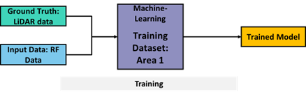
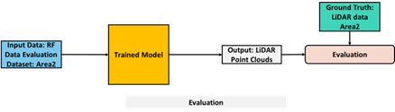

# Depth Map Estimation in 6G mmWave Systems Challenge

## Description

The Depth Map Estimation in 6G mmWave systems challenge tackles one of the key problems to realizing the vision of digital-twin-enabled 6G systems.

A **digital twin** is the ability to create a virtual representation of a physical system and its dynamics. In 6G networks, for instance, a digital twin could virtually implement the physical wireless propagation environment, enabling learning, optimization, and dynamical re-calibration of 6G operational parameters to improve network performance. To fulfill this vision, extracting new information from existing sensors is of greatest importance to enable and create scalable and efficient digital twin networks. Using existing mmWave systems already present in current devices incurs no additional cost of integrating other sensors. Moreover, jointly using communication signals to perform depth map estimation enables easier network management, keeping network bandwidth usage, reliability, and latency under control, since no extra data and overhead is generated by using secondary sensors. Equally importantly, exploiting signals already designed with the purpose of wireless communication will avoid energy consumption escalation.

Participants are challenged to propose an AI/ML algorithm that reconstructs the depth map of an indoor environment, given a dataset consisting of mmWave MIMO channel impulse responses and the corresponding depth map representation of the room. The dataset is obtained using the NIST high-precision 3D double-directional 60 GHz channel sounder, which, beyond conventional RF information, collects depth maps by using a lidar. During the measurement campaign, one node is fixed, while the second node is moving and collecting information in more than 6000 locations of the room.

In the training phase, participants will be provided with MIMO channel impulse responses and the corresponding environment information obtained from the lidar.

Participants will be asked to evaluate their algorithm using an evaluation dataset consisting of MIMO channel impulse responses collected in the same room but in different locations of the room.

---

## Evaluation Criteria

* **Point cloud similarity**.
* **Evaluation metric**: Chamfer distance.

---

## Resources

* **Dataset**: [https://datapub.nist.gov/od/id/mds2-2645](https://datapub.nist.gov/od/id/mds2-2645)
* **GitHub**: [https://github.com/usnistgov/ML5G-PS-004](https://github.com/usnistgov/ML5G-PS-004)

---

## References

* [https://www.nist.gov/communications-technology-laboratory/wireless-networks-division/millimeter-wave-channel-sounding-and](https://www.nist.gov/communications-technology-laboratory/wireless-networks-division/millimeter-wave-channel-sounding-and)

---

## Contact

* **Steve Blandino**: steve.blandino@nist.gov