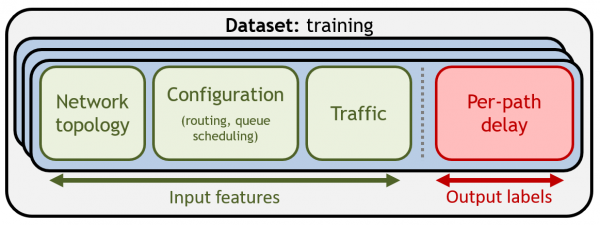
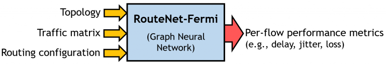
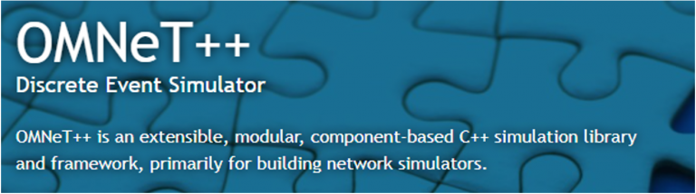

# Graph Neural Networking Challenge 2022: Data-Centric AI for Network Digital Twins

## Description

**Overview**

In recent years, the networking community has produced robust Graph Neural Networks (GNNs) that can accurately mimic complex network environments. Modern GNN architectures enable building lightweight and accurate Network Digital Twins that can operate in real time. However, the quality of ML-based models depends on two main components: the model architecture and the training dataset. In this context, very little research has been done on the impact of training data on the performance of network models.

The problem statement of the Graph Neural Networking challenge 2022 focuses on a fundamental problem of current ML-based solutions applied to networking: **how to generate a good dataset**. We invert the format of traditional ML competitions, which follow a model-centric approach. Instead, we propose to explore a **data-centric approach** for building accurate Network Digital Twins.

**Problem Statement**

Participants will be given a state-of-the-art GNN model for network performance evaluation (RouteNet-Fermi) and a packet-level network simulator to generate datasets. They will be tasked with producing a training dataset that results in better performance for the target GNN model.

The training dataset should help the GNN model scale effectively to samples of larger networks than those seen during training.

 *

**GNN Model**

**RouteNet-Fermi** is a GNN-based model for network performance evaluation. This model has a network state description as input, and it produces estimates of flow-level performance metrics as output (e.g., delay, jitter, loss). The model supports network scenarios with arbitrary topologies, configurations (routing, queue scheduling), and flow-level traffic descriptions.

In this challenge, we focus on predicting only the **per-path mean delay** on networks.

 

We provide an open-source implementation of RouteNet-Fermi in TensorFlow with fixed training parameters. More details about the internal architecture of this model can be found in our technical report [Link](https://github.com/BNN-UPC/GNNetworkingChallenge/blob/2022_DataCentricAI/training_dataset_constraints.md).

**Network Simulator and Dataset**

To generate training datasets, we provide an accurate packet-level network simulator based on OMNeT++ (Docker image). Network simulators are computationally very expensive to simulate real networks at scale. Their cost is proportional to the number of packet events in the network. To make the problem tractable, we have scaled it down. Participants will be able to quickly generate their training datasets on commodity hardware. We put the constraint that training datasets must have a maximum of 100 samples, and these samples must be from small networks of up to 10 nodes.

 

We also provide a validation dataset. Participants can use this dataset to test the performance of RouteNet-Fermi after being trained with their own datasets. This validation dataset contains samples from networks up to 300 nodes, including larger link capacities. A fundamental part of the challenge is to generate samples in small networks (up to 10 nodes) that can help the model generalize to larger networks with higher link capacities. A complete list with all the constraints that the training dataset must satisfy can be found [here].

To test the capability of RouteNet-Fermi to potentially scale to larger networks, we have trained it with a very large dataset with thousands of samples of networks up to 10 nodes. After training, we could validate that the model was able to produce accurate per-path delay estimates on the validation dataset (Mean Relative Error < 5%).

But, is it possible to achieve such a level of accuracy with training datasets of limited size (e.g., 100 samples or less)? This remains an open question for the participants of this challenge! We hope it can help generate groundbreaking knowledge on **Data-Centric AI for networking**.

## Resources

All the main resources can be found at the following [GitHub repository](GitHub repository).

This repository includes three Jupyter Notebooks that should serve as a quick-start tutorial:

* [`quickstart.ipynb`](https://github.com/BNN-UPC/GNNetworkingChallenge/blob/2022_DataCentricAI/quickstart.ipynb): Step-by-step tutorial with the entire execution pipeline for the challenge (dataset generation & model training).
* [`input_parameters_glossary.ipynb`](https://github.com/BNN-UPC/GNNetworkingChallenge/blob/2022_DataCentricAI/input_parameters_glossary.ipynb): It contains information on how to generate datasets with the simulator, what parameters can be modified, and what constitutes a valid dataset.
* [`dataset_visualization.ipynb`](https://github.com/BNN-UPC/GNNetworkingChallenge/blob/2022_DataCentricAI/dataset_visualization.ipynb): Here there is some code to visualize and analyze the generated datasets.

Below there are other useful resources for the challenge:

* Summary slides [Link](https://2ja3zj1n4vsz2sq9zh82y3wi-wpengine.netdna-ssl.com/wp-content/uploads/2020/12/GNNet_challenge_2022_ITU-webinar.pdf).
* Technical report of RouteNet-Fermi [Link](https://bnn.upc.edu/download/technical_report_routenet_fermi).
* Mailing list for questions and comments related to the challenge [Link to subscribe](https://mail.bnn.upc.edu/cgi-bin/mailman/listinfo/challenge2022).

## Evaluation

The evaluation objective is to test the accuracy of RouteNet-Fermi after being trained with the participants’ training datasets.

At the end of the challenge (Oct 1st-Oct 15th), we will ask participants for their training datasets and the RouteNet-Fermi trained with those datasets.

We will make a score-based evaluation on a new test dataset. To this end, we will use the Mean Absolute Percentage Error (MAPE) score computed over the delay predictions produced by trained models:

$$ \text{MAPE} = \frac{1}{n} \sum_{t=1}^{n} \left| \frac{A_t - F_t}{A_t} \right| \times 100\% $$

Where:
* $A_t$ is the actual value.

# Rules

**IMPORTANT NOTE**: It is mandatory to fill out the registration form to officially participate in this problem statement [Link to registration form](https://bnn.upc.edu/challenge/gnnet2022/registration).

All participants must satisfy the following rules:

* Participants can work in teams of up to 4 members (i.e., 1-4 members). All the team members should be announced at the beginning (in the registration form) and will be considered to have an equal contribution.
* Training datasets generated by participants must only include samples generated with the network simulator provided to them (Docker image).
* All the RouteNet-Fermi models submitted to the evaluation platform must be exclusively trained with samples from the training datasets generated by participants. Also, the training parameters of RouteNet-Fermi must not be modified from those of the original implementation provided to participants.
* During the evaluation process, each team can only submit one solution simultaneously. Note that the evaluation platform can take some time to process submissions, as it needs to compute the evaluation score over the test dataset. Also, there will be a maximum number of submissions allowed per team, which will depend on the number of teams registered in the evaluation platform.
* All training datasets must comply with the constraints detailed [here](https://github.com/BNN-UPC/GNNetworkingChallenge/blob/2022_DataCentricAI/training_dataset_constraints.md). Samples from the validation dataset provided to participants cannot be included in the training dataset. After the evaluation phase, top-5 solutions will be reproduced to check that training datasets satisfy all the specified constraints. The Organizing Committee reserves the right to reject solutions that have strong evidence of cheating. For example, if the performance tested in the organizer’s lab does not match the performance of trained models provided by participants.
* The challenge is open to all participants except members of the Organizing Committee, members of the Scientific Advisory Board, and members from the Barcelona Neural Networking Center at UPC.

In case of any doubt about the rules, participants are encouraged to contact the organizers proactively. Please, use the following email: `gnnetchallenge@bnn.upc.edu`.

---

# Timeline

* **Challenge duration**: May-Nov 2022
* **Open registration**: May 27th-Sep 31st 2022
* **Release of tools and validation dataset**: June 30th 2022
* **Score-based evaluation phase**: Oct 1st-Oct 15th 2022
* **Provisional ranking of all the teams**: Oct 16th 2022
* **Top-5 teams submit the dataset, code and documentation**: Oct 31st 2022
* **Final ranking and official announcement of top-3 teams**: Nov 2022

Please note that these dates are tentative and may change slightly over the course of the challenge. Stay tuned for further updates via the mailing list and also on the website of this problem statement: [https://bnn.upc.edu/challenge/gnnet2022/#timeline](https://bnn.upc.edu/challenge/gnnet2022/#timeline)