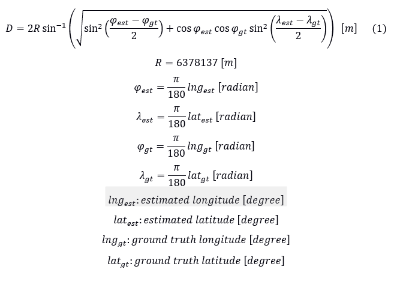

# AI/ML-Based Localization with RSS and Environmental Information

## Description

**Brief overview:**
The advancements in map applications and augmented reality (AR) have boosted the demand for location information more than ever. Global positioning system (GPS) has been the leading and prominent way of localization for a long time; however, its accuracy significantly degrades when the number of satellites seen from a receiver decreases or an impact of reflection from structures exists. Thus, the sole use of GPS cannot guarantee ubiquitously accurate localization (positioning). As a substitution, localization techniques utilizing the radio signal received from Wi-Fi access points (APs) and cellular base stations (BSs) are promising. However, traditional received signal strength (RSS)-based or so-called model-based localization techniques must have accurate channel modeling to achieve high localization accuracy. Their estimation accuracy significantly deteriorates once the channel model differs from an actual model. Furthermore, a typical triangulation approach suffers from a multipath fading channel, and hence it cannot achieve high accuracy. Such a situation may frequently happen in an urban environment, where many buildings exist between the radio transmitters and the receiver.

This challenge explores the possibility that the data-oriented localization technique can replace the model-based localization with the help of powerful AI/ML techniques. Ultimately, this challenge tries to tackle the limitation of AI/ML-based localization using RSS information: can an AI/ML-based localization technique achieve similar accuracy as the GPS-based location technique or even better accuracy?

**Problem statement:**
This challenge aims to develop an AI/ML-based localization algorithm/technique that can accurately estimate the position of a receiver based on RSS information obtained from the surrounding radio transmitters. Different from the prior year's challenge, information about the surrounding environment is provided in addition to RSS information.

The developed localization algorithm/technique needs to estimate the position of the receiver given:
(i) RSS information from transmitters whose positions are known in advance.
(ii) Information about the surrounding buildings such as RSSI measured with a timestamp and SSID, time-series GPS data (Latitude and Longitude) of the transmitter, channel setting, and map information of the measurement area to analyze Line-of-Sight (LoS)/Non-Line-of-Sight (NLoS) conditions in each wireless communication link.

---

## Evaluation Criteria

**Submission format:**
I) Program code, including:
    (1) Brief explanation of code.
    (2) Flowchart explaining how the algorithm works.
II) Evaluation results:
    (1) Computational complexity, in an objective metric (e.g., FLOPS, number of multiplications and additions).
    (2) Required memory size.
III) Explanatory material about the developed algorithm and discussion about performance evaluation, which includes the evaluation criteria provided below. It is preferred if participants provide detailed discussions about how the developed algorithm is superior and different from existing algorithms.

**Evaluation criteria:**
I) **Average localization error $\bar{D}$ [m]**, which is defined as RMSE (root-mean-square error) of localization:

$$ \bar{D} = \sqrt{\frac{1}{N} \sum_{i=1}^{N} D_i^2} $$

where $D_i$ is the localization error of the $i$-th estimation and $N$ is the total number of data points. $D_i$ must be calculated using Equation (1).

II) **Maximum localization error [m]**, which is the maximum value among all the localization errors calculated using Equation (1).

III) **Algorithm performance** (computational complexity, required memory size, scalability, etc.).

IV) **Future direction** of improving the proposed algorithm/technique.

**Localization error $D_i$ in evaluations (I) & (II):**

The top three teams are supposed to compete their developed algorithm/technique by using the additional dataset provided just before the final competition.

# Data Source

Participating teams will be provided a dataset obtained from actual measurement. The dataset contains samples of:
* RSS information and location information obtained by GPS.
* Information about the surrounding buildings such as RSSI measured with timestamp and SSID.
* Time-series GPS data (Latitude and Longitude) of the transmitter.
* Channel setting.
* Map information of the measurement area to analyze LoS/NLoS (Line-of-Sight/Non-Line-of-Sight) conditions in each wireless communication link.

---

# References

* [1] N. Bulusu, J. Heidemann, and D. Estrin, “GPS-less low-cost outdoor localization for very small devices,” IEEE Personal Commun., vol. 7, no. 5, pp. 28-34, Oct. 2000, doi: 10.1109/98.878533.
* [2] N. Patwari, J. N. Ash, S. Kyperountas, A. O. Hero, R. L. Moses, and N. S. Correal, “Locating the nodes: cooperative localization in wireless sensor networks," IEEE Signal Process. Mag., vol. 22, no. 4, pp. 54-69, July 2005, doi: 10.1109/MSP.2005.1458287.
* [3] S. He and S. -. G. Chan, “Wi-Fi Fingerprint-Based Indoor Positioning: Recent Advances and Comparisons,” IEEE Commun. Surv. Tutor., vol. 18, no. 1, pp. 466-490, Firstquarter 2016, doi: 10.1109/COMST.2015.2464084.
* [4] I. Guvenc and C. -C. Chong, “A Survey on TOA Based Wireless Localization and NLOS Mitigation Techniques,” IEEE Commun. Surv. Tutor., vol. 11, no. 3, pp. 107-124, 3rd Quarter 2009, doi: 10.1109/SURV.2009.090308.
* [5] C. Chen, B. Wang, C. X. Lu, N. Trigono, and A. Markham, “A Survey on Deep Learning for Localization and Mapping: Towards the Age of Spatial Machine Intelligence,” arXiv preprint arxiv.2006.12567, 2020.

---

# Contact

* ai_ml_challenge@awcc.uec.ac.jp