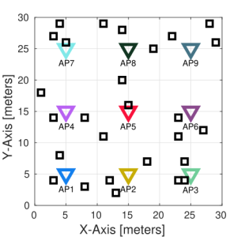
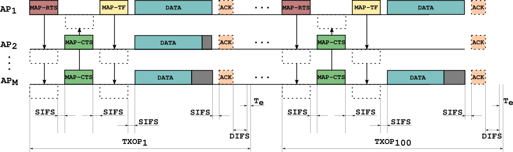
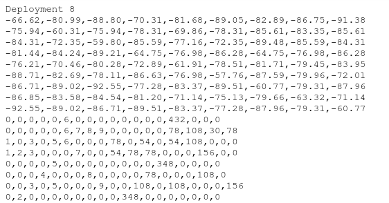

# Multi-Access Point Coordination (MAPC) Throughput Prediction

## Description

Multi-Access Point Coordination (MAPC) is one of the new features to be included in next generation Wi-Fi networks. It represents a radical change in the way traditional Wi-Fi networks work. Following the MAPC framework, APs can agree on how to share spectrum resources, aiming to improve the network efficiency by reducing unnecessary contention inside the same WLAN network. Several schemes like coordinated Spatial Reuse (c-SR), where multiple APs can transmit simultaneously, have been proposed to take advantage of the MAPC framework [1-4]. In c-SR, APs exchange the Received Signal Strength Indicator (RSSI) from their neighboring stations to a controller, which can be one of the APs, for building groups of APs that can perform simultaneous transmissions. Creating groups of compatible APs means finding subsets of those APs that do not cause unacceptable interference to the others when transmitting at the same time.

This problem statement proposes the use of Machine Learning (ML) to predict the throughput that a subset of APs transmitting at the same time can achieve. Predicting the performance of different sets of transmitting devices is essential to derive the optimal set of groups in WLAN settings. To carry out this problem statement, we provide a synthetic dataset with data extracted from multiple random WLAN deployments. More specifically, the dataset contains the RSSI overheard by all stations in the neighborhood, the subset of APs selected to collaboratively transmit in a given transmission opportunity (TXOP) using c-SR, and the achieved throughput. Then, the goal is to build an ML model able to predict the achievable throughput given any random -and maybe not present in the original dataset- combination of APs that aim to transmit simultaneously. Once an accurate throughput model is built, participants are invited to use it to find the best groups of APs in different network scenarios and topologies.

---

## Evaluation Criteria

Participants will submit a report explaining their solution, including the outcomes of their models and code or notebooks.

---

## Data Source

The dataset contains several entries for different deployments, i.e., varying the devices position and including the RSSI matrices and the list of the subset of random scheduled APs for each of them. This dataset will be used to train ML models, and then to estimate the most suitable subset of devices around each AP, as well as the aggregate throughput achieved using these selections.

# Resources

## Description of the scenario

The figure below shows the scenario used for the simulations. It consists of M=9 access points (APs) and a variable number of stations (STAs), i.e., for each deployment the number of STAs associated with each AP is a random number, N = 1, 2, …, 5. All APs are located at the center of a subarea of 10x10 meters and STAs are placed uniformly at random in the corresponding subarea and associated with the nearest AP.

All APs are set to operate in the same channel, so they are overlapping. We consider only download traffic under saturation conditions, and APs are able to transmit simultaneously using coordinated spatial reuse (c-SR) scheme [1-4]. The next figure shows an example of the employed transmission model.

At every transmit opportunity (TXOP), the number of APs selected to cooperatively transmit is a random number between one and four, and also which APs and STAs are randomly selected. Thus, the power received at the stations, i.e., the received signal strength indicator (RSSI), is stored in a matrix for all the AP-STA links - the RSSI matrix. As simultaneous transmissions are allowed, the quality of the received signal, i.e., the signal-to-interference-plus-noise ratio (SINR) at the receiver, is influenced by the RSSI of the desired transmitter as well as the potential interferer. MAP-RTS and MAP-CTS are used to reserve the channel and MAP-TF is useful to exchange information between the coordinated APs.

## Data set and resources

The provided dataset is generated on Matlab. It is intended for training a machine learning model that has to be able to estimate the throughput. The dataset is split into several files (10000), each of them containing information about one deployment. At every deployment, the number of stations as well as their positions are randomly generated. Once the scenario is generated, APs start transmitting and they are randomly selected for all TXOPs (100 TXOPs per deployment).

The training files include the information of each deployment as follows:

* **Header line**: indicating the number of the deployment, e.g., `Deployment 1`.
* The next rows contain the **RSSI matrix**. Values are in decibels (dB). The size of this matrix is NxM, where M is the number of APs (set always to 9) and N is the number of STAs randomly selected for this particular deployment.
* Then the information about each **TXOP** appears. In each row, the first 9 columns indicate the AP-STA pairs, e.g., `2,0,0,0,0,0,0,0,27` means AP1 (because the number 2 is on the first position which corresponds to AP1) transmits to STA2 and AP9 transmits to STA27. No other AP transmits, so their positions are represented with zeros. Then the values of throughput (in Mbps) referred to this particular TXOP are given afterward, e.g., `108,0,0,0,0,0,0,0,54` where 108 and 54 are the corresponding values for AP1-STA2 and AP9-STA27, respectively, in the example above.
* In some cases, when the value of SINR at the receiver is under a certain threshold, the STA is unable to decode the received frame without errors, so the value of throughput is considered equal to zero. Thus, in the example above if STA27 were unable to decode the frame properly, its throughput would have been set to zero, and the entire row would be: `2,0,0,0,0,0,0,0,27,108,0,0,0,0,0,0,0,0`. The figure below shows an excerpt of a deployment.

# References

* [1] D. Nunez, F. Wilhelmi, S. Avallone, M. Smith and B. Bellalta, “TXOP sharing with Coordinated Spatial Reuse in Multi-AP Cooperative IEEE 802.11be WLANs,” 2022 IEEE 19th Annual Consumer Communications & Networking Conference (CCNC), 2022, pp. 864-870, doi: 10.1109/CCNC49033.2022.9700500.
* [2] López-Pérez, D., Garcia-Rodriguez, A., Galati-Giordano, L., Kasslin, M., & Doppler, K. (2019). IEEE 802.11be extremely high throughput: The next generation of Wi-Fi technology beyond 802.11ax. IEEE Communications Magazine, 57(9), 113-119.
* [3] E. Khorov, I. Levitsky and I. F. Akyildiz, “Current Status and Directions of IEEE 802.11be, the Future Wi-Fi 7,” in IEEE Access, vol. 8, pp. 88664-88688, 2020, doi: 10.1109/ACCESS.2020.2993448.
* [4] C. Deng et al., “IEEE 802.11be Wi-Fi 7: New Challenges and Opportunities,” in IEEE Communications Surveys & Tutorials, vol. 22, no. 4, pp. 2136-2166, Fourthquarter 2020, doi: 10.1109/COMST.2020.3012715.

---

# Contact

* **David Nunez**: david.nunez@upf.edu
* **Rashid Ali**: rashid.ali@upf.edu
* **Boris Bellalta**: boris.bellalta@upf.edu