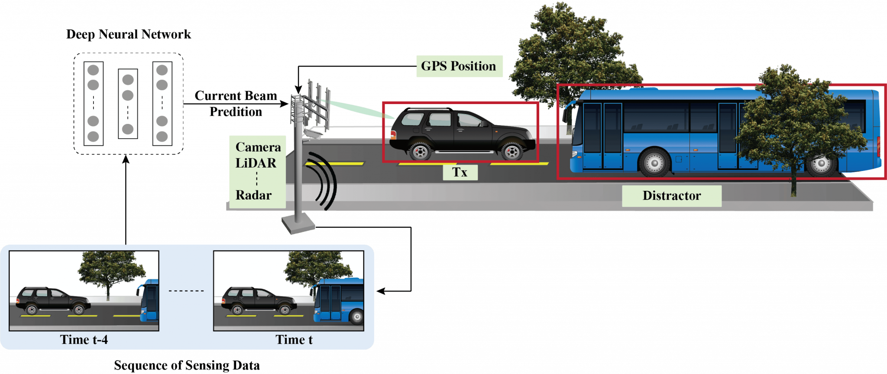
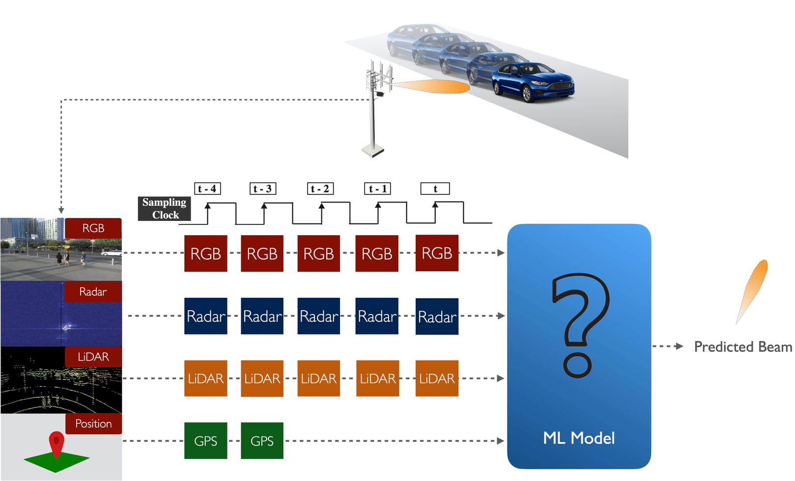
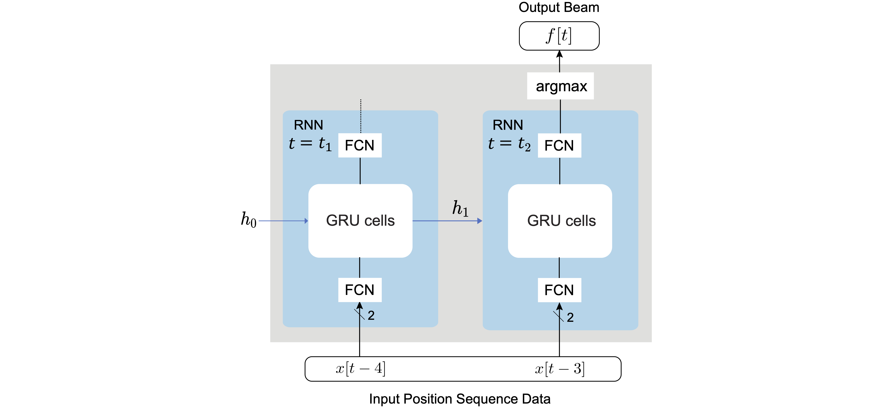
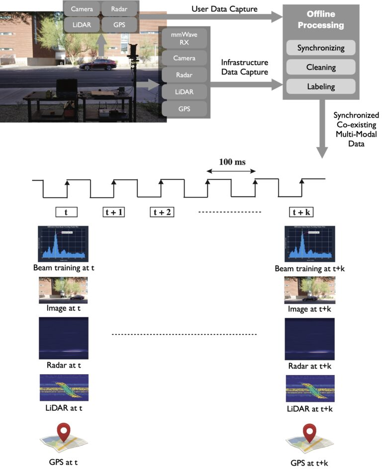
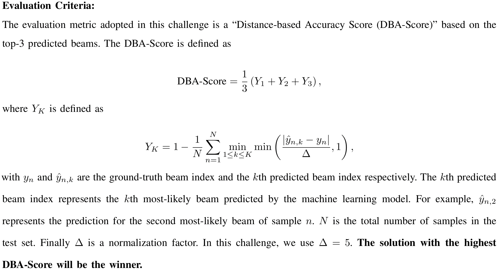

# Multi-Modal Sensing-Aided Beam Prediction: Towards Generalization

## Description

**Introduction:**

**Beam selection is a challenge**: Current and future communication systems are moving to higher frequency bands (mmWave in 5G and potentially sub-terahertz in 6G and beyond). The large available bandwidth at the high frequency bands enables these systems to satisfy the increasing data rate demands of the emerging applications, such as autonomous driving, edge computing, and mixed-reality. These systems, however, require deploying large antenna arrays at the transmitters and/or receivers and using narrow beams to guarantee sufficient receiver power. Finding the best beams (out of a pre-defined codebook) at the transmitter and receiver is associated with high beam training overhead (search time to find/align the best beams), which makes it difficult for these systems to support highly-mobile and latency-sensitive applications.

**Sensing aided beam prediction is a promising solution**: The dependence of mmWave/THz communication systems on the LOS (Line-of-Sight) links between the transmitter/receiver means that the awareness about their locations and the surrounding environment (geometry of the buildings, moving scatterers, etc.) could potentially help the beam selection process. To that end, **the sensing information of the environment and the UE could be utilized to guide the beam management and reduce beam training overhead significantly.** For example, the sensory data collected by the RGB cameras, LiDAR, Radars, GPS receivers, etc., can enable the transmitter/receiver decide on where to point their beams (or at least narrow down the candidate beam steering directions).

**Towards real-world deployment**: Recent work on sensing-aided beam prediction has shown initial promising results in utilizing the sensory data such as RGB images, LiDAR, radar, and GPS positions for the beam prediction problem. However, these solutions were mainly trained and tested on the same (mainly synthetic) datasets. To take these interesting ideas one step towards real-world deployments, we need to answer the following important questions:
(i) **Can sensing-aided beam prediction solutions perform well on real-world data?**
(ii) **Can the developed ML models that are trained on certain scenarios generalize their beam prediction/learning to new scenarios that they have not seen before?**

## Problem Statement

This ML challenge targets addressing the important questions mentioned above. In the challenge, the participants are asked to design machine learning-based solutions that can be trained on a dataset of few scenarios and then generalize successfully to data from scenarios not seen before.

**Objective**: Given a multi-modal training dataset consisting of data collected at different locations with diverse environmental features, the objective is to develop machine learning-based models that can adapt to and perform accurate sensing-aided beam prediction at an entirely new location (not part of the training dataset).

With the objective mentioned above, the primary track in this challenge is **Multi-Modal Sensing-Aided Beam Prediction**.

For this, the task entails observing a sequence of sensory data captured at the basestation to predict the current optimal beam indices from a pre-defined codebook. Along with the sequence of the sensing data (i.e., image, LiDAR, and radar), we also provide the ground-truth GPS locations (latitude and longitude) of the transmitter in the scene for a subset of the sequence. The scenarios selected for this challenge are primarily multi-candidate, i.e., more than one object is present in the wireless environment. One approach can be to first identify the transmitter in the scene. For this, the positional data can be utilized.

**Problem Statement**: As shown in Fig. 2, at any time instant $t$, a sequence of 5 samples (current and previously observed sensing data, i.e., $[t-4, \dots, t]$) is provided. We also provide the ground-truth GPS locations of the user for the first two samples in the sequence, i.e., time instants $t-4$ and $t-3$. Participants are expected to design a machine learning solution that takes this data sequence and learns to predict the optimal beam index at time $t$.

**Note**: The participants are free to utilize either all the data modalities or a subset of the data modalities.

We formulate this problem in this way to mimic a real-world scenario where not all the modalities (especially position) are available at all the samples. In reality, the position information may be captured by the user and then transmitted back to the basestation for downstream applications. Hence, the position data might not be available for every time instance and may be subject to additional delays. Further, the sampling frequency of GPS sensors could, in practice, be less than the sampling rate for the other modalities.

## Baseline Solution and Starter Script

In the challenge dataset, a sequence of 5 input samples is provided along with the ground-truth locations for the first two instances. The participants are expected to predict the optimal beam indices corresponding to the 5th data sample in the sequence. As a baseline solution, we utilize only the two ground-truth user GPS locations provided in each data sample to predict the future beam at the 5th time instance.

The proposed solution utilizes a two-stage LSTM network, followed by a fully-connected layer acting as a classifier. More specifically, the model receives a sequence of 2 positions (for the 1st and 2nd time instances) as input and predicts the optimal beam at 3 steps in the future (at the 5th time instance).

**Link to the baseline code**: [https://github.com/DeepSense6G/Multi-Modal-Beam-Prediction-Challenge-2022-Baseline](https://github.com/DeepSense6G/Multi-Modal-Beam-Prediction-Challenge-2022-Baseline)

More information can be accessed Challenge webpage: [https://deepsense6g.net/multi-modal-beam-prediction-challenge/](https://deepsense6g.net/multi-modal-beam-prediction-challenge/)

# Dataset

## DeepSense 6G Scenarios

Developing efficient solutions for sensing-aided beam prediction and accurately evaluating them requires the availability of a large-scale real-world dataset. With this motivation, we built the DeepSense 6G dataset, the first large-scale real-world multi-modal dataset with co-existing communication and sensing data. Fig. 4 highlights the DeepSense 6G testbed and the overall data collection and post-processing setup.

 
In this challenge, we build development/challenge datasets based on the DeepSense data from scenarios 31 - 34. Please follow the links below to learn more about each scenario.

* Scenario 31 ([https://deepsense6g.net/scenario-31/](https://deepsense6g.net/scenario-31/))
* Scenario 32 ([https://deepsense6g.net/scenario-32/](https://deepsense6g.net/scenario-32/))
* Scenario 33 ([https://deepsense6g.net/scenario-33/](https://deepsense6g.net/scenario-33/))
* Scenario 34 ([https://deepsense6g.net/scenario-34/](https://deepsense6g.net/scenario-34/))

Each scenario dataset comprises the **GPS position of the user**, **RGB images**, **radar** and **LiDAR data**, and the corresponding **64x1 power vectors** obtained by performing beam training with a 64-beam codebook at the receiver (with omni-transmission at the transmitter). The LiDAR, radar, and visual data are captured by the sensors installed at the basestation. The positional data is collected from the GPS receivers installed on the mobile vehicle (Tx).

**Note**: For better visualization, we provide the links to the scenario videos below:

* Scenario 31 ([Link](https://www.youtube.com/watch?v=hgvoPFn6NAQ&ab_channel=WirelessIntelligenceLab)) 
* Scenario 32 ([Link](https://www.youtube.com/watch?v=kwZ6JdFqjEc&ab_channel=WirelessIntelligenceLab)) 
* Scenario 33 ([Link](https://www.youtube.com/watch?v=o2BBh5HmWXQ&ab_channel=WirelessIntelligenceLab)) 
* Scenario 34 ([Link](https://www.youtube.com/watch?v=4L7njWb9GfA&ab_channel=WirelessIntelligenceLab)) 

## Development Dataset

The primary goal of this challenge is to study the generalizability of the sensing-aided beam prediction solutions. With this motivation, we generate the final challenge training and test dataset.

* **Training Dataset**: The majority of the training dataset comprises datasets from three scenarios (32, 33, and 34).
* **Test Dataset**: 50% of the test dataset is from scenarios 32-34, and the remaining 50% is from the unseen scenario 31.

In this challenge, we have one primary track: **Multi-Modal Beam Prediction**. However, participants can select a subset of these data modalities and design the ML solution based on them. For easier access to the datasets, we also provide the following sub-datasets: (i) **vision-position**, (ii) **LiDAR-position**, and (iii) **radar-position**. For the other dataset combinations, please use the multi-modal dataset comprising all the modalities.

For each of the sub-datasets, we provide the respective modality data with the ground-truth beam indices. The multi-modal beam prediction track includes all the data modalities. For example, in the **vision-position beam prediction sub-dataset**, we provide the following:

* **Training Dataset**: Each data sample consists of a sequence of **5 images and the ground-truth GPS locations of the transmitter for the first two instances in the sequence.** We also provide the **64x1 power vector corresponding to the 5th sample in the sequence** obtained by performing beam training with a 64-beam codebook at the receiver (with omni-transmission at the transmitter). The visual data consists of the RGB images of the wireless environment captured by the camera installed at the basestation. The dataset also provides the optimal beam indices as the ground-truth labels.
* **Test Dataset**: To motivate the development of efficient ML models, we provide a test dataset, consisting of **only the sequence of input RGB images.** The ground-truth labels are hidden from the users by design to promote a fair benchmarking process.

Similarly, for the other two sub-datasets, radar-position and LiDAR-position, we provide the sequence of 5 radar and LiDAR data samples with the corresponding GPS data of the user in the scene for the first two instances in the sequence.

**Note**: The development dataset is available in the participants' dashboard (after registration).

## Evaluation Criteria

# Submission

The objective is to evaluate the beam prediction accuracy and the ability to generalize to unseen scenarios. For this objective, we will release the test set before the end of the competition. This test set contains a mix of data samples:
(i) 50% of the test samples are from the scenarios present in the training set, and
(ii) 50% of the samples are from a similar but different scenario (not part of the training set).

Participants should use their ML models to predict **the top 3 optimal beam indices** for the test dataset and send the results in the CSV file format described here: [https://deepsense6g.net/multi-modal-beam-prediction-challenge/](https://deepsense6g.net/multi-modal-beam-prediction-challenge/)

Every submission should include the pre-trained models, an evaluation code, and a **ReadMe file** documenting the requirements to run the code. Participants are encouraged to make their results as easy to reproduce as possible, e.g., by providing a single entry point to a predefined Docker image. Any submission that cannot be reproduced because of issues with setup, dependencies, etc., won’t be considered valid.

# Timeline and Prizes

## Timeline

* **Registration**: June 20, 2022 – September 30, 2022
* **Release of the development dataset**: June 20, 2022
* **Release of the test dataset**: October 1, 2022
* **Submission deadline**: October 28, 2022
* **Final ranking (and announcing the winners)**: November 10, 2022
* **Grande challenge finale**: November – December 2022

## Prizes

* **1st winner**: A cash prize of $4000\*
* **2nd winner**: A cash prize of $2000
* **3rd winner**: A cash prize of $1000

The top 3 teams will also be invited to co-author a paper together with the organizers on multi-modal sensing aided beam prediction.

This competition is sponsored by Qualcomm and ITU.

\*$4000 is divided into $3000 by Qualcomm and 1000 CHF ~~$1000 from ITU

# Resources

All the tools and resources can be found at the following link:
[https://deepsense6g.net/multi-modal-beam-prediction-challenge/](https://deepsense6g.net/multi-modal-beam-prediction-challenge/)

* **Datasets**: Training, validation (released at the beginning) and test (unlabelled, released at the end)
* **A Baseline and a starter script**
* **Python API** to easily read the datasets provided
* **Forum** for questions and comments related to the challenge.

# Leaderboard

| Rank | Team name        | Scenario 31 | Scenario 32 | Scenario 33 | Scenario 34 | Overall DBA Score |
| :--- | :--------------- | :---------- | :---------- | :---------- | :---------- | :---------------- |
| 1    | Avatar           | 0.6536      | 0.7074      | 0.8576      | 0.7120      | 0.7162            |
| 2    | TII              | 0.5331      | 0.7173      | 0.7910      | 0.8209      | 0.6671            |
| 3    | MMJ              | 0.3700      | 0.8012      | 0.8857      | 0.8865      | 0.6310            |
| 4    | 805Mainstream    | 0.4047      | 0.6716      | 0.7310      | 0.7547      | 0.5742            |
| 5    | ULTIMO           | 0.3100      | 0.6889      | 0.7557      | 0.8061      | 0.5466            |
| 6    | Import_CERTH     | 0.1991      | 0.5667      | 0.7186      | 0.7399      | 0.4606            |
| 7    | 5G_beam_pred     | 0.2304      | 0.5025      | 0.7043      | 0.5725      | 0.4318            |
| 8    | UCF-Knights      | 0.2604      | 0.4765      | 0.5971      | 0.5756      | 0.4206            |
| 9    | VALAB            | 0.0933      | 0.5111      | 0.7100      | 0.7496      | 0.4051            |
| 10   | NeuraBeam        | 0.1860      | 0.3160      | 0.6981      | 0.5425      | 0.3867            |
| 11   | HSC              | 0.0862      | 0.2914      | 0.6410      | 0.5720      | 0.3300            |
| 12   | Qualcomm AI      | 0.3229      | 0.2185      | 0.2900      | 0.1176      | 0.2635            |
| 13   | TheOne           | 0.1891      | 0.2432      | 0.1705      | 0.1781      | 0.1873            |

**NOTE**: This is a final ranking after verifying team scores and evaluating code of Top-5 Teams!

*The "DBA Score" (Distance-Based Accuracy Score) is the evaluation metric for this challenge, utilizing the top-3 predicted beams to measure how close the predicted beams are to the ground truth.*

# Organizers

The competition is organized by:

* **Ahmed Alkhateeb**, Director, Wireless Intelligence Lab, Arizona State University
* **Gouranga Charan**, Wireless Intelligence Lab, Arizona State University
* **Arash Behboodi**, ML Research Scientist, Qualcomm
* **Hamed Pezeshki**, Staff System Engineer, Qualcomm
* **Umut Demirhan**, Wireless Intelligence Lab, Arizona State University
* **Joao Morais**, Wireless Intelligence Lab, Arizona State University

To contact the organizers, please send an email to: [competition@deepsense6g.net](mailto:competition@deepsense6g.net)