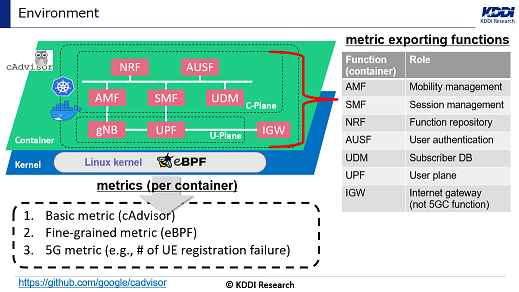
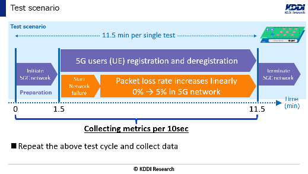
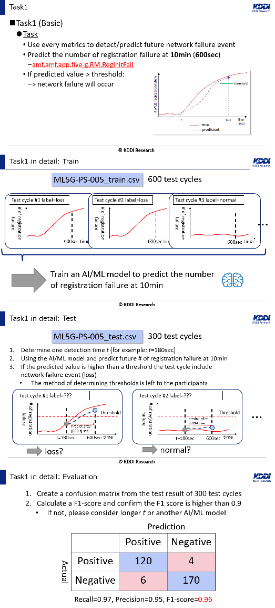
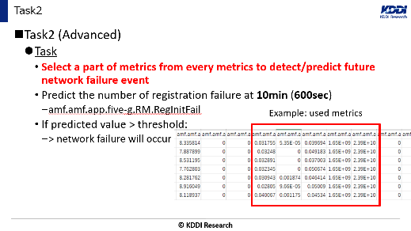
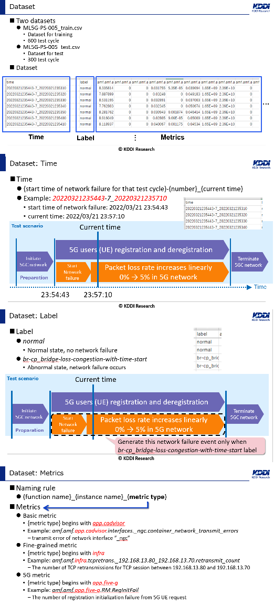

# 5G Core Network Failure Prediction Challenge

## Description

Many telecom carriers have launched their 5G services in the past couple of years, and currently, the number of 5G mobile users has been expanding globally. In the deployment of 5G networks, especially 5G Stand Alone (SA), Network Function Virtualization (NFV) technology, including Cloud-native Network Function (CNF), is often introduced. This can lead to complexity and uncertainty for operation. To maintain 5G-specific requirements such as Ultra-Reliable and Low Latency Communications (URLLC), a proactive operation is a must to minimize the social impacts caused by 5G service outages due to network failures that occurred in the 5G Core Network (5GC). Proactive operation is an operational style that detects network failures and resolves them before impacting customer communication. One of the key enablers for this is **network failure prediction**. If a potential network failure is detected in the early stage, mobile network operators can fix the problem rapidly before getting a huge outage. To realize network failure prediction, AI/ML technology is expected to be leveraged.

In this challenge, the target network is a CNFs 5GC on top of Kubernetes with extended Berkeley Packet Filter (eBPF) [1], as shown in Fig. 1. eBPF enables deriving fine-grained metrics from the Linux kernel space, providing observability. However, network failure prediction is still challenging only by eBPF, without analysis technology. Here, participants will be asked to predict future network failures on the 5GC using AI/ML. This challenge will provide 3 types of metrics: basic metrics obtained by cAdvisor [2], fine-grained metrics by eBPF, and 5G metrics by counting 5G logs. In failure scenarios, a packet loss event occurs and the loss rate increases linearly while 5G users are repeating registration and deregistration, as shown in Fig. 2. Participants are asked to challenge how early and accurately future network failures can be predicted using time-series data consisting of thousands of metrics.

 

 
For **Task 1**, participants will use all metrics to create AI/ML models for predicting a network failure that will occur in the future. The target value for prediction is the number of UE registration failures (`amf.amf.app.five-g.RM.RegInitFail`) at 10 minutes (600 seconds). This value represents the number of failed connection requests from 5G users and is directly related to the Quality of Experience (QoE) of 5G services. In this task, participants will compete for the detection time `t` when the models can achieve over 0.9 of F1 score in detection by threshold. The detailed steps in Task 1 are shown in Fig. 3.

For **Task 2**, participants will select a subset of metrics from all available metrics to develop models that can predict failures at the detection time `t`, as shown in Fig. 4. In this task, participants will compete for the detection time `t` and the number of metrics used for training.

---

## Evaluation Criteria

Participants must submit a PowerPoint file in PDF format including the following contents:

* Results for Task 1 and Task 2.
* What type of AI/ML model was used.
* Originality in the use of AI/ML models.

For **Task 1**, participants with a smaller detection time `t` will be the winners, considering the originality, validity, and versatility of the solutions.

For **Task 2**, participants with a smaller detection time `t` AND a smaller number of metrics used for training will be the winners, considering the originality, validity, and versatility of the solutions.

# Data Source

This challenge will provide multi-variant time-series metrics obtained by cAdvisor, eBPF, and 5G log for each 5GC CNF under normal and failure conditions. The provided data were generated in the CNF-based 5GC test environment. The failure injector causes packet loss on the 5GC intentionally, extending the loss rate time by time, while the data collector obtains metrics from the 5GC.

The data consist of training and test data, both of which include labels and time-series metrics as shown in Fig. 5. The details of the dataset, such as time, label, and metrics, are explained in Fig. 5.

---

# Resources

Participants must prepare their own computing environment. Utilized tools are desired to be OSS (open-source software)-based in order for other people to conduct additional experiments.

---

# References

* [1] [https://ebpf.io](https://ebpf.io)
* [2] [https://github.com/google/cadvisor](https://github.com/google/cadvisor)

---

# Contact

* nw_ai@list.kddi-research.jp