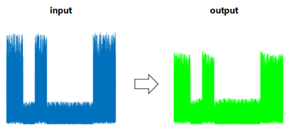
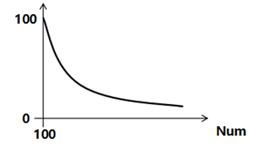

# Behavioral Modeling of Power Amplifiers with AI

## Description

**Background:**

Power amplifiers (PA) are one of the critical components of radio frequency (RF) transmitters in base stations, aiming at amplifying RF signals without distortion. In modern 5G wireless communication systems, demand for more service scenarios requires the employment of complicated signals. These wideband signals with high peaks and time-varying envelopes stimulate the **nonlinear and memory effect distortions** in PAs, meaning that the output signals depend non-linearly on the input signals and are influenced by the inputs at former time steps. These distortions hinder wireless communication systems from enhancing linearity and energy efficiency at the same time.

In this problem statement, the competitors are expected to bring AI algorithms into behavioral modeling of power amplifiers with nonlinear and long-term memory effect distortions. The work of accurate behavior model of PA may further promote the design of algorithms to compensate for these distortions, which would be helpful for developing highly efficient 5G wireless communication systems.

**Task:**

This is a nonlinear time sequence forecasting task that is open to all with machine-learning backgrounds. The competitors are provided with the input and output signals of a nonlinear system (in particular, a power amplifier, PA). The input is a wideband (bandwidth 200MHz) signal with varying average power. The output signals show the distortions in PA, including the nonlinear effect, short-term memory effect, and more importantly, the long-term memory effect. **The long-term memory effect** is featured by the slowly-varying output signal envelope with charging and discharging-like characteristics when abruptly changing the average power of input signal (see Figure 1 below).

The competitors are expected to:

* Use AI algorithms (for example, but not limited to, Neural Networks, Support Vector Regression) to design a mathematical model for fitting the above-mentioned nonlinear system (PA), as $y=f(x)$. Then predict the PA’s output with input signals given in testing datasets.
* **Hints**: The above-mentioned distortion characteristics, including the nonlinear effect, short-term and long-term memory effects, should be effectively modeled.

The competitors should submit:

* The source code with comments, in Matlab or Python.
* A report (doc or pdf file) containing:
    * Detailed design of your model and the interpretation, schematic diagram showing the architecture of the model.
    * Algorithm simulation flow chart.
    * Algorithm settings, hyper-parameters, the design of training algorithm or solvers used and its parameters.
    * Chart or figures showing the model’s performance, including NMSE (Normalized Mean Square Error) and ACEPR (Adjacent Channel Error Power Ratio) on training and testing datasets.
    * Detailed calculation of the model inference complexity, i.e., the number of real-number multiply operations in the inference stage.
    * If you refer to any publications during your design, please cite them properly.

# Evaluation Criteria

* **Accuracy** (60%)
    * **(1) NMSE (30%)**: The normalized mean square error (NMSE) between the predicted output signal and the real output signal. It should be as small as possible.
    * **(2) ACEPR (30%)**: The linearization capability of the designed model, evaluated by the adjacent channel error power ratio (ACEPR). Details for calculating ACEPR are provided in the Attachment. It should be as small as possible.
    * **Hint**: You can find the reference or benchmark of NMSE/ACEPR performance from the online testing platform (update later).

* **Model inference complexity** (40%)
    * Score = $100 - 10 \times \log_2(\text{Num}/100)$

    

    * Num = the number of real-number multiply operations in the inference stage.

* **Model interpretability** (bonus points): The competitors are encouraged to design AI algorithm with interpretability to some extent. Interpretable AI model will gain extra bonus points (no more than 10 points).

**Total Points** = NMSE score * 0.3 + ACEPR score * 0.3 + Complexity score * 0.4 + bonus

# Data Source

**Attachment:**

* **Datasets**: 1 training dataset and 4 testing datasets. Data files in both `.mat` and `.dat` format are provided for your option.
    * Each dataset contains the one input and the corresponding output signal sequence of the PA. All of the datasets are collected from the same PA.
* **CalPerformance.doc / CalPerformance.m / CalPerformance.py**:
    * The formula or code for evaluating the modeling performance, NMSE and ACEPR (in Matlab or Python, for your option).
* **Instructions.txt**:
    * This is a documentation the participants may refer to before programming.

---

# Resources

**Online testing platform:**
(to be updated later)

An online testing platform is provided that may be helpful for the competitors. The competitors can upload their codes on this platform and get the NMSE and ACEPR as feedback, which are the indicators of modeling performance (part of evaluation criteria). So the competitors can find the reference or benchmark of NMSE/ACEPR performance in this way and keep improving their algorithms.

Evaluation criteria of NMSE / ACEPR are embedded on this testing platform, as well as the confidential testing dataset which updates irregularly. All of the training and testing datasets are collected from the same PA.

---

# References

* [1] F. M. Ghannouchi and O. Hammi, “Behavioral modeling and predistortion,” in IEEE Microwave Magazine, vol. 10, no. 7, pp. 52-64, Dec. 2009, doi: 10.1109/MMM.2009.934516.
* [2] A. Katz, J. Wood and D. Chokola, “The Evolution of PA Linearization: From Classic Feedforward and Feedback Through Analog and Digital Predistortion,” in IEEE Microwave Magazine, vol. 17, no. 2, pp. 32-40, Feb. 2016, doi: 10.1109/MMM.2015.2498079.

---

# Contact

* **Yisheng Fang**: fang.yisheng@zte.com.cn