# AI for Good Challenge: AI-powered Video Chaptering for Webinars

## Description

**Introduction:**

YouTube’s “Video Chapter” feature segments a video into sections marked by timestamps so that the user can easily navigate to the part of the video which is of most interest. This can be done by clicking or pressing the chapter marker, or by selecting the timestamp in the video description.

In this problem statement, we want to take this feature further. In webinars where speakers present slides, participants of the problem statement are asked to create the best AI model which annotates slide transitions by:

* identifying starting and ending frames of each slide shown in the video
* extracting (apparent) titles of each slide

Recordings of 100 “AI for Good” (https://aiforgood.itu.int/) webinars were sourced to assemble a diverse collection of more than 140 video presentations made by members of the scientific community, entrepreneurs, and standardization experts.

**We are providing:**

* Video files covering the presentation from when the speaker started screenshare right to the moment when it was turned off. Video files vary in duration (from several minutes to several hours) and resolution (from 1600x1200 to 3840x2160).
* A ground truth dataset with 2500+ slide transitions showing the starting and ending frame of each slide including (apparent) titles.

**Submissions by participants are expected to include:**

* Documented design and source code of the solution with files or dependencies necessary for execution
* Installation material (e.g., `requirements.txt`)
* Test set predictions

The preferred form of submission is in the form of a Jupyter Notebook. Participants are encouraged to submit Python code.

# Slide Definition, Title Definition

When it comes to defining where one slide ends and another starts in video presentations, our primary reference are the presenters themselves. Sometimes they number their slides, and sometimes it is easy to see how the presentation was structured. A general rule of thumb here is to look out for the slide title and see if it changes. (A title change is a strong indicator that a slide has transitioned into a new one).

Titles can be of any color, font size and have any position on the screen. While for many slides it is clear what the slide title is, there are numerous “outlier” situations which make it difficult or even impossible to determine a slide title. Therefore, it is hard to give a proper definition of a slide title. We expect participants to consult titles in the ground truth for a better understanding.

# Test Set Predictions

For each video in the test set, the solution must annotate every slide that was visible (even for a brief time) by specifying:
* frame-level timeline boundaries (starting and ending frame numbers)
* (apparent) title of the slide

Each video in the dataset was recorded at a rate of 25 FPS (frames per second).

# Prediction Process

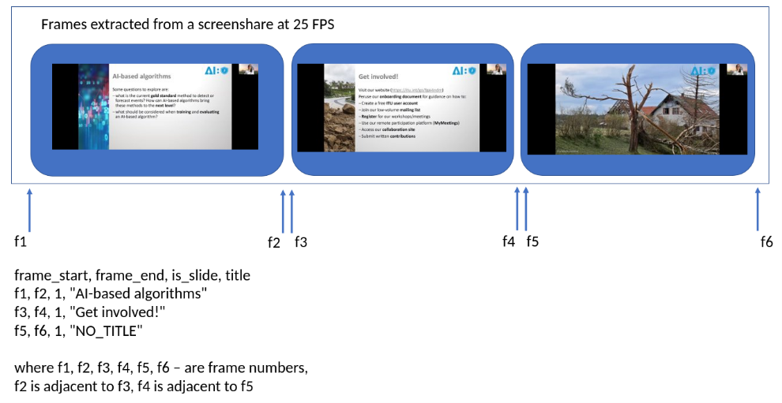

Be aware that part of the slide content may change (appear or disappear), but that will not necessarily signify the beginning of a new slide. Your AI model should be wise enough to differentiate when the **whole slide has changed** to a new one as against something **within the slide has changed**.

While this is a slide annotation problem, our dataset contains some complex features. Cases of presenters demonstrating real-world footage amid the slideshow, or minimizing PowerPoint and opening another program should be treated as non-slide content. To simplify the problem statement, we do not expect titles to be identified in these instances, just the frame boundaries.

To distinguish slide content from everything else in predictions we utilize the “is_slide” column. It should be set to “0” (zero) for any video fragment that is not a slide, and to “1” (one) otherwise.

Non-slide content can be identified in videos through tracking pixels refresh ratio (a typical slide fragment will have simple and discrete visual changes unlike real-world footage) or through an advanced image recognition model trained specifically for this task.

Our evaluation metric will focus on how accurate slide content/slide transitions were predicted in the video without taking in consideration other types of content.

# Prediction Format

For each video processed by a solution a separate output file with predictions should be generated. The first line in the file must be a header. For example:

frame_start, frame_end, is_slide, title
1, 30, 0, ""
31, 208, 1, "Locus Charter"
209, 1516, 1, "Our Vision Who We Are"
1517, 3101, 1, "Founding Principles"
3102, 3157, 1, "NO_TITLE"

* `frame_start`: initial frame of when slide is visible
* `frame_end`: last video frame containing the slide
* `is_slide`: 1 if it is a slide, 0 if something else
* `title`: (apparent) slide title when `is_slide=1`

As you see in the example above, there must be no gaps between starting and ending frame numbers of adjacent slides/sections in prediction. i.e., all the frames in the video must be accounted for.

In the event where a single slide has multiple, equally important titles (up to 4), you manage to predict all of them, you earn bonus points: you should list the titles in any order, whitespace-separated. (See case #2 for better understanding)

“NO_TITLE” should be written in place of a regular title if a solution could not identify a valid title on the slide (e.g., if it was a photo slide with no text).

# Accuracy Calculation

## Boundary accuracy (BA)

For each slide in the ground truth, our evaluation metric will find a corresponding predicted slide with **closest** temporal boundaries and will form a pairing (ground truth slide boundary, predicted slide boundary).

A pairing is considered correct if the Intersection over Union (IoU) of the two boundaries exceeds 0.99 (IoU > 0.99)

$$
IoU = \frac{\min(P_{end}, G_{end}) - \max(P_{start}, G_{start})}{\max(P_{end}, G_{end}) - \min(P_{start}, G_{start})}
$$

Where:
* $P_{\text{start}}, P_{\text{end}}$ - starting and ending frame numbers of predicted slide.
* $G_{\text{start}}, G_{\text{end}}$ - starting and ending frame numbers of ground truth slide.

The boundary accuracy of a solution is calculated as follows:

$$
\text{BA} = \frac{\text{Correct} - 0.5*  \text{Incorrect}}{\text{TotalGroundtruth}}
$$

* **Correct**: number of correct pairings of boundaries
* **Incorrect**: number of predicted slides not included in the pairings
* **TotalGroundtruth**: number of ground truth slides

## Title accuracy (TA)

For each slide in the ground truth, our evaluation metric will find a corresponding predicted slide with **closest** temporal boundaries and will form a pairing (ground truth slide title, predicted slide title).

Before any matching can be done, the metric will “normalize” both strings by deleting extra whitespaces, replacing problematic characters (e.g., “$” character will be changed to “S”) and converting all characters to lowercase. The normalization step should alleviate certain difficulties that you may experience when using OCR (optical character recognition) software for this challenge.

A pairing of predicted and ground truth title is correct when Levenshtein distance between two normalized strings does not exceed 1 character (it is less than or equal to 1).

Some cases of ground truth titles allow more than one title: these titles will feature an alternative “complete” version which we treat as a perfect answer to be given. Predicting a “complete" version of a title correctly will earn a bonus point.

The title accuracy of a solution is calculated as follows:

$$
\text{TA} = \frac{\text{Correct} - 0.5 * \text{Incorrect} + \text{BonusPoints}}{\text{TotalGroundtruth} + \text{TotalBonusPoints}}
$$

* **Correct**: number of correct pairings of titles
* **Incorrect**: number of predicted slides not included in the pairings
* **TotalGroundtruth**: number of ground truth slides
* **BonusPoints**: number of bonus points earned by a solution
* **TotalBonusPoints**: number of total achievable bonus points

## Final accuracy (FA)

The final accuracy of a solution will be calculated:

$$
\text{FA} = 0.4 \times \text{BA} + 0. 6\times \text{TA}
$$

# Accommodative Ground Truth

There are multiple instances in our dataset with ambiguous prediction scenarios. We acknowledge that many answers to the same question are possible and that therefore several versions of the ground truth may exist. In light of this, our evaluation metric will try to consider all reasonable answers to complex cases when benchmarking your predictions. Hopefully, this will remove luck from the equation and enable us to identify the most reasonable and well-optimized solution.

## Complex Scenarios and How to Handle Them

For many slides it is clear what the title of the slide is. In this example, the slide title is “Example knots and invariants” (from DeepMind’s talk “Working together with AI to make new mathematical discoveries”, AI for Good, 27 January 2022)

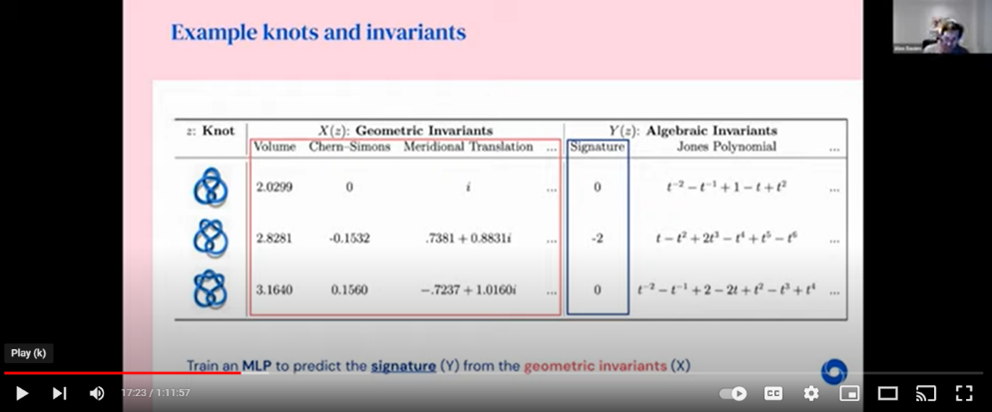

However, there are numerous outliers, some of which are listed below.

### No title:
Sometimes there is no (obvious) title to a slide.

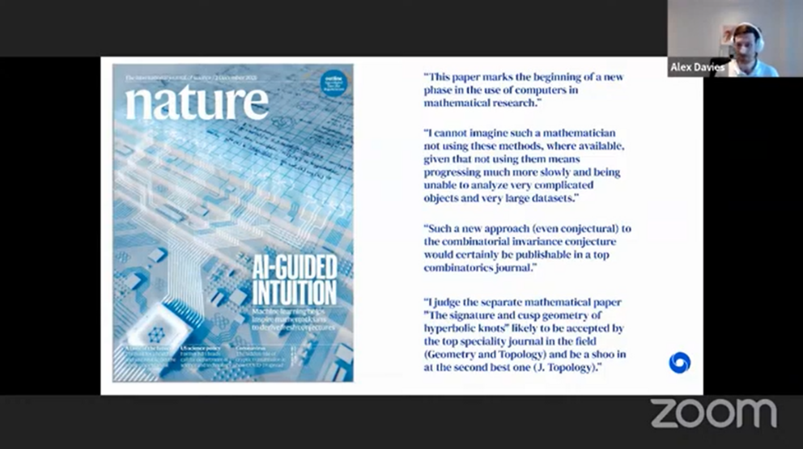

**How to handle this case for the Challenge**: A solution selects “AI-Guided Intuition” as the slide title is preferable. “Nature“ makes a bad title for this case and we believe a good model can learn the difference between a logotype and a title.

### More than one slide title:
The slide below juxtaposes two slides, one with the title “Knot Theory”, the other with the title “Representation Theory”.

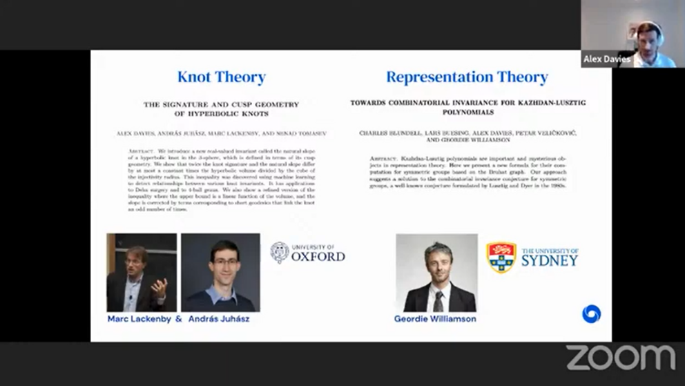

**How to handle this case for the Challenge**: Picking either “Knot Theory“ or “Representation Theory“ as a slide title will be correct. A solution that manages to predict both titles (in any order) will be awarded a bonus point.

### Incomplete titles:
For example, the speaker’s image cuts off part of the slide title.

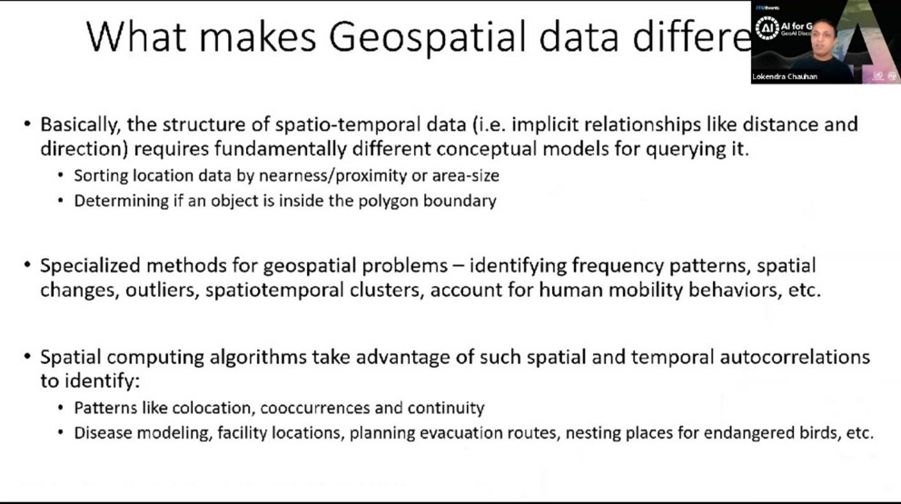

**How to handle this case for the Challenge**: A cut off title is treated as a correct solution, but extra points will be given for completing the slide title (e.g., using a language model or a dictionary).
Correct answers for this case: ”What makes Geospatial data differe” and ”What makes Geospatial data different” (bonus points)

### “Loading screen / blank screen”:
A screen which is being loaded can appear at the beginning or even in midst of the presentation. The loading process is not necessarily short.

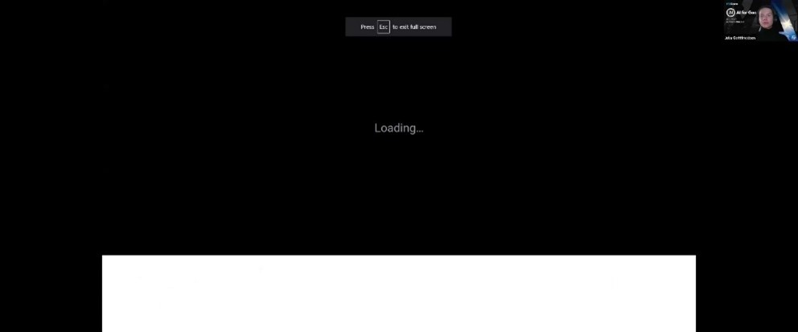

**How to handle this case for the Challenge**: Loading screen should not be predicted as a slide (`is_slide` must be set to 0), with title being `“NO_TITLE”`.

### Speaker is not in “Slide Show” mode:
Speakers starting their presentation are in general in a presentation mode other than “Slide Show” mode. They take a few seconds before they have selected “Slide Show” mode, or they may stay in some other presentation mode during the entire presentation.

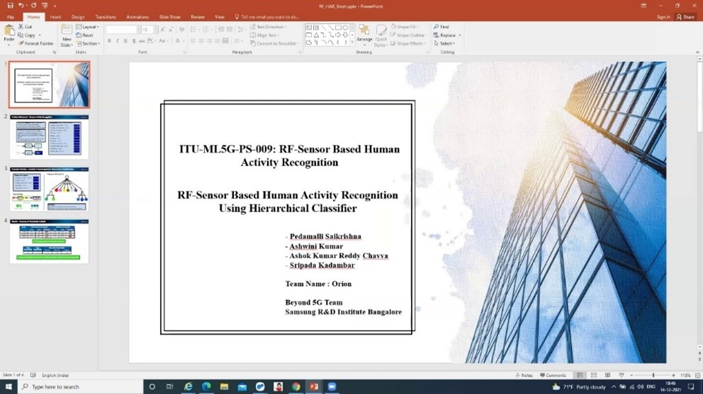

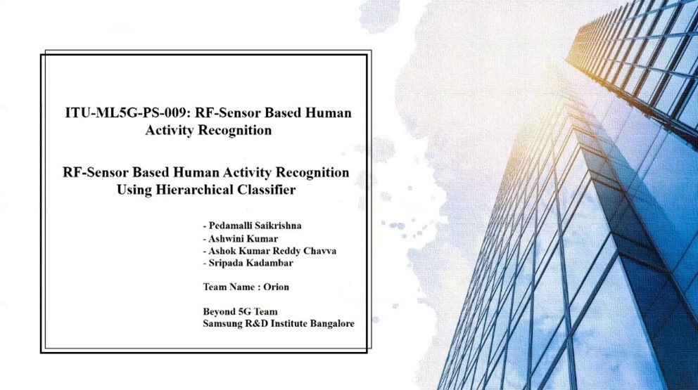
**How to handle this case for the Challenge**: Whether the submitted solution will predict this scenario as a single slide or two separate slides, our evaluation metric will be flexible to accept both answers.

### Same title, different slides:
The slide title stays the same on consecutive slides, but the subtitle and the rest of the slide is different.

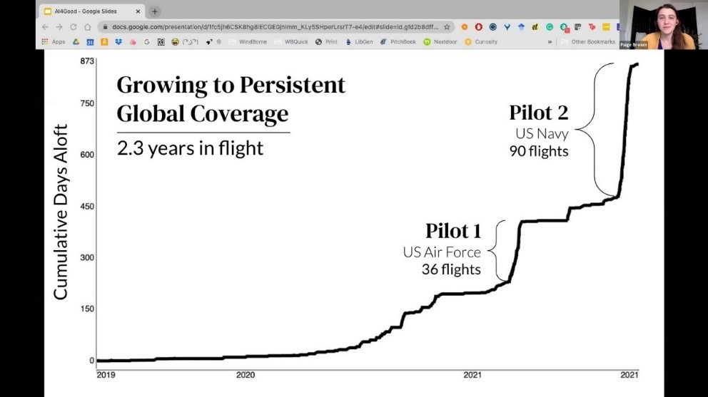
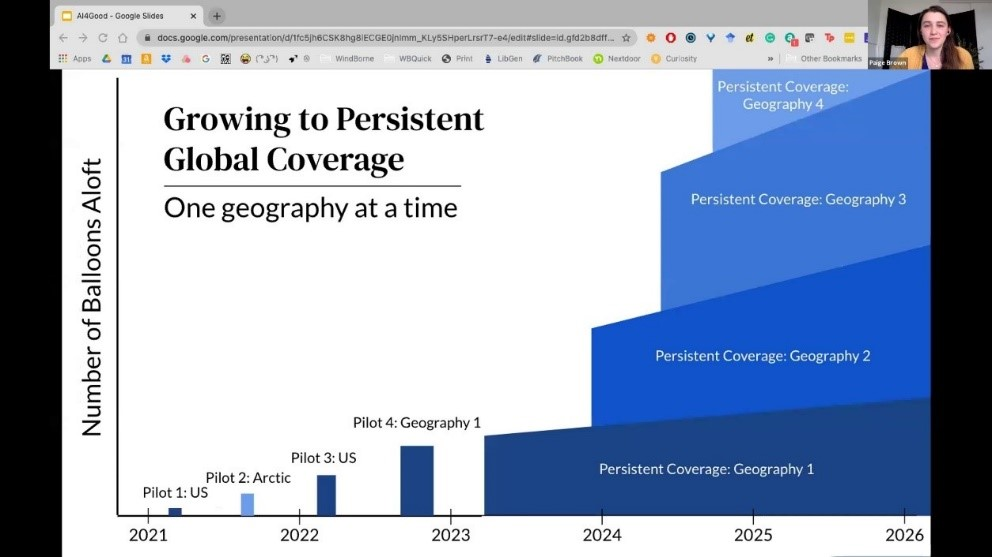
**How to handle this case for the Challenge**: This situation can be counted as either one slide or as two slides. (Both predictions are accepted).

### Slide presentation contains a video:
Some presentations may contain a (usually short; seconds up to about a minute) video. The video may or may not have a title.

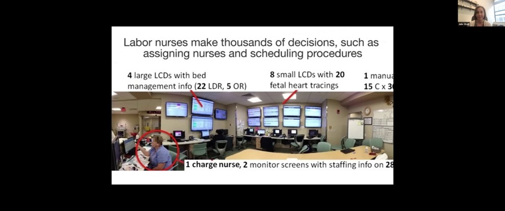
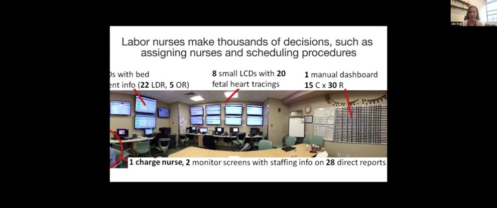
**How to handle this case for the Challenge**: Only temporal boundaries of a video must be predicted and `is_slide` is set to 0. If a solution accidentally predicts a title for the video, it will not be counted as an error.

### Accidental noise in the slide:
In the example below, an unrelated piece of text appeared for a fleeting time.

**How to handle this case for the Challenge**: Optimal solution should neglect glitches that may occur during the slideshow.

### Accidental slide transitions:

* Presenter demonstrated slide #1 (initial slide)

* Presenter switched to slide #2

* The presenter accidentally switched back to slide #1 instead of advancing to slide #3. Slide #1 remained visible for ~1 second until presenter switched to slide #3.

**How to handle this case for the Challenge**: The repeated slide should be predicted normally as if it was a new slide, never seen before.

### Photo lacking textual content:

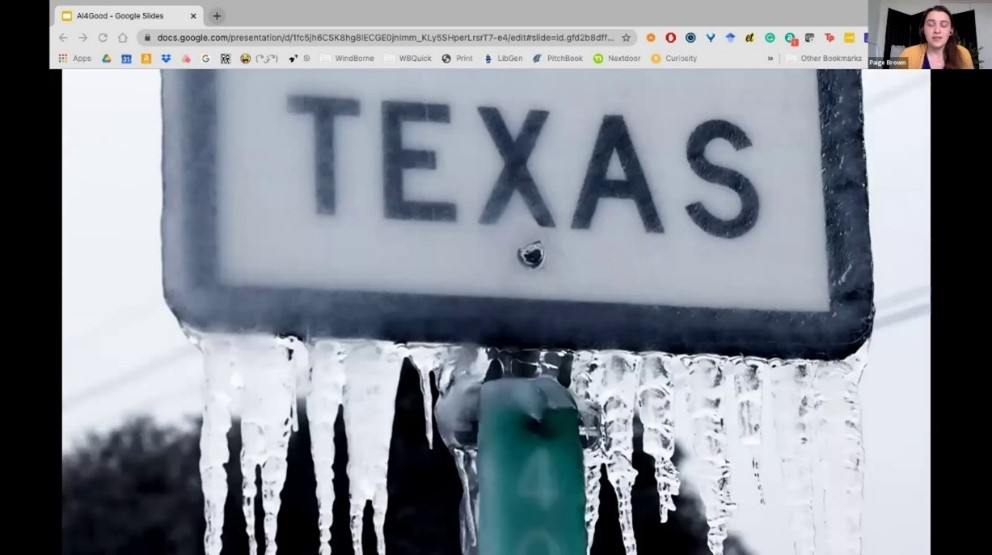

**How to handle this case for the Challenge**: The predicted title for this case should be `”NO_TITLE”`.

### Scrolling:
One or more slides are long text listings or computer code.

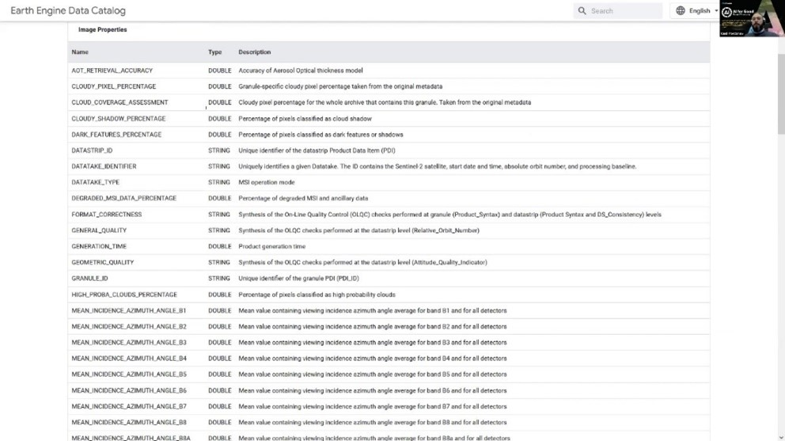
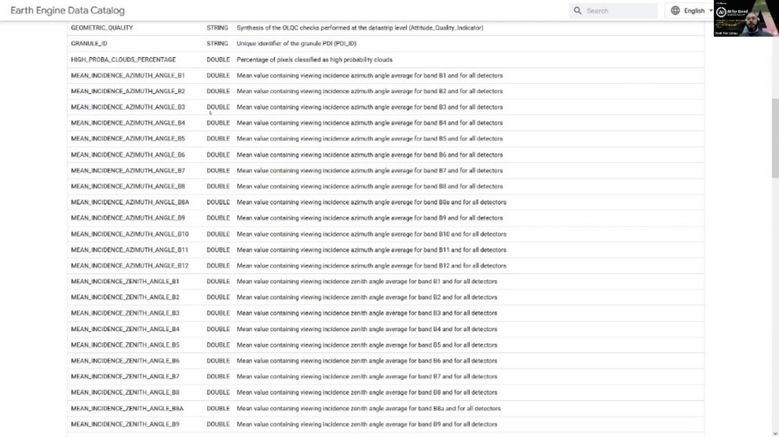
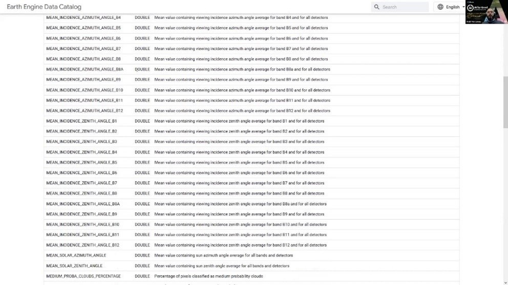
**How to handle this case for the Challenge**: The whole video section related to this scrolling must be flagged `is_slide=0`.

### Complex interactions:
The presenter had interacted with the map and code for quite a long time. Lots of text has changed, while the top panel remained unchanged.

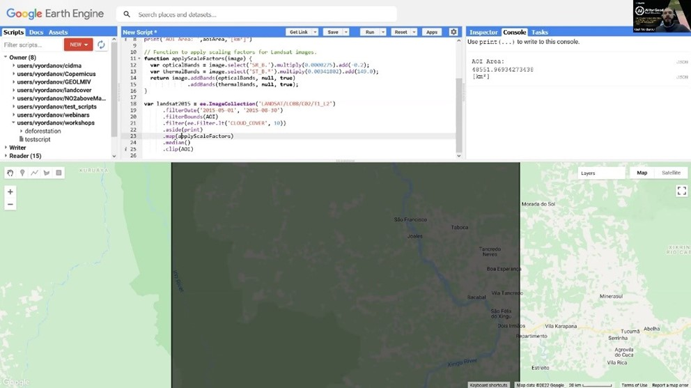

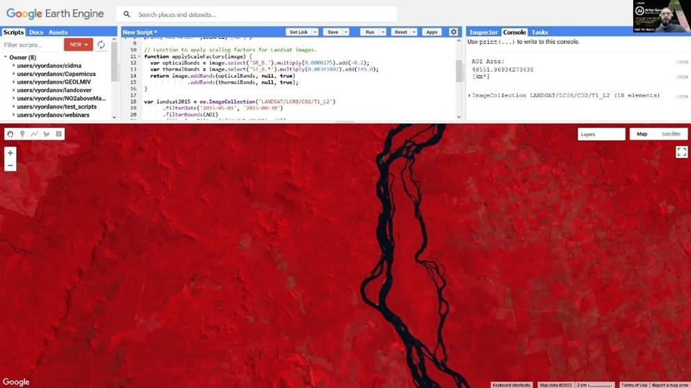

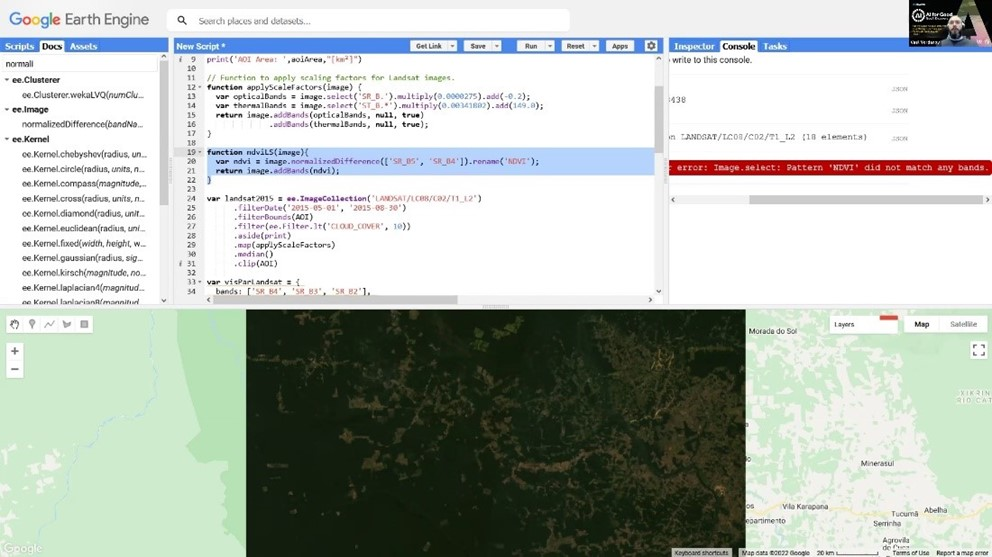
**How to handle this case for the Challenge**: The whole section related to this complex scenario must be flagged `is_slide=0` in the predicted output (no title is expected for this section).

### Transition animations:
A slide transition may be animated when moving from one slide to the next. In this example the subsequent slides is flying in from the bottom.

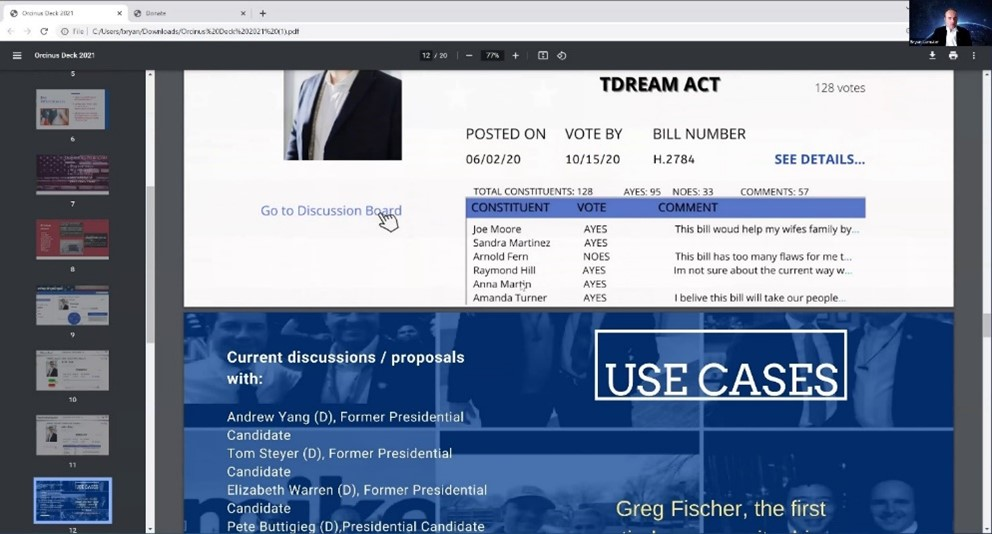
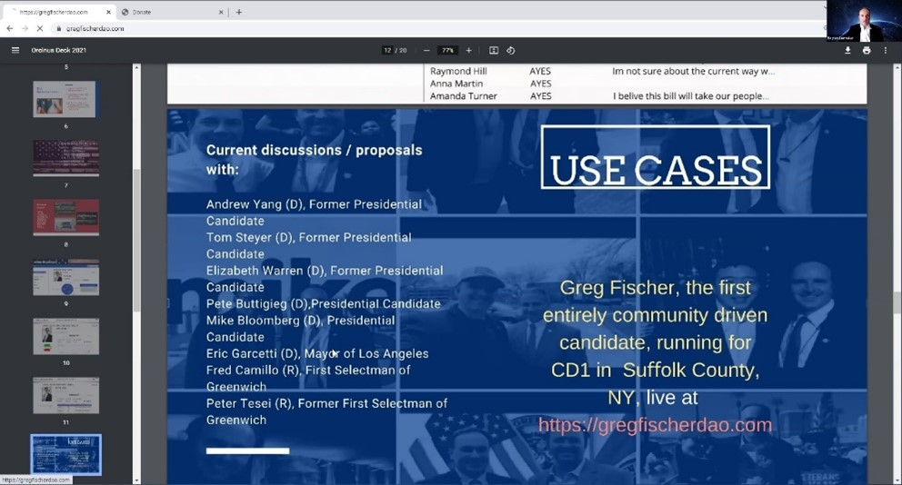

**How to handle this case for the Challenge**: In cases of slide transitions having animation effects, it could be difficult to determine an exact boundary of when the first slide is completely gone and the second one has just appeared. You are free to choose any boundary within animation range (a submitted solution must predict the last frame of a first slide and first frame of a second slide to be anywhere within that range).

# Data Source

Recordings of 100 “AI for Good” (https://aiforgood.itu.int/) webinars were sourced to assemble a diverse collection of more than 240 video presentations made by members of the scientific community, entrepreneurs, and standardization experts.

The following is provided for each video presentation:
* Video file covering presentation from when presenter started screenshare right to the moment when it was turned off.
* Annotation specifying frame-level temporal boundaries of each slide that was shown during a presentation as well as its (apparent) title.

Video files vary in duration (from several minutes to several hours) and resolution (from 1600x1200 to 3840x2160).
Each video in the dataset was recorded at a rate of 25 FPS (frames per second).

The dataset is available for teams registered to participate in this problem statement (under Data Download). You can also email <AI5GChallenge[at]itu.int> for a link to download a zip folder with all files.

---

# References

* [1] Guan, M., Li, K., Ma, R., An, P. (2020). Convolutional-Block-Attention Dual Path Networks for Slide Transition Detection in Lecture Videos. In: Zhai, G., Zhou, J., Yang, H., An, P., Yang, X. (eds) Digital TV and Wireless Multimedia Communication. IFTC 2019. Communications in Computer and Information Science, vol 1181. Springer, Singapore.
* [2] SPaSe - Multi-Label Page Segmentation for Presentation Slides; Monica Haurilet, Ziad Al-Halah, Rainer Stiefelhagen; Winter Conference on Applications of Computer Vision.

---

# Contact

To contact the organizers, please send an email to:
* [Kirill.Ekshembeev@itu.int](mailto:Kirill.Ekshembeev@itu.int)
* [Bastiaan.Quast@itu.int](mailto:Bastiaan.Quast@itu.int)
