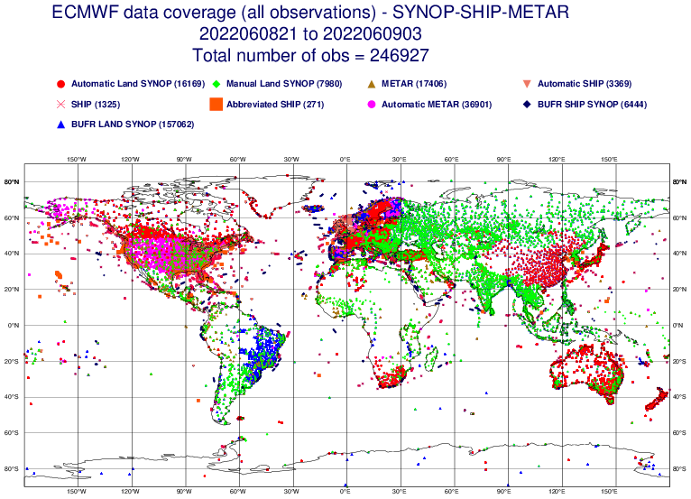
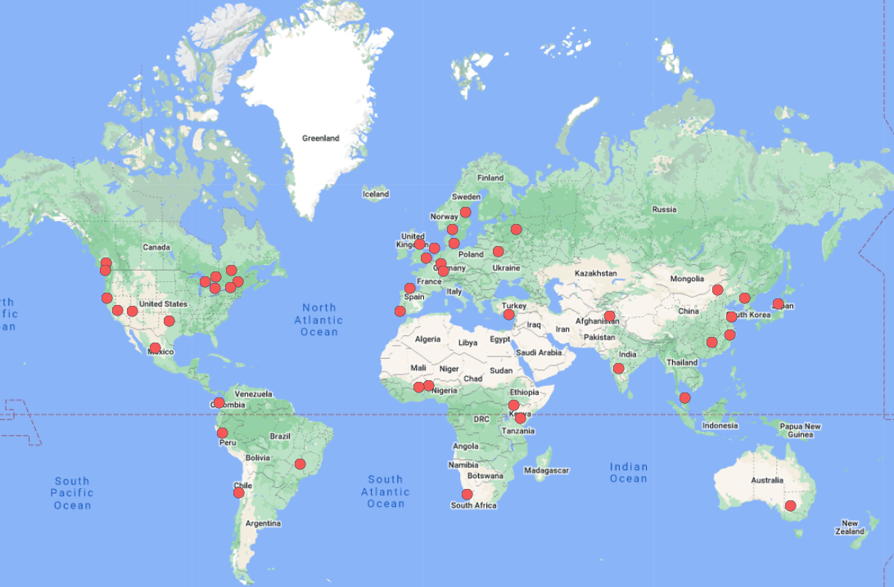

# TinyML for Weather and Climate Monitoring in Developing Countries

## Description

**Background:**

Developing Countries are the areas of the globe where land-based, in situ monitoring of weather and climate is at its scarcest, but at the same time has arguably the most potential to benefit society (see figure below, source: ECMWF).

[credit: https://www.ecmwf.int/en/forecasts/charts/monitoring/dcover?facets=undefined&time=2022050600,0,2022050600&obs=synop-ship&Flag=all]

Rainfall and temperature can have high spatial variability due to the strong feedback that can exist between the land and atmosphere. Temperature can change rapidly in space due to land-cover heterogeneity and changing altitude over complex mountainous terrain. This means that a weather station tens of kilometers away may measure conditions that have little relevance to your location, making it hard to make informed local decisions.

Attempts can be made to supplement weather information with satellite data, but these infer rainfall and near-surface temperature at spatially averaged scales exceeding 10km and are subject to considerable uncertainties despite advances in sensor technology; moreover, some data such as near-surface winds or solar flux are not available at all.

Local weather information can have a huge impact on communities, and applications enabled by granular weather data include agriculture, change in prices of commodities, and early warning systems.

[**TinyML**](https://aiforgood.itu.int/event/aiot-when-iot-meets-the-ai/) is a new technology that allows Machine Learning (ML) models to run on low-power microcontrollers that do not require a network infrastructure. We believe that TinyML has a great role to play not only to reach the SDGs, but also to facilitate scientific research in areas such as environmental monitoring, physics of complex systems, and energy management.

The [**tinyML Foundation**](https://www.tinyml.org/about/) is a non-profit organization with the mission to accelerate the growth of a prosperous and integrated Global Community of scientists, engineers, designers, product and business leaders developing leading edge energy efficient machine learning computing. The goal is to connect various technologies and innovations in this domain of machine intelligence to enormous product and business opportunities and value creation across the whole ecosystem.

The tinyML Foundation hosts monthly [**Meetups**](https://www.meetup.com/pro/tinyml) all over the world with 10,000+ members from 33+ countries.

# Problem Statement

The goal of this challenge is to create a low-cost, low-power, reliable, accurate, easy to install and maintain weather station, with no mechanical moving parts for measuring all weather conditions with a focus on rain and wind, based on ultra-low power machine learning at the edge, that can be deployed locally.

This weather station could be deployed in a farm, for example, to provide local conditions and assist farmers in deciding when to plant crops.

**Suggested process:**

* Collect local rain and wind acoustic or other types of sensor measurements with an embedded device without any moving parts and add them to your dataset.
* Develop a tinyML model to derive rain and wind values from sound measurements of rain and wind.
* Employ means to show when rain/wind are detected as well as intensivity levels.
* Deploy to an embedded device in the field and measure how well the model performs.
* Document the process and publish a video of the prototype.
* Optimize the overall power consumption.

**Stretch goal:**

* Develop a fully functioning rugged and cost-effective weather station based on a single device able to detect all weather parameters including TPH (temperature, pressure and humidity), wind and rain with no moving parts.

# Milestones and Checkpoints

**Checkpoints**

Through the following optional checkpoints, teams will be able to receive feedback and extra points.*

* **Monday July 25, 2022 - Proposal checkpoint**
    * Submit your project proposal to receive initial feedback and be notified of available development resources. (Optional and not all submissions will receive feedback.)
* **Monday August 15, 2022 - Dataset checkpoint**
    * Submit your rich and diverse dataset early to receive extra bonus points by the judges. (Optional and not all submissions will receive feedback.)
* **Monday September 5, 2022 - Model checkpoint**
    * Submit your tinyML model early to receive extra bonus points by the judges. (Optional and not all submissions will receive feedback.)
* **Monday October 3, 2022 - Device checkpoint**
    * Submit a video of your tinyML model working on an embedded device to receive extra bonus points by the judges. (Optional and not all submissions will receive feedback.)

**Final submission** - Monday November 14, 2022

Submit your fully functional weather station project for a chance to win the tinyML Challenge.

Submit:

* Final project write-up accompanied by photos and videos of your weather station prototype.
* Final dataset
* Final tinyML model
* Final embedded application

# Prizes

* **1st place prize**: $3,000 [CSEM: Aurora weather station]
* **2nd place prize**: $2,000 [Brain Circuit]
* **3rd place prize**: $1,000 [TinyCow, AI4Africa, ICFOSS]
* **Special Sustainability Prize** [KT: Kasun]
* **Special Prizes**
    
    * **Best use of [Edge Impulse](https://edgeimpulse.com/) prize**: $3,000 [Brain Circuit]
    
    * **Best use of Syntiant [TinyML Board](https://www.syntiant.com/tinyml)**: $500
    
    * **Additional 1st place prize**: [SenseCAP S1000 10-in-1 Compact Weather Sensor with CO2 Measurement](https://www.seeedstudio.com/SenseCAP-S1000-10-in-1-Compact-Weather-Sensor-with-CO2-Measurement-p-5362.html)
    [CSEM: Aurora weather station]
    
    * **Best vision-based weather station implementation**: $500 in [Sony merchandise](https://electronics.sony.com/) or gift card

*Cash prizes paid in cash or equivalent (gift card); amounts in US dollars. All awards are made in compliance with international monetary transfer restrictions and reporting requirements. Void where prohibited by law. All prizes awarded at the sole discretion of the tinyML Foundation or sponsoring company.*

# Resources

* [**Discussion Forum**](https://forums.tinyml.org/c/challenge-2022/19): To ask your questions and connect with other participants.

## Hardware and Software

* [**Edge Impulse**](https://studio.edgeimpulse.com/signup): Free license and [support](alessandro@edgeimpulse.com) to all participants.
* [**Syntiant**](https://www.syntiant.com/): Receive a $100 gift card when using the [TinyML Board](https://www.syntiant.com/tinyml).*
* [**Renesas**](https://www.renesas.com/): Receive a a $40 gift card when using the [RA2E1 Fast Prototyping Board](https://www.renesas.com/us/en/products/microcontrollers-microprocessors/ra-cortex-m-mcus/rtk7fpa2e1s00001be-ra2e1-fast-prototyping-board).* To learn more, see the [RA2E1 Application Note](https://www.renesas.com/us/en/products/microcontrollers-microprocessors/ra-cortex-m-mcus/rtk7fpa2e1s00001be-ra2e1-fast-prototyping-board) and [sample application](https://www.renesas.com/us/en/document/apn/ra2e1-hs3001-sensor-device-sample-application-project?language=en).
* [**Seeed Studio**](https://www.seeedstudio.com/): [TinyML hardware available](https://www.seeedstudio.com/ai-for-good-2022-explore-marvelous-world-of-tinyml.html) at 20% discount.
* [**Qeexo**](https://qeexo.com/): Free six-month Pro Tier license for [Qeexo AutoML](https://qeexo.com/ml-platform/) upon request to Elias Fallon.

## Other General Resources

* [tinyML Foundation](https://www.tinyml.org/)
* [https://tinyml.seas.harvard.edu/teach](https://tinyml.seas.harvard.edu/teach)
* [https://docs.edgeimpulse.com/docs](https://docs.edgeimpulse.com/docs)
* [https://arxiv.org/abs/2106.04008](https://arxiv.org/abs/2106.04008)

*Amounts in US dollars. All gift card reimbursements will be made at the sole discretion of the tinyML Foundation after the conclusion of the challenge upon submission of a substantive use of indicated hardware and proof of purchase. Limit one gift card per team. Gift cards are sent in compliance with international monetary transfer restrictions and reporting requirements. Void where prohibited by law.*