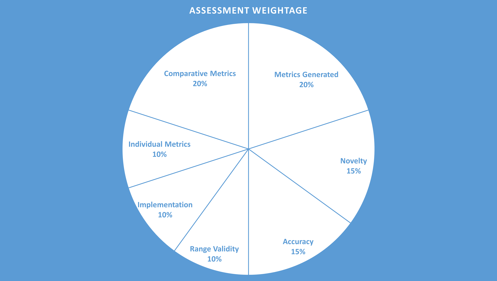

# Synthetic Observability Data Generation using GANs

## Description

Observability data can be any of the following:

I). **Telco-Cloud Infrastructure Metrics** (servers)
    * H/W Level
    * OS Level
    * Virtualization Level
II). Metrics/Statistics from Physical Network Elements.
III). Application (virtualized Network functions) Metrics
IV). System logs (Servers, Applications, etc.)
V). Metrics/Statistics from centralized orchestration systems (VIM, SDN-Controller, VNFM, NFVO, etc.)
VI). Metrics/Statistics from other control-plane services

Availability of these data for AI/ML researchers, who are not part of the Telco, is very difficult. To solve this availability issue, one approach is to generate synthetic observability data. In this project, we propose to generate this synthetic observability data using GANs. For this first round, only **Telco-Cloud Infrastructure Metrics** will be considered.

## Deliverables

### Code

* Either `.ipynb` or `.py` file(s).
* `requirements.txt` - List of dependent libraries.
* References, if any code is reused.

### Documentation

* Document (`.md` or `.rst`) explaining how to:
    * Provide input.
    * Run the code.
    * Collect Output.
* Maximum of 5-minute video of running the code and generating the output – with other description.
    * Use Zoom with screen-share and record to cloud to create this video and send the link.

### Output

* Create separate folders for each node.
    * Minimum: 1-Node
* In each node-folder:
    * Create folders for each metrics and place generated files in these 4 folders.
        * **CPU** (At least 1 of the below three)
            * `percent-user`
            * `percent-system`
            * `percent-idle`
        * **Memory** (At least 1 of the below two)
            * `used`
            * `free`
        * **Interface** (At least 1 of the below two)
            * `Packets/Octets`
            * `Dropped/Errors`
        * **Load**
            * `load*` (e.g., load1, load5, load15)
    * Each file should have at least 7000 entries.
    * * Only load file will have more than 2 columns.
* Zip the main folder.
* Name it with your team name.

## Assessment

### Categories

* **Metrics Generated**
    * CPU, Memory, Network, and Load.
* **Novelty**
    * Neural Network
    * Discriminator
* **Accuracy**
    * Range Validity
        * Max and Mins
        * Variations
        * Trend
* **Implementation**
    * Code Quality
    * Code Re-Use
* **Individual Metrics** (Analyzed for each generated metric)
    * Distribution
    * Autocorrelation
    * ARIMA
* **Comparative Metrics** (Comparing generated data with real data or across generated metrics)
    * DTW (Dynamic Time Warping)
    * Wasserstein Distance
    * RMSE (Root Mean Square Error)
    * Maximum Mean Discrepancy
    * Mutual Information
* **Weightage Distribution** (Details not provided in the text, but implies how the above categories are weighted)

These details can also be accessed here: [https://wiki.anuket.io/display/HOME/Delivery+and+Assessment](https://wiki.anuket.io/display/HOME/Delivery+and+Assessment)

# Data Source

Real-World observability data (Telco-Cloud Infrastructure Metrics) will be provided.

---

# Resources

Computing resources can be provided to those who do not have access to one.

---

# Contact

* **Lei Huang**: huangleiyjy@chinamobile.com
* **Sridhar K. N. Rao**: sridharkn@u.nus.edu