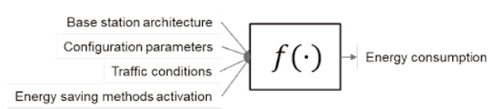
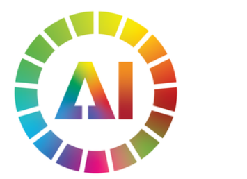

# AIML for 5G-Energy Consumption Modelling by ITU AIML in 5G Challenge

##  Can you predict energy consumption of different 5G products?
Original on Zindi: https://zindi.africa/competitions/aiml-for-5g-energy-consumption-modelling

5G, the fifth generation of radio technology, has brought about new services, technologies, and networking paradigms, with the corresponding social benefits. However, there is growing concern over the energy consumption of these new network deployments. While 5G networks are estimated to be about 4x more energy-efficient than 4G networks, their energy consumption is approximately 3x larger due to the need for a larger number of cells to provide the same coverage at higher frequencies and the increased processing required for wider bandwidths and more antennas. It is worth noting that, on average, network operational expenditure (OPEX) already accounts for around 25 percent of the total operator’s cost, and 90 percent of it is spent on large energy bills. More than 70 percent of this energy is estimated to be consumed by the radio access network (RAN), particularly by the base stations (BSs), while data centres and fibre transport account for a smaller share.

Base station energy consumption depends on multiple factors, such as specific architecture (e.g. RRU or AAU), configuration parameters (e.g., number of operated carriers, bandwidth, transmit power), traffic conditions (e.g., number of allocated physical resource blocks), and the activation of energy-saving methods (e.g., symbol shutdown, RF shutdown). To reduce network energy consumption, it is crucial to optimize base station parameters and energy-saving methods. This requires a deep understanding of how these parameters and methods impact the energy consumption of different base stations. Therefore, accurate modelling of energy consumption is essential for achieving more energy-efficient network deployments.

This ML challenge targets addressing the important questions mentioned above. In the challenge, the participants are asked to design a machine learning-based solution that can be trained on a dataset of few scenarios and then generalize successfully to data from scenarios not seen before. In particular, the designed machine learning model must be able to achieve the following objectives.

Objective A: Develop a model able to estimate the energy consumed by different base station products. The participants are required to develop a model that estimates the energy consumed by different base station products, taking into consideration the impact of various engineering configurations, traffic conditions, and energy-saving methods.

Objective B: Achieve generalization capabilities across different base station products. The model must estimate the energy consumption of a new base station product based on measurements collected from existing ones, such as Products A, B, and C. For example, if training data is available for these three products, the model must be able to provide an estimate of the energy consumed by Product D.

Objective C: Achieve generalization capabilities across different base station configurations. The model must predict the energy consumption of newly configured parameters based on a small number of real network configuration parameters. For instance, if the training data contains samples collected from many base station products, when the transmit power is set to 30, 35, and 43 dBm, the model must estimate the energy consumed when the transmit power is set to 40 dBm.

### About AI for Good - International Telecommunication Union (ITU)

AI for Good is organized by ITU in partnership with 40 UN Sister Agencies. The goal of AI for Good is to identify practical applications of AI to advance the United Nations Sustainable Development Goals and scale those solutions for global impact. It’s the leading action-oriented, global & inclusive United Nations platform on AI.

#### Evaluation

While the challenge is running your submissions will be scored on Mean Absolute Error.

For every row in the dataset, submission files should contain 2 columns: Time and Energy.

Your submission file should look like this (numbers to show format only):

| Time | Energy |
| :--- | :--- |
| 2023-01-01_B_0 | 84.154 |
| 2023-01-01_B_0 | 17.178 |

Once the challenge has closed the private leaderboard will be delayed by 48 hours as we take your submission file and score it against WMAPE and this will constitute your final leaderboard score.

The private leaderboard scores of your two chosen submissions, will be overwritten with your WMAPE scores, so remember to select your two best submissions before the deadline.

To focus on the cross-equipment and cross-configuration generalization capability of the model, the test set estimation accuracy is evaluated by using a weighted relative error evaluation method. Specifically, the error weight, w_i, of the sample corresponding to the new device and/or new configuration in the test set is larger and is provided in the test set. The error metric is defined as:

$$WMAPE = \frac{\sum_{i=1}^{n} (w_i |y_i - \hat{y}_i|)}{\sum_{i=1}^{n} (w_i |y_i|)}$$

where y_i is the true energy consumption and (y_i)^ is the estimated energy consumption.

The final model performance is ranked according to the minimum WMAPE error.

Participants are required to submit:

1. A CSV file named power_consumption_prediction.csv, containing the power consumption prediction performed over the test set;
2. The developed model code;
3. A report explaining their solution, including the outcomes of their models.

In evaluating the final submission, both the quality of the report (weighted 50%) and the achieved model score (weighted 50%) will be considered.

As there are 8 prizes to be won, once the private leaderboard has been revealed, ALL users will be required to submit the 3 items detailed above to a Google Form that will be shared with the client. The form will be shared and opened once the private leaderboard has been revealed and closed 48 hours afterward.

### Prizes

1st place: 5 000 CHF cash prize + 5 000 CHF travel grant to Dubai to present your solution.
2nd place: 3 000 CHF
3rd place: 2 000 CHF
4th place: 1 000 CHF
5th place: 1 000 CHF
Best solution from students: 1 000 CHF
The most creative solution: 1 000 CHF
Best presentation: 1 000 CHF
Internship will be offered the winning team at Huawei.

Participants are required to submit:

A CSV file named power_consumption_prediction.csv, containing the power consumption prediction performed over the test set;
The developed model code;
A report explaining their solution, including the outcomes of their models.
As there are 8 prizes to be won, once the private leaderboard has been revealed, ALL users will be required to submit the 3 items detailed above to a Google Form that will be shared with the client. The form will be shared and opened once the private leaderboard has been revealed and closed 48 hours afterward.

There are 20 000 Zindi points available. You can read more about Zindi points [here](https://zindi.africa/discussions/13959?utm_source=zindi&utm_medium=blog&utm_campaign=challenge_resources&utm_id=CR).

Participants are required to submit:

1. A CSV file containing model predictions (online leaderboard);
2. The developed model code;
3. A report explaining their solution, including the outcomes of their models. The technical report will be used to judge the novelty/originality and usefulness of the proposed methodology
4. Participants will be required to present their solutions to an ITU Challenge Finale session

In evaluating the final submission, both the quality of the report (weighted 40%) and the achieved model score (weighted 60%) will be considered.

### Timeline
Competition closes on 13 October 2023.

Final submissions must be received by 11:59 PM GMT.

We reserve the right to update the contest timeline if necessary.

### Rules
#### Teams and collaboration

You may participate in challenges as an individual or in a team of up to four people. When creating a team, the team must have a total submission count less than or equal to the maximum allowable submissions as of the formation date. A team will be allowed the maximum number of submissions for the challenge, minus the total number of submissions among team members at team formation. Prizes are transferred only to the individual players or to the team leader.

Multiple accounts per user are not permitted, and neither is collaboration or membership across multiple teams. Individuals and their submissions originating from multiple accounts will be immediately disqualified from the platform.

Code must not be shared privately outside of a team. Any code that is shared, must be made available to all challenge participants through the platform. (i.e. on the discussion boards).

The Zindi data scientist who sets up a team is the default Team Leader but they can transfer leadership to another data scientist on the team. The Team Leader can invite other data scientists to their team. Invited data scientists can accept or reject invitations. Until a second data scientist accepts an invitation to join a team, the data scientist who initiated a team remains an individual on the leaderboard. No additional members may be added to teams within the final 5 days of the challenge or last hour of a hackathon.

The team leader can initiate a merge with another team. Only the team leader of the second team can accept the invite. The default team leader is the leader from the team who initiated the invite. Teams can only merge if the total number of members is less than or equal to the maximum team size of the challenge.

A team can be disbanded if it has not yet made a submission. Once a submission is made individual members cannot leave the team.

All members in the team receive points associated with their ranking in the challenge and there is no split or division of the points between team members.

### Full Challenge Rules
This challenge is open to all.

#### Datasets and packages

The solution must use publicly-available, open-source packages only. Your models should not use any of the metadata provided.

You may use only the datasets provided for this competition. Automated machine learning tools such as automl are not permitted.

If the challenge is a computer vision challenge, image metadata (Image size, aspect ratio, pixel count, etc) may not be used in your submission.

If external data is allowed you may only use data that is freely available to everyone. You must send it to Zindi to confirm that it is allowed to be used and then it will appear on the data page under additional data.

You may use pretrained models as long as they are openly available to everyone.

You are allowed to access, use and share competition data for any non-commercial, research or education purposes, under a CC BY-NC-SA license.

@INPROCEEDINGS{9897443,

  author={Nalepa, Jakub and Le Saux, Bertrand and Longépé, Nicolas and Tulczyjew, Lukasz and Myller, 
  Michal and Kawulok, Michal and Smykala, Krzysztof and Gumiela, Michal},
  booktitle={2022 IEEE International Conference on Image Processing (ICIP)},
  title={The Hyperview Challenge: Estimating Soil Parameters from Hyperspectral Images},
  year={2022},
  pages={4268-4272},
  doi={10.1109/ICIP46576.2022.9897443}
}
Your solution must not infringe the rights of any third party and you must be legally entitled to assign ownership of all rights of copyright in and to the winning solution code to Zindi.

#### Submissions and winning

You may make a maximum of 10 submissions per day.

You may make a maximum of 300 submissions for this challenge.

Before the end of the challenge you need to choose 2 submissions to be judged on for the private leaderboard. If you do not make a selection your 2 best public leaderboard submissions will be used to score on the private leaderboard.

During the challenge, your best public score will be displayed regardless of the submissions you have selected. When the challenge closes your best private score out of the 2 selected submissions will be displayed.

Zindi maintains a public leaderboard and a private leaderboard for each challenge. The Public Leaderboard includes approximately 30% of the test dataset. While the challenge is open, the Public Leaderboard will rank the submitted solutions by the accuracy score they achieve. Upon close of the challenge, the Private Leaderboard, which covers the other 70% of the test dataset, will be made public and will constitute the final ranking for the challenge.

Note that to count, your submission must first pass processing. If your submission fails during the processing step, it will not be counted and not receive a score; nor will it count against your daily submission limit. If you encounter problems with your submission file, your best course of action is to ask for advice on the Competition’s discussion forum.

If you are in the top 10 at the time the leaderboard closes, we will email you to request your code. On receipt of email, you will have 48 hours to respond and submit your code following the Reproducibility of submitted code guidelines detailed below. Failure to respond will result in disqualification.

If your solution places in the top 10 on the final leaderboard, you will be required to submit your winning solution code to us for verification.

If two solutions earn identical scores on the leaderboard, the tiebreaker will be the date and time in which the submission was made (the earlier solution will win).

The winners will be paid via bank transfer, PayPal if payment is less than or equivalent to $100, or other international money transfer platform. International transfer fees will be deducted from the total prize amount, unless the prize money is under $500, in which case the international transfer fees will be covered by Zindi. In all cases, the winners are responsible for any other fees applied by their own bank or other institution for receiving the prize money. All taxes imposed on prizes are the sole responsibility of the winners. The top winners or team leaders will be required to present Zindi with proof of identification, proof of residence and a letter from your bank confirming your banking details. Winners will be paid in USD or the currency of the challenge. If your account cannot receive US Dollars or the currency of the challenge then your bank will need to provide proof of this and Zindi will try to accommodate this.

Payment will be made after code review and sealing the leaderboard.

You acknowledge and agree that Zindi may, without any obligation to do so, remove or disqualify an individual, team, or account if Zindi believes that such individual, team, or account is in violation of these rules. Entry into this challenge constitutes your acceptance of these official challenge rules.

Zindi is committed to providing solutions of value to our clients and partners. To this end, we reserve the right to disqualify your submission on the grounds of usability or value. This includes but is not limited to the use of data leaks or any other practices that we deem to compromise the inherent value of your solution.

Zindi also reserves the right to disqualify you and/or your submissions from any challenge if we believe that you violated the rules or violated the spirit of the challenge or the platform in any other way. The disqualifications are irrespective of your position on the leaderboard and completely at the discretion of Zindi.

Please refer to the FAQs and Terms of Use for additional rules that may apply to this challenge. We reserve the right to update these rules at any time.

#### Reproducibility of submitted code

- If your submitted code does not reproduce your score on the leaderboard, we reserve the right to adjust your rank to the score generated by the code you submitted.

- If your code does not run you will be dropped from the top 10. Please make sure your code runs before submitting your solution.

- Always set the seed. Rerunning your model should always place you at the same position on the leaderboard. When running your solution, if randomness shifts you down the leaderboard we reserve the right to adjust your rank to the closest score that your submission reproduces.

- Custom packages in your submission will not be accepted.

- You may only use tools available to everyone i.e. no paid services or free trials that require a credit card.

Read this [article](https://zindi.africa/learn/how-to-ensure-success-when-submitting-your-code-for-review) on how to prepare your documentation and this article on how to ensure a successful code review.

#### Data standards:

- Your submitted code must run on the original train, test, and other datasets provided.
- If external data is allowed, external data must be freely and publicly available, including pre-trained models with standard libraries. If external data is allowed, any data used should be shared with Zindi to be approved and then shared on the discussion forum. Zindi will also make note of the external data available on the data page.

- Packages:
- You must submit a requirements file with all packages and versions used.
- If a requirements file is not provided, solutions will be run on the most recent packages available.
- Custom packages in your submission notebook will not be accepted.
- You may only use tools available to everyone i.e. no paid services or free trials that require a credit card.

### Documentation
A README markdown file is required

It should cover:

- How to set up folders and where each file is saved
- Order in which to run code
- Explanations of features used
- Environment for the code to be run (conda environment.yml file or an environment.txt file)
- Hardware needed (e.g. Google Colab or the specifications of your local machine)
- Expected run time for each notebook. This will be useful to the review team for time and resource allocation.

Your code needs to run properly, code reviewers do not have time to debug code. If code does not run easily you will be bumped down the leaderboard.

#### Consequences of breaking any rules of the challenge or submission guidelines:

- First offence: No prizes for 6 months and 2000 points will be removed from your profile (probation period). If you are caught cheating, all individuals involved in cheating will be disqualified from the challenge(s) you were caught in and you will be disqualified from winning any challenges for the next six months and 2000 points will be removed from your profile. If you have less than 2000 points to your profile your points will be set to 0.

- Second offence: Banned from the platform. If you are caught for a second time your Zindi account will be disabled and you will be disqualified from winning any challenges or Zindi points using any other account.

- Teams with individuals who are caught cheating will not be eligible to win prizes or points in the challenge in which the cheating occurred, regardless of the individuals’ knowledge of or participation in the offence.

- Teams with individuals who have previously committed an offence will not be eligible for any prizes for any challenges during the 6-month probation period.

#### Monitoring of submissions

- We will review the top 10 solutions of every challenge when the challenge ends.
- We reserve the right to request code from any user at any time during a challenge. You will have 24 hours to submit your code following the rules for code review (see above). Zindi reserves the right not to explain our reasons for requesting code. If you do not submit your code within 24 hours you will be disqualified from winning any challenges or Zindi points for the next six months. If you fall under suspicion again and your code is requested and you fail to submit your code within 24 hours, your Zindi account will be disabled and you will be disqualified from winning any challenges or Zindi points with

### References
[1] N. Piovesan, D. López-Pérez, A. De Domenico, X. Geng, H. Bao, M. Debbah, “Machine Learning and Analytical Power Consumption Models for 5G Base Stations”, IEEE Communications Magazine, 60(10), 56-62, 2022 [2] N. Piovesan, D. López-Pérez, A. De Domenico, X. Geng, H. Bao, “Power Consumption Modeling of 5G Multi-Carrier Base Stations: A Machine Learning Approach”, 2023 IEEE International Conference of Communications (ICC