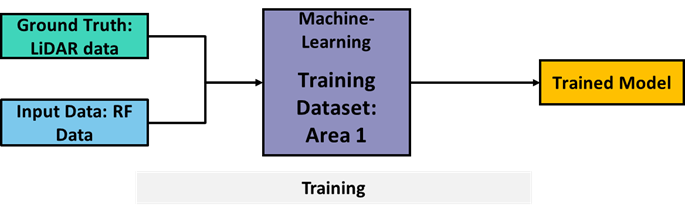
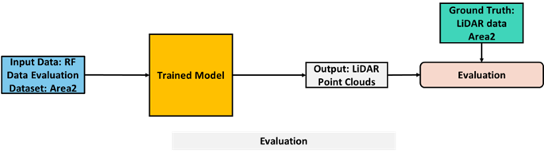
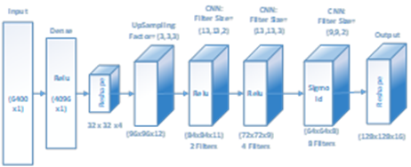

# PS-005 -- Depth Map Estimation in 6G mmWave systems

## Introduction
## Description

<u>Introduction</u>

The Depth Map Estimation in 6G mmWave systems challenge tackles one of the key problems to realizing the vision of digital-twin-enabled 6G systems.

Digital twin is the ability to create a virtual representation of a physical system and its dynamics. In 6G networks, for instance, a digital twin could virtually implement the physical wireless propagation environment, enabling learning, optimization, and dynamical re-calibration of 6G operational parameters to improve network performance. To fulfil this vision, extracting new information from existing sensors is of greatest importance to enable and create scalable and efficient digital twin networks. Using existing mmWave systems already present in current devices incurs no additional cost of integrating other sensors. Moreover, jointly using communication signals to perform depth map estimation, enables easier network management, keeping network bandwidth usage, reliability, and latency under control, since no extra data and overhead is generated by using secondary sensors. Equally importantly, exploiting signals already designed with the purpose of wireless communication will avoid energy consumption escalation.
*
#### **<u>Problem statement</u>**:
Participants are challenged to propose an AI/ML algorithm that reconstructs the depth map of an indoor environment, given a data set consisting of mmWave MIMO channel impulse responses and the corresponding depth map representation of the room. The dataset is obtained using the NIST high-precision 3D double-directional 60 GHz channel sounder, which beyond conventional RF information, collects depth maps by using a lidar. During the measurement campaign, one node is fixed, while the second node is moving and collecting information in more than 6000 locations of the room.

In the training phase, participants will be provided with MIMO channel impulse responses and the corresponding environment information obtained from the lidar.

Participants will be asked to evaluate their algorithm using an evaluation dataset consisting of MIMO channel impulse responses collected in the same room but in different locations of the room.

<u>**Baseline Solution**</u>

A baseline solution is provided: https://github.com/ITU-AI-ML-in-5G-Challenge/ML5G-PS-004-Depth-map-estimation-in-6G-mmWave-systems

This solution consists of 2 main steps:

1. Pre-processing of the data: processing bi-static MIMO channel data to fit mono-static LIDAR data.
2. A ML model proposed consists of a dense layer, which makes the connection with all the elements of input to the hidden layer neurons followed by a convolutional neural network.

### **Evaluation criteria**
Point cloud similarity

### **Data source**
The challenge relies on measurements obtained using the NIST 3D double-directional 60 GHz channel sounder

 **Training Data set**

- MIMO Channel Impulse Response
- Lidar depth map

**Test**

- MIMO Channel Impulse Response
https://drive.google.com/drive/folders/1jGtE3UtdqgEkBojJ8OS7rYHA0H7kf6OW?usp=sharing

### **Resources**
https://github.com/usnistgov/ML5G-PS-004

### **References**
https://www.nist.gov/communications-technology-laboratory/wireless-networks-division/millimeter-wave-channel-sounding

https://ieeexplore.ieee.org/stamp/stamp.jsp?tp=&arnumber=9664350

### **Contact**
steve.blandino@nist.gov