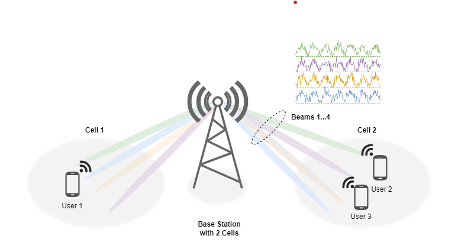
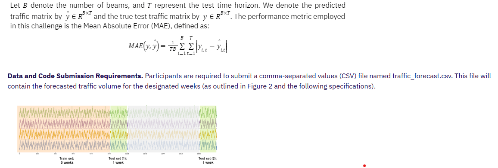

# Smart Energy Supply Scheduling for Green Telecom Challenge by ITU

## Can you forecast traffic throughput volumes within communication networks?

Original on Zindi: https://zindi.africa/competitions/spatio-temporal-beam-level-traffic-forecasting-challenge

Join the launch webinar on Tuesday 6 August here --> https://neuralnetwork.aiforgood.itu.int/event/ai-for-good/register?registerAsParticipant=true&externalId=27487

This competition introduces a new challenge within the field of spatio-temporal forecasting. The challenge centers on forecasting traffic throughput volumes within communication networks (as illustrated in Figure 1). Precise prediction of traffic volume holds significant importance for optimizing network flow and resource allocation, thereby rendering this task highly relevant to the scientific community in the domains of networking and machine learning. To effectively address this challenge, the competition necessitates the development of solutions leveraging state-of-the-art (SOTA) forecasting machine learning models capable of analyzing complex, multivariate time series data.

<i>Figure 1. An illustration of a base station (center), two cells (left and right), and four beams in each cell.</i>

A distinguishing feature of this challenge is the provision of high-resolution, beam-level throughput data with precise hourly granularity. Furthermore, the dataset encompasses not only throughput volume, but also throughput time, Physical Resource Block (PRB) utilization, and user count.

The objective of this challenge is to develop a multivariate time series forecasting model for traffic volume (DLThpVol) at the beam level. This model will be trained on high-resolution data to capture the intricacies of real-world traffic scenarios.

By leveraging machine learning expertise, participants will design and implement models that surpass the accuracy of baseline models provided. Successful development of such models has the potential to revolutionize traffic management practices, yielding societal benefits such as energy conservation, reduced network congestion, improved user experiences, and enhanced environmental sustainability.

### About AI for Good - International Telecommunication Union (ITU)

AI for Good is organized by ITU in partnership with 40 UN Sister Agencies. The goal of AI for Good is to identify practical applications of AI to advance the United Nations Sustainable Development Goals and scale those solutions for global impact. It’s the leading action-oriented, global & inclusive United Nations platform on AI.

### Evaluation
Please note scoring will take ~50 minutes per submission to score so please be patient.

<i>Figure 2. Dataset splits: train set available to participants for weeks (first 5 weeks), and two target weeks (immediate 6th week and the 11th week).</i>

File Name: traffic_forecast.csv
IDs: This column contains identifiers for the forecasted values, covering weeks 5-6 and 10-11. Each identifier specifies a combination of hour, gnodeb, cell, and beam (168 hours [0--167], 30 gnodebs [0--29], 3 cells [0--2], and 32 [0--31] beams per week). The format for these identifiers is:

1. traffic_DLThpVol_test_5w-6w_hour_gnodeb_cell_beam
2. traffic_DLThpVol_test_10w-11w_hour_gnodeb_cell_beam

- Target: The corresponding forecasted DLThpVol value.

The challenge organizers evaluated the performance of several baseline models. We report the MAE achieved by these models in the following table.

### Prizes
1st prize: 7 000 CHF, this includes 3 000 CHF to travel to Top  AI/ML Conference

2nd prize: 2 000 CHF

3rd prize: 1 000 CHF

4th place: 1 000 CHF

5th place: 500 CHF

6th place: 500 CHF

There are 12 000 Zindi points available. You can read more about Zindi points [here](https://zindi.africa/discussions/13959?utm_source=zindi&utm_medium=blog&utm_campaign=challenge_resources&utm_id=CR).

### Timeline
Competition starts on 24 July 2024 at 8:00 AM GMT.

Competition closes on 11 October 2024.

Final submissions must be received by 11:59 PM GMT.

We reserve the right to update the contest timeline if necessary.

### Rules

- Languages and tools: You may only use open-source languages and tools in building models for this challenge.
- Who can compete: Open to all
- Submission Limits: 2 submissions per day, 200 submissions overall.
- Team size: Max team size of 4
- Public-Private Split: Zindi maintains a public leaderboard and a private leaderboard for each challenge. The Public Leaderboard includes approximately 30% of the test dataset. The private leaderboard will be revealed at the close of the challenge and contains the remaining 70% of the test set.
- Data Sharing: CC-BY SA 4.0 license XX
- Platform abuse: Multiple accounts, or sharing of code and information across accounts not in teams, or any other forms of platform abuse are not allowed, and will lead to disqualification.
- Code Review: Top 10 on the private leaderboard will receive an email requesting their code at the close of the challenge. You will have 48 hours to submit your code. XX

ENTRY INTO THIS CHALLENGE CONSTITUTES YOUR ACCEPTANCE OF THESE OFFICIAL CHALLENGE RULES.

### Full Challenge Rules
This challenge is open to all.

#### Teams and collaboration

You may participate in challenges as an individual or in a team of up to four people. When creating a team, the team must have a total submission count less than or equal to the maximum allowable submissions as of the formation date. A team will be allowed the maximum number of submissions for the challenge, minus the total number of submissions among team members at team formation. Prizes are transferred only to the individual players or to the team leader.

Multiple accounts per user are not permitted, and neither is collaboration or membership across multiple teams. Individuals and their submissions originating from multiple accounts will be immediately disqualified from the platform.

Code must not be shared privately outside of a team. Any code that is shared, must be made available to all challenge participants through the platform. (i.e. on the discussion boards).

The Zindi data scientist who sets up a team is the default Team Leader but they can transfer leadership to another data scientist on the team. The Team Leader can invite other data scientists to their team. Invited data scientists can accept or reject invitations. Until a second data scientist accepts an invitation to join a team, the data scientist who initiated a team remains an individual on the leaderboard. No additional members may be added to teams within the final 5 days of the challenge or last hour of a hackathon.

The team leader can initiate a merge with another team. Only the team leader of the second team can accept the invite. The default team leader is the leader from the team who initiated the invite. Teams can only merge if the total number of members is less than or equal to the maximum team size of the challenge.

A team can be disbanded if it has not yet made a submission. Once a submission is made individual members cannot leave the team.

All members in the team receive points associated with their ranking in the challenge and there is no split or division of the points between team members.

#### Datasets and packages

The solution must use publicly-available, open-source packages only.

You may use only the datasets provided for this challenge. Automated machine learning tools such as automl are not permitted.

You may use pretrained models as long as they are openly available to everyone.

You are allowed to access, use and share challenge data for any commercial,. non-commercial, research or education purposes, under a CC-BY SA 4.0 license.

You must notify Zindi immediately upon learning of any unauthorised transmission of or unauthorised access to the challenge data, and work with Zindi to rectify any unauthorised transmission or access.

Your solution must not infringe the rights of any third party and you must be legally entitled to assign ownership of all rights of copyright in and to the winning solution code to Zindi.

#### Submissions and winning

You may make a maximum of 10 submissions per day.

You may make a maximum of 200 submissions for this competition.

Before the end of the competition you need to choose 2 submissions to be judged on for the private leaderboard. If you do not make a selection your 2 best public leaderboard submissions will be used to score on the private leaderboard.

During the competition, your best public score will be displayed regardless of the submissions you have selected. When the competition closes your best private score out of the 2 selected submissions will be displayed.

Zindi maintains a public leaderboard and a private leaderboard for each competition. The Public Leaderboard includes approximately 20% of the test dataset. While the competition is open, the Public Leaderboard will rank the submitted solutions by the accuracy score they achieve. Upon close of the competition, the Private Leaderboard, which covers the other 80% of the test dataset, will be made public and will constitute the final ranking for the competition.

Note that to count, your submission must first pass processing. If your submission fails during the processing step, it will not be counted and not receive a score; nor will it count against your daily submission limit. If you encounter problems with your submission file, your best course of action is to ask for advice on the Competition’s discussion forum.

If you are in the top 10 at the time the leaderboard closes, we will email you to request your code. On receipt of email, you will have 48 hours to respond and submit your code following the Reproducibility of submitted code guidelines detailed below. Failure to respond will result in disqualification.

If your solution places 1st, 2nd, or 3rd on the final leaderboard, you will be required to submit your winning solution code to us for verification, and you thereby agree to assign all worldwide rights of copyright in and to such winning solution to Zindi.

If two solutions earn identical scores on the leaderboard, the tiebreaker will be the date and time in which the submission was made (the earlier solution will win).

The winners will be paid via bank transfer, PayPal if payment is less than or equivalent to $100, or other international money transfer platform. International transfer fees will be deducted from the total prize amount, unless the prize money is under $500, in which case the international transfer fees will be covered by Zindi. In all cases, the winners are responsible for any other fees applied by their own bank or other institution for receiving the prize money. All taxes imposed on prizes are the sole responsibility of the winners. The top winners or team leaders will be required to present Zindi with proof of identification, proof of residence and a letter from your bank confirming your banking details. Winners will be paid in USD or the currency of the competition. If your account cannot receive US Dollars or the currency of the competition then your bank will need to provide proof of this and Zindi will try to accommodate this.

Payment will be made after code review and sealing the leaderboard.

You acknowledge and agree that Zindi may, without any obligation to do so, remove or disqualify an individual, team, or account if Zindi believes that such individual, team, or account is in violation of these rules. Entry into this competition constitutes your acceptance of these official competition rules.

Zindi is committed to providing solutions of value to our clients and partners. To this end, we reserve the right to disqualify your submission on the grounds of usability or value. This includes but is not limited to the use of data leaks or any other practices that we deem to compromise the inherent value of your solution.

Zindi also reserves the right to disqualify you and/or your submissions from any competition if we believe that you violated the rules or violated the spirit of the competition or the platform in any other way. The disqualifications are irrespective of your position on the leaderboard and completely at the discretion of Zindi.

Please refer to the FAQs and Terms of Use for additional rules that may apply to this competition. We reserve the right to update these rules at any time.

#### Reproducibility of submitted code

- If your submitted code does not reproduce your score on the leaderboard, we reserve the right to adjust your rank to the score generated by the code you submitted.

- If your code does not run you will be dropped from the top 10. Please make sure your code runs before submitting your solution.

- Always set the seed. Rerunning your model should always place you at the same position on the leaderboard. When running your solution, if randomness shifts you down the leaderboard we reserve the right to adjust your rank to the closest score that your submission reproduces.

- Custom packages in your submission will not be accepted.

- You may only use tools available to everyone i.e. no paid services or free trials that require a credit card.

Read this [article](https://zindi.africa/learn/how-to-ensure-success-when-submitting-your-code-for-review) on how to prepare your documentation and this article on how to ensure a successful code review.

### Documentation
A README markdown file is required

It should cover:

- How to set up folders and where each file is saved
- Order in which to run code
- Explanations of features used
- Environment for the code to be run (conda environment.yml file or an environment.txt file)
- Hardware needed (e.g. Google Colab or the specifications of your local machine)
- Expected run time for each notebook. This will be useful to the review team for time and resource allocation.

Your code needs to run properly, code reviewers do not have time to debug code. If code does not run easily you will be bumped down the leaderboard.

#### Consequences of breaking any rules of the challenge or submission guidelines:

- First offence: No prizes for 6 months and 2000 points will be removed from your profile (probation period). If you are caught cheating, all individuals involved in cheating will be disqualified from the challenge(s) you were caught in and you will be disqualified from winning any challenges for the next six months and 2000 points will be removed from your profile. If you have less than 2000 points to your profile your points will be set to 0.

- Second offence: Banned from the platform. If you are caught for a second time your Zindi account will be disabled and you will be disqualified from winning any challenges or Zindi points using any other account.

- Teams with individuals who are caught cheating will not be eligible to win prizes or points in the challenge in which the cheating occurred, regardless of the individuals’ knowledge of or participation in the offence.

- Teams with individuals who have previously committed an offence will not be eligible for any prizes for any challenges during the 6-month probation period.

#### Monitoring of submissions

- We will review the top 10 solutions of every challenge when the challenge ends.
- We reserve the right to request code from any user at any time during a challenge. You will have 24 hours to submit your code following the rules for code review (see above). Zindi reserves the right not to explain our reasons for requesting code. If you do not submit your code within 24 hours you will be disqualified from winning any challenges or Zindi points for the next six months. If you fall under suspicion again and your code is requested and you fail to submit your code within 24 hours, your Zindi account will be disabled and you will be disqualified from winning any challenges or Zindi points with