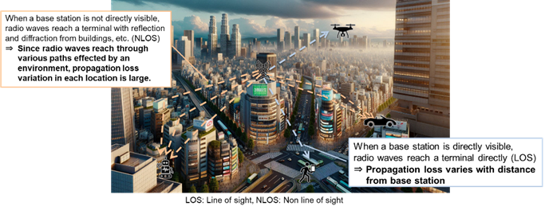
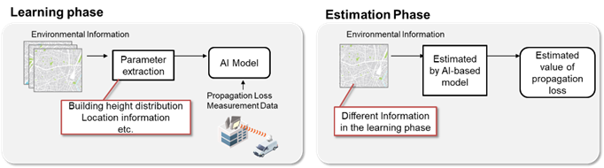
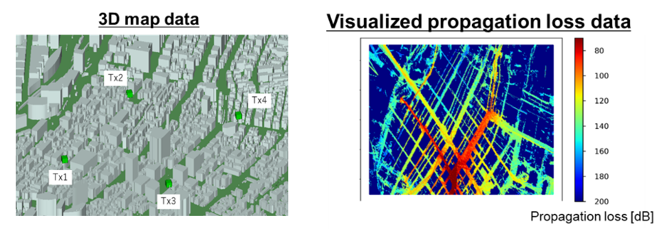
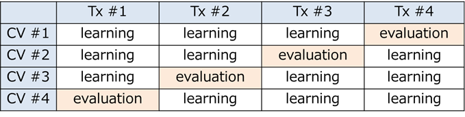
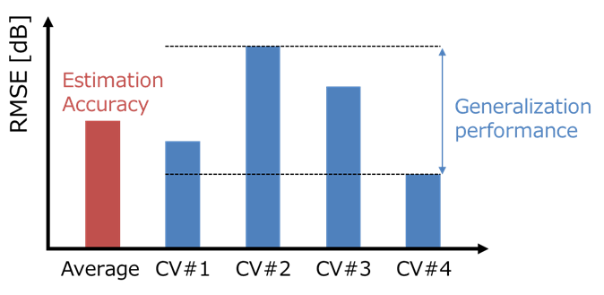
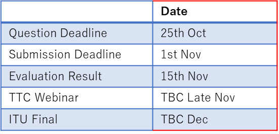

# Description

To provide stable communication in mobile networks, it is necessary to deliver signals to the areas where users are located without causing interference to neighboring areas. This requires adjustments to the position of base stations and antenna directions. For this purpose, a high-precision estimation of propagation loss is required to represent the attenuation of signals. Propagation models have been used for this estimation. They are based on statistical parameters such as measured data and average building heights and road widths in the surrounding environment. However, the propagation models do not adequately reflect environmental information such as different buildings and structures in each location, leading to insufficient accuracy (Fig. 1).

Therefore, in recent years, there has been active research on developing propagation models that utilize AI/ML technologies to accurately estimate the propagations in each location. These technologies learn the relationship between environmental information, such as structures extracted from map data, and propagation loss, then they estimate the propagations in each location using AI/ML models (Fig. 2). This challenge is to construct an AI/ML model to accurately estimate propagation loss. To achieve this, the following steps will be taken: (1) identifying the features of the environmental information used for estimation, (2) parameterizing (quantifying) these features, and (3) examining the relationship between the parameters in the learning model and the propagation loss.

The details are explained in the explanation material. Participants should check it in Data Source.

This problem statement is being conducted by:

* **Management**: [IEICE RISING](https://www.ieice.org/cs/rising/en/index.html) and [KDDI Research](https://www.kddi-research.jp/english/), Inc.
* **Problem statement**: KDDI Research, Inc.
* **Sponsorship**: XG Mobile Promotion Forum [XGMF, Japan](https://xgmf.jp/) and The Telecommunication Technology Committee [TTC, Japan](https://www.ttc.or.jp/e)

# Tasks of this Challenge

Participants will estimate propagation loss within a certain area from a transmission point (Tx) using 3D map data and propagation loss data from multiple Txs (Fig. 3).

## Tasks

* **Task 1 (Basic)**: Frequency = 800 MHz
* **Task 2 (Advanced)**: Frequency = 7 GHz
* **Task 3 (Advanced)**: Frequency = 28 GHz

Due to the increased influence of the environment, the difficulty level becomes higher in the order of Task 2 to 3.

## Webinar Recording

* **English**: [Link to English Webinar](https://www.youtube.com/watch?v=C4np69oTXQ0)
* **Japanese**: [Link to Japanese Webinar](https://www.youtube.com/watch?v=uLN8Ws9RL3A)

# Dataset

## 3D Map Data

* **File Format**: OBJ file format, converted from PLATEAU data (*).
    * (*) The data is sourced from "PLATEAU Open Data 3D Urban Model Chuo-ku[1] and Chiyoda-ku[2]” (Ministry of Land, Infrastructure, Transport and Tourism, Japan). The provided data is a file format conversion.
    * [1] [https://www.geospatial.jp/ckan/dataset/plateau-13102-chuo-ku-2023](https://www.geospatial.jp/ckan/dataset/plateau-13102-chuo-ku-2023)
    * [2] [https://www.geospatial.jp/ckan/dataset/plateau-13101-chiyoda-ku-2023](https://www.geospatial.jp/ckan/dataset/plateau-13101-chiyoda-ku-2023)

## Propagation Loss Data per Tx

* **Generation Method**: Created using ray tracing simulation, considering up to 4 reflections and 1 diffraction at most.
* **Content**: Propagation loss values for each Receiver (Rx) coordinate from a Transmission point (Tx) can be obtained.

---

# Data Source

The original dataset for this problem statement is distributed. Before using, please check the license of this dataset (included in the zip file) and the following detailed explanation material.

* `Dataset_ITU-AIML_2024-KRI-program.zip`

In addition, the explanation material and reference document for this problem statement are also distributed:

* `20240906_ITU_AIML_KRI-Program_r18c_en.pdf`
* `20240906_ITU_AIML_KRI-Program_r18c_jp.pdf`
* `[Refernce for method]PIMRC2022_WS-presentation_r1.pdf`

# Evaluation Criteria

## Method

Cross-validation (CV) with the distributed dataset is required (Fig. 4).

**Example in CV#1:**
* Trained with environmental data and measurements from Tx #1-3.
* Estimated propagation loss with environmental data from Tx #4.
* Evaluate the accuracy of the estimated value with measured values of Tx #4.

## Procedures

1.  **Create AI model**: Create an AI model of radio propagation loss at a point on the map (latitude and longitude) for each CV.
2.  **Estimation of radio propagation loss**: Estimate radio propagation loss by the AI model at the transmission point in the evaluation data. This involves estimating propagation loss at measured points in the evaluation data.
3.  **Calculate Root Mean Square Error (RMSE)**: Calculate RMSE from the measured value ($M$) in the evaluation data and the estimated value ($E$) from step (2).

## Conditions

(a) For each CV, the evaluation data must not be used for training, but only for the evaluation in step (3).
(b) Learning/evaluation must use the propagation data in the same frequency band.
(c) AI modelling methods and training methods can be freely considered, including:
    * How much of the propagation loss measurement data (three Tx) is used when training each CV.
    * Characteristic parameters from the dataset.
    * AI model used for learning.

## Criteria

### Criteria #1: Usefulness of your AI-model (Fig. 5)

* **Estimation accuracy**: Average of RMSE from CV#1 to CV#4.
* **Generalization performance**: Variance of RMSE from CV#1 to CV#4.
* A method with both good estimation accuracy and generalization performance would be considered useful.

### Criteria #2: Modelling Methods

* Overall evaluation of originality and complexity.

# Submissions

The material which follows the conditions must be submitted via the ITU website by **November 01, 2024**.

## Presentation File

* **Format**: Assumed maximum of 20 slides in Microsoft PowerPoint, etc.
* **Language**: English or Japanese.
    * In the case of a Japanese submission, the winner or winning team is required to create a presentation material in English.

## What should be included:

* **Front cover**
* **Your team structure**: Organization, participants, roles.
* **Numerical data on Evaluation Criteria #1**:
    * **Estimation accuracy**: RMSE of each of CV#1 to #4, and the average dB value across all of them.
    * **Generalization performance**: Variance values of RMSE for each of CV#1 to #4.
* **A description of your developed model to evaluate Criteria #2**:
    * Please describe your design of (1) the characteristics that describe the environment, (2) the parameters, and (3) how the learning model was designed, as detailed in the “Considered points of constructing the AI-based model” page of the explanation material.
    * Please include references, if necessary.
    * Please describe the details and characteristics of your consideration.
* **Processing time measurement for processing**:
    * **Implementation environment**: OS, development environment, CPU, memory, storage, GPU (if used).
        * **Example**: Windows 10, Python3 with XXX library, Intel Core i5-10310U, 32GB, 256GB SSD, Nvidia GeForce 4080 SUPER (16GB).
    * **Time (in seconds)**: The time required for processing each of CVs #1 through #4. You do not have to include the time for data conversion or loading, but measure only the time required for learning and estimation.

---

# Controls

This problem statement is open to any interested party. We encourage not only experts in the field of radio communication but also those in the AI/ML field who are interested in data analysis and inference, to actively participate in this challenge.

The specific rules and conditions of this problem statement are written in the explanation material. Please check it in the Data Source section.

The winner teams or individuals are also required to present the result of this program in English at an online meeting hosted by TTC/Japan in late November, in addition to the presentation at the ITU webinar.

KDDI Research will offer an incentive for the winner teams or individuals:

* **Certificate for winners** of this program.
* The opportunity to write a **collaborated paper with persons in KDDI Research, Inc.**, if a KDDI Research person determines that there is sufficient academic knowledge.

# References

There is a lot of research being conducted in this field. Please search for “radio propagation prediction machine learning” to find many papers related to this program.

The related papers by KDDI Research are as follows:

* **T. Hayashi, T. Nagao and S. Ito**, “A study on the variety and size of input data for radio propagation prediction using a deep neural network,” 2020 14th European Conference on Antennas and Propagation. [https://ieeexplore.ieee.org/document/9135876](https://ieeexplore.ieee.org/document/9135876)
* **T. Nagao and T. Hayashi**, “A Study on Path Loss Modeling using ResNet and Pre-Training with Free Space Path Loss,” 2022 IEEE 33rd Annual International Symposium on Personal, Indoor and Mobile Radio Communications. [https://ieeexplore.ieee.org/document/9977760](https://ieeexplore.ieee.org/document/9977760)
* **T. Nagao and T. Hayashi**, “A Study on Urban Structure Map Extraction for Radio Propagation Prediction using XGBoost,” 2021 15th European Conference on Antennas and Propagation. [https://ieeexplore.ieee.org/document/9411102](https://ieeexplore.ieee.org/document/9411102)
# Timeline

# Contact

**KDDI Research, Inc.**
* Kazuki TAKEZAWA
* Satoshi ITO
* Tatsuya NAGAO
* Hiroyuki SHINBO

For inquiries, please use the following form:
[https://forms.office.com/r/TrNK6As1h9](https://forms.office.com/r/TrNK6As1h9)

We will reply within 2 business days.