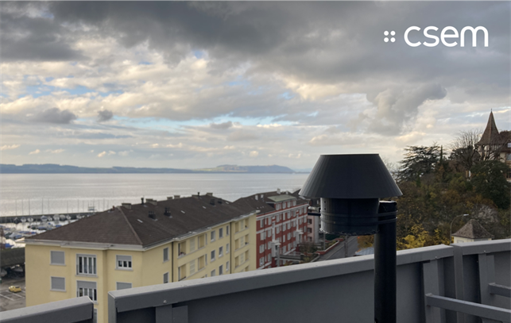

# Next-Gen tinyML Smart Weather Station Challenge 2024

## Description

### Introduction

The “Next-Gen tinyML Smart Weather Station 2024” competition is a challenge aimed at inspiring and promoting the development of innovative, energy-efficient, and cost-effective smart weather stations using Tiny Machine Learning (tinyML) technology. Participants from diverse backgrounds are invited to design, build, and deploy weather stations that can accurately measure and report real-time environmental data (rain and wind), as well as temperature, humidity, pressure, and/or air quality. The competition encourages the use of low-power, low-cost hardware and software solutions that are capable of processing data locally and can operate autonomously for extended periods. The competition is expected to foster collaboration, creativity, and practical solutions that can contribute to improving weather monitoring, thereby enhancing community resilience and adaptation to climate change.

### Problem Statement

The goal of this challenge is to create a low-cost, low-power, reliable, accurate, easy to install and maintain weather station, **with no mechanical moving parts** for measuring all weather conditions with a focus on rain and wind, based on ultra-low power machine learning at the edge, that can be deployed locally. This weather station could be deployed in a farm, for example, to provide local conditions and assist farmers in deciding when to plant crops.

To get you off with a flying start, the Swiss Technology Innovation Center [CSEM](https://www.csem.ch/) will provide a dataset acquired by their winning Weather Station Aurora[link](https://aiforgood.itu.int/the-days-of-bigger-is-better-are-over-say-hello-to-the-power-of-tinyml/). This dataset contains microphone recordings and environmental sensor data (temperature, humidity, and pressure). In addition, it will come with ground truth information from a mechanical weather station, which gives information about the wind and rain intensity. The dataset is available [here](https://aurora.portal.csem.ch/dataset.html).

### Suggested Process:

* Start with the dataset provided by the tech partner CSEM, to collect local rain and wind audio and other types of sensor measurements with an embedded device without any moving parts. In addition, you are also invited to come up with your own local dataset.
* Develop a tinyML model to derive rain and wind intensity from sound measurements of rain and wind.
* Optimize the memory footprint and the power consumption of the tinyML model.
* Deploy the tinyML model on an embedded device in the field and measure how well the model performs in real-life.
* Document the process, write a report, and publish a video of the prototype.

### Final Goal:

Develop a fully functioning, rugged, and cost-effective weather station based on a single device able to detect all weather parameters including TPH (temperature, pressure, and humidity), wind, and rain with no moving parts. Participants can get off with a flying start, using the dataset from the Smart Weather Station Aurora which will be made available by CSEM. The architecture of Aurora is depicted in the figure below. Exploiting this dataset, participants are challenged to go further and to propose their own robust and unique embedded solution for a Smart Weather Station that can be deployed in the field.

### Hardware Support:

We are excited to inform participants that [**Seeed Studio**](https://www.seeedstudio.com/) and [**Arduino**](https://www.arduino.cc/) are providing hardware support to complete your tinyML challenge. Some teams who have not received HW support but submit proposals will have a chance to receive the HW support.

### About CSEM:

Founded in 1984 and headquartered in Neuchâtel, CSEM is an internationally recognized innovation specialist with over 550 employees across six locations in Switzerland and more than 200 registered patents. We develop disruptive technologies with a high societal impact in the fields of precision manufacturing, digitalization, ultra-low-power electronics, optical elements, AI, and sustainable energy. We then transfer these innovations to industry partners in a variety of sectors, including renewable energy, healthcare, watchmaking, and aerospace, or encourage start-up creations. As a public-private, non-profit organization, our mission is to support the innovation of Swiss companies and strengthen the economy through ongoing collaboration with leading universities, research institutes, and industrial partners.

**Website**: [www.csem.ch](https://www.csem.ch)

# Evaluation Criteria

The evaluation will be performed by benchmarking your designed tinyML model against the models from the other participants, on the test set of Aurora, which will be released at the end of the challenge. Participants should provide the proposed tinyML model, as well as the Python script that reads in the test dataset, feeds it to the tinyML model, and outputs the evaluation metrics.

The ranking will be done based on the combination of the evaluation metrics listed below:

* **Accuracy**: The proposed tinyML model should estimate the intensity of wind and rain with high accuracy (analyzed through precision and recall metrics). In addition, the output should be as fine-grained as possible, to closely match the intensity from the ground truth weather station.
* **Memory Footprint**: The proposed tinyML model should be optimized for both FLASH and RAM usage.
* **Energy Consumption**: The proposed tinyML model should be optimized for energy consumption to enable a long battery lifetime for the weather station. (Note: The original text had this twice. I've kept one instance and the description.)
* **Latency**: The proposed tinyML model should be optimized for latency, allowing for real-time or near real-time processing of weather data. (Note: The description for latency in the original text was identical to energy consumption. I've corrected it to reflect latency optimization.)
* **Prototype**: Participants should build a prototype that can execute local inference of the proposed tinyML model on a resource-constrained device of choice.
* **Documentation and Code Quality**: Participants should provide clear documentation detailing their approach, tinyML model architecture, optimization techniques, and scalability considerations. The submitted code should be well-organized, modular, and easy to understand, with appropriate comments and explanations.

A detailed overview of the quantitative metrics that will be used for the evaluation will be shared with the participants throughout the challenge.

---

# Data Source

* You can find the dataset and its documentation on this link: [https://aurora.portal.csem.ch](https://aurora.portal.csem.ch).
* You can find the dedicated Q&A Forum on this link: [https://aurora-forum.portal.csem.ch](https://aurora-forum.portal.csem.ch)

---

# References

* [1] Aurora website with detailed information about the dataset: [https://aurora.portal.csem.ch](https://aurora.portal.csem.ch)
* [2] Aurora Q&A Forum: [https://aurora-forum.portal.csem.ch](https://aurora-forum.portal.csem.ch)
* [3] Next-Gen tinyML Smart Weather Station 2023: [https://challenge.aiforgood.itu.int/match/matchitem/85](https://challenge.aiforgood.itu.int/match/matchitem/85)
* [4] Github repository of Winner TinyML Challenge 2022: [https://github.com/ITU-AI-ML-in-5G-Challenge/TinyML-Smart-Weather-Station-CSEM](https://github.com/ITU-AI-ML-in-5G-Challenge/TinyML-Smart-Weather-Station-CSEM)
* [5] Final report TinyML Challenge 2022: [https://github.com/ITU-AI-ML-in-5G-Challenge/TinyML-Smart-Weather-Station-CSEM/blob/main/TinyML_Challenge_2022_CSEM_report.pdf](https://github.com/ITU-AI-ML-in-5G-Challenge/TinyML-Smart-Weather-Station-CSEM/blob/main/TinyML_Challenge_2022_CSEM_report.pdf)

# Prizes

The prizes are sponsored by [**Edge Impulse**](https://edgeimpulse.com/).

The following teams were awarded prizes according to their submitted and presented solutions:

* **1st place prize**: **GenStorm** (Fortunatus Aabangbio Wulnye) - $500
* **2nd place prize**: **ADDInnovators** (Abhay Bhosle) - $300

---

# Hardware Support

Thanks to [**Seeed Studio**](https://www.seeedstudio.com/) and [**Arduino**](https://www.arduino.cc/) for providing hardware support to teams participating in the Challenge.

# Milestones and Checkpoints (Past Dates)

Here are the optional checkpoints where teams could receive feedback and extra points.

* **Monday, February 26, 2024** - Proposal checkpoint: Submit your project proposal to receive initial feedback and be notified of available development resources. (Optional, and not all submissions received feedback.)
* **Week of March 25, 2024** - Q&A session with organizers: A Q&A session was organized where participants could ask technical questions related to the challenge.
    * **Date**: March 27, 2024 (Wednesday)
    * **Time**: 14:00 – 15:00 (CET)
    * **Registration**: [https://itu.zoom.us/meeting/register/tJwqfuiprDooHN1EAmHBWiuRprhl94uSItWW](https://itu.zoom.us/meeting/register/tJwqfuiprDooHN1EAmHBWiuRprhl94uSItWW)
* **Monday, April 15, 2024** - Model checkpoint
* **Friday, April 26, 2024** - Model checkpoint [extended]: Submit your tinyML model early to receive extra bonus points from the judges. (Optional, and not all submissions received feedback.)
* **Monday, May 20, 2024** - Final submission: Submit your fully functional weather station project for a chance to win the tinyML Challenge 2024.

**Final submission requirements included:**

* Final project write-up accompanied by photos and videos of your Smart Weather Station prototype.
* Final dataset
* Final tiny ML model
* Final embedded application

---

# Contact

* jona.beysens[at]csem.ch
* robin.berguerand[at]csem.ch