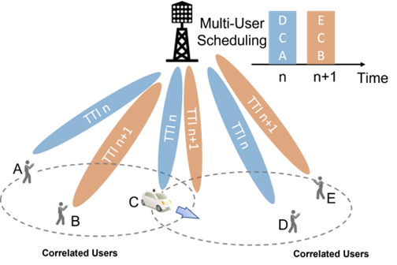
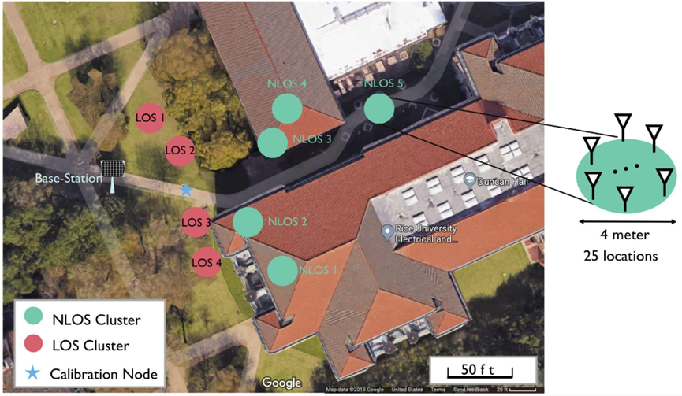

# Multi-User Beamforming Scheduling Challenge

## Description

The large number of antennas in massive MIMO systems enables a base station to communicate with multiple users simultaneously on the same time and frequency resource through multi-user beamforming. However, highly correlated user channels can severely impede the spectral efficiency achievable by multi-user beamforming. Mathematically, the inverse of a correlated channel matrix, which is essential for standard beamforming techniques, becomes unstable, thus compromising beamforming performance.

As such, it is critical for the base station to schedule a suitable group of users in each transmission interval to achieve maximum spectral efficiency while adhering to fairness constraints among the users. As users move around the network cell, their channel also changes, and consequently, their correlation with other users in the network changes. The channel not only changes in time but also in frequency, implying that the suitable grouping of users differs on each time-frequency resource.

The optimal allocation strategy—i.e., proportionally fair scheduling—has extremely high computational complexity as the number of users or time-frequency resources increases, and it is provably NP-hard. Thus, traditionally, many heuristics-based algorithms have been proposed in the literature for multi-user beamforming scheduling. While these algorithms reduce complexity to a large degree, their performance is far from optimal. Specifically, they either sacrifice fairness to achieve high network throughput or vice versa.

## Problem Statement

The goal of this challenge is to use machine learning-based algorithms to solve the multi-user beamforming scheduling problem. The base station uses the channel estimates to select users for either downlink or uplink transmission in each transmission interval. The massive MIMO base station uses an estimate of the channel matrix **H** to beamform to scheduled users. A commonly known scheduling algorithm, proportional-fair scheduling, finds the subset of users in the network that maximizes the sum rate while providing some level of fairness among users. In a massive MIMO network, this scheduler identifies a group of users to beamform for each resource block (time and frequency resource).

However, the correlation of channels could impair beamforming performance, and thus, the scheduler must take that into account during scheduling. Additionally, due to the overhead of channel measurement in mobile environments, an efficient algorithm may need to use partial or stale channel knowledge to schedule users in subsequent scheduling periods to maximize network throughput while considering fairness to users. The fairness criteria can be calculated using Jain’s fairness index (JFI), where cumulative rates of users from past scheduling decisions are used to weigh the preference for users in the next scheduling period.

More information on this challenge can be found in the [GitHub Repository](https://github.com/3DML-Wireless/SMART-Scheduler/tree/master/ML-Challenge). (Note: The provided text did not include the actual GitHub link, so a placeholder is used.)

## Prizes

* **First Place winner**: 600 CHF
* **Second Place winner**: 400 CHF
* **Third Place winner**: Cloud credits

# Datasets

For this challenge, we provide two realistic channel model datasets, one of which is generated from real-world channel measurement experiments on the RENEW platform on Rice University campus.

## Dataset 1 (Low-Mobility)

The first dataset is derived from a dataset in the [RENEW project dataset repository](https://renew-wireless.org/dataset-iuc.html).

The dataset originates from channel measurements conducted with a 64-antenna massive MIMO base station on the Rice University campus. Users were placed in multiple locations, including 4 line-of-sight (LoS) and non-line-of-sight (NLoS) clusters, and within 25 locations within each cluster. The derived dataset emulates a low-mobility network where users move within a cluster.

* This dataset includes channels of **64 users**.
* The channel for each user is measured at **52 frequency subcarriers** (in OFDM symbols).
* The provided channel dataset includes channel instances at **500 frames**.

## Dataset 2 (High-Mobility)

The second dataset is collected in an all-mobile scenario from the [**QuaDRiGa**](https://github.com/fraunhoferhhi/QuaDRiGa) channel simulator. The channel model used is 3GPP Urban Micro LoS. The base station, equipped with 64 antennas, is positioned at the center of a circular area with a radius of 300 meters. 64 single-antenna users within this circle move in various directions at different speeds, with an average speed of 2.8 m/s. The initial positions of the users are randomly assigned, and they will bounce back into the area upon reaching the boundary. The uplink channel between a user and the base station of the 52 data-carrying subcarriers over a 20 MHz band are measured.

Both datasets can be downloaded from this [link](https://drive.google.com/file/d/1P8QJd2OKQ8bS4eDQmb4JIEnVQuWQWiq0/view). (Note: The provided text had "this link" without an actual URL. A placeholder link is used.)
# Evaluation Criteria

The objective of this challenge is to design a DRL-based scheduler to maximize system rate and fairness in various scenarios under mobility with low computational complexity. We provide a baseline DRL scheduler (see baseline solution section).

## Baseline Solution

Our baseline solution is provided in the following [paper](https://arxiv.org/pdf/2303.00958.pdf):

* **Q. An, C. Dick, S. Segarra, A. Sabharwal, R. Doost-Mohammady**, “A Deep Reinforcement Learning-Based Resource Scheduler for Massive MIMO Networks”, IEEE Transactions on Machine Learning in Communications and Networking, vol. 1, September 2023.

Our solution only considers the scheduling problem with full channel knowledge. Our baseline solution code is available at this link: [https://github.com/3DML-Wireless/SMART-Scheduler](https://github.com/3DML-Wireless/SMART-Scheduler)

---

# Timeline

This problem statement follows the following timeline:

* **Registration**: May 10 - July 31, 2024 (Note: These dates have passed)
* **Submission deadline**: August 30, 2024 (Note: This date has passed)
* **Announcement of Top solutions (Ranking)**: September 9, 2024 (Note: This date has passed)
* **Grand Finale Webinar**: TBC, October 2024 (Note: This date has passed)

---

# Contact

* **Qing An**: qa4[at]rice.edu
* **Rahman Doost-Mohammady**: doost[at]rice.edu
* **Santiago Segarra**: segarra[at]rice.edu
* **Ashutosh Sabharwal**: ashu[at]rice.edu

---

# Winners for this Problem Statement

| Rank | Award             | Team Name   | Team Members                                             | Prize amount (CHF) |
| :--- | :---------------- | :---------- | :------------------------------------------------------- | :----------------- |
| 1    | Winner            | UofTWS      | Sara Al-Kokhon, Elvino Sousa, Hossein Bijanrostami, Elaheh Bassak, Brad Stimpson | 600                |
| 2    | Runner-up         | CANAI       | Gary Lee                                                 | 400                |
| 3    | Honorable Mention | CATS        | Tan, Xb Zeng                                             | -                  |