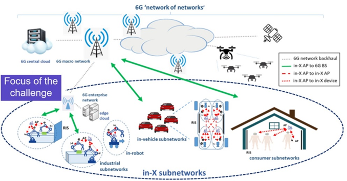
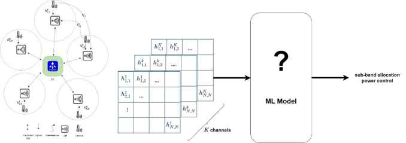
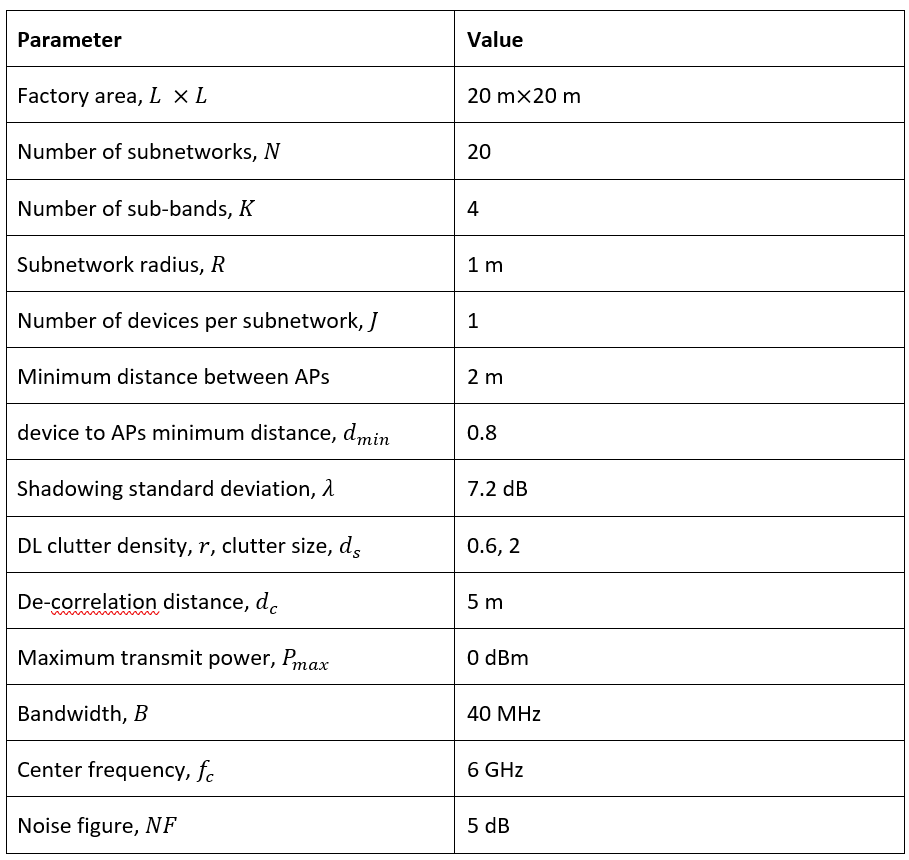

# AI/ML for Radio Resource Management in Hyper-Dense In-X Subnetworks

## Introduction

Radio resource management (RRM), encompassing the selection of transmission parameters like transmit power, frequency resources, precoder, and modulation, is a complex optimization problem. This complexity is significantly exacerbated by the anticipated densification in 6G networks, projected to be tenfold denser than 5G. The concept of **in-X subnetworks** has emerged as a further evolution of heterogeneous networks, aiming to provide highly localized wireless coverage for specialized use cases such as in-robot, in-production module, in-vehicle, and in-room communication.

These subnetworks are expected to support diverse services, potentially with extreme requirements in terms of ultra-short control cycle time, reliability, and service availability, surpassing the capabilities of 5G and its evolution. As their name suggests, in-X subnetworks can operate as part of a larger 6G infrastructure, offloading the broader network from its most demanding services. While the specific characteristics of in-X subnetworks present opportunities for efficient radio design, **interference** can be a major limiting factor in dense deployments. Subnetworks might be characterized by exceptionally high density (e.g., vehicles on a congested road, robots in a matrix production environment) and can also be mobile, leading to rapid interference fluctuations. As illustrated in Figure 1 (conceptually), these aspects can result in wide and rapidly fluctuating interference patterns, making the RRM problem more challenging than in traditional wireless setups with static base stations/access points and lower cell densities.

Interference management typically operates across frequency, time, and spatial domains. However, for in-X subnetworks supporting low-latency services, time-domain interference coordination schemes are generally unsuitable. Similarly, spatial coordination solutions based on beamforming may be ineffective due to the limited form factor of Access Points (APs) and devices, leading to a low number of antennas, especially for low carrier frequencies. Therefore, interference management for in-X subnetworks should primarily operate on the **frequency domain**, by dividing the available spectrum into several frequency chunks to be selected or assigned to the subnetworks to minimize mutual interference.

*Figure 1: Representation of the in-X subnetworks targeted in this challenge.*

## General Objective

Develop AI/ML-based centralized or distributed techniques for joint sub-band and power allocation in hyper-dense deployments for industrial subnetworks.

The RRM problem is typically formulated as an optimization problem aimed at maximizing the average spectral efficiency of the network in the presence of legitimate and malicious interference, subject to constraints on maximum transmit power and energy consumption at the device and AP.

While traditional optimization methods and heuristics have proven effective in certain contexts, the dynamic and complex nature of in-X subnetworks demands a more adaptive and data-driven approach, necessitating the adoption of advanced AI/ML solutions. The unprecedented densities characterizing the operational scenario render heuristic approaches inefficient, as they are often designed for generic environments and conditions rather than being tailored to the effective operational scenario.

## Problem Statement

In-X subnetworks can be **hyper-dense** (e.g., subnetworks installed in vehicles driving on a congested road); moreover, in-X subnetworks can be **mobile**. It is our hypothesis that AI methods are essential to address such complex scenarios, which are characterized by large interference patterns. Existing literature on AI for radio resource management primarily focuses on networks with lower densities, static base stations, and less challenging requirements in terms of throughput, latency, or reliability. Furthermore, current solutions are often reactive by design, relying on slowly varying channel and interference profiles that relax the timing assumptions for algorithm execution.

This AI/ML challenge, as depicted conceptually in Figure 2, targets addressing the RRM challenge specifically for in-X subnetworks. In particular, the task calls for the development of machine learning-based solutions that can find the optimized policy for **sub-band allocation and power control** within a dense in-factory network.

*Figure 2: Schematic representation of the input data utilized in this challenge tasks.*

# Evaluation Criteria

The primary objective is to evaluate the accuracy of the Radio Resource Management (RRM) system. To facilitate this, a test dataset will be provided to all competitors before the end of the competition. Participants are required to use their machine learning (ML) algorithms to determine the optimal sub-band and power level for this dataset and submit their results in a specified format.

A complete submission must include the following elements:

* **A CSV File**: This file should be named `<group_name>_subband_power.csv` and must contain two columns: `subband` and `power`. These columns are to record the sub-band index and power level, respectively.

* **A Compressed (ZIP) File**: Titled `<group_name>_code.zip`, this file should encompass the evaluation code, any pre-trained models, and a README file explaining how to run the code. This comprehensive package is essential for verification purposes. **Any submission that cannot be replicated based on its contents will be disqualified.**

* **A PDF Document**: Named `<group_name>_document.pdf`, this concise document, ranging from 1 to 3 pages, should outline the proposed methodology and provide clear instructions for replication.

---

## Evaluation Metrics

Submissions will be evaluated based on their performance, which is determined by the following metrics:

* **Rate @ Median**: This metric evaluates the median bitrate across all subnetworks, indicating the average performance a user might experience. A higher median rate suggests robust and consistent performance under various conditions.

* **Rate @ Low Percentile ($P=10^{-3}$)**: This metric measures the bitrate at a very low percentile, assessing the system’s performance under extreme conditions. It ensures the system’s capability to maintain satisfactory performance in the lowest 0.1% of scenarios, which might include poor signal conditions or high interference.

---

## Unified Evaluation Metric

To achieve a balance between these metrics, the **Performance Score (PS)** is used as a holistic evaluation metric. It is calculated through a weighted sum of the normalized rates at median and at ($P=10^{-3}$), with their respective weights. The PS is defined as:

$$PS = w_1 \times (\text{Normalized Rate @ Median}) + w_2 \times (\text{Normalized Rate @ } P=10^{-3})$$

Where:

* **Normalized Rate @ Median** and **Normalized Rate @ ($P=10^{-3}$)** are calculated by dividing the achieved rates by the maximum observed rates across all solutions. This normalization ensures that the scores range from 0 to 1, with 1 representing the best observed performance.
* $w_1$ and $w_2$ are the weights assigned to the median rate and rate at ($P=10^{-3}$), respectively, with $w_1 = \frac{1}{3}$ and $w_2 = \frac{2}{3}$.

If the performance of the top solutions is nearly identical, the **complexity of the solutions** will serve as the deciding factor.

# Simulation Parameters and Dataset Generation

As outlined in the challenge’s objective, the focus is on the industrial application of subnetworks. In the simulated factory environment, a multitude of strategically deployed short-range cells form the backbone of robotic systems, production modules, conveyors, and other industrial machinery. These cells, designated as **In-factory subnetworks (InF-S)**, are comprised of a central communication node serving one or more devices within the subnetwork. Each device is allocated orthogonal resources, with the primary challenge being **inter-cell interference** affecting spectral efficiency. For simplicity, we assume each subnetwork serves a single device, utilizing the entire available bandwidth for its transmissions.

Within each InF-S, the Access Point (AP) is positioned at the center of a circular coverage area with a radius ($R$), and a device is located at a distance ($d$) with a minimum proximity of ($d_{min}$) meters to the AP. Our system accommodates four available channels for wireless communication.

The wireless communication channel model adheres to **3rd Generation Partnership Project (3GPP)** specifications for InF scenarios, encompassing path-loss, shadowing, and small-scale fading. Small-scale fading, assumed to be Rayleigh distributed, exhibits flat fading. For the path-loss model, we consider a dense clutter and low base station height InF scenario, calculating losses based on carrier frequency and the distance between nodes. The probability of a clear Line of Sight (LoS) is determined by distance, size of clutter elements, and clutter density.

Subnetwork links feature **correlated shadowing**, wherein a source of shadowing affects multiple links simultaneously. Deployment area shadowing is represented in a grid with a stationary and isotropic Gaussian random field characterized by zero mean and exponentially decaying spatial correlation.

The deployment density is specified as **50,000 subnetworks per square kilometer**, with a minimum separation distance ($d_{min}=2$) meters between subnetworks. InF-S are modeled by circular coverage areas with a radius of ($d_r=1$) meter. The minimum distance between APs and devices is 0.8 meters. Shadowing standard deviation is 7.2. Clutter element size is 2 meters, and clutter density is 60%.

For dataset generation, **20 subnetworks** are deployed in a factory with a **$20 \times 20$ (m$^2$) area**, characterized by dense clutter. Radio resources are sparse, and thus, the number of frequency channels is set to ($K = 4$), compelling subnetworks to share limited resources. Radio propagation parameters (carrier frequency ($f_c=6$) GHz, channel bandwidth ($BW = 10$) MHz, transmit powers ($p=0$) dBm, noise figure ($NF = 5$) dB, and decorrelation distance ($d_c=5$) meters) are fixed for all simulation results, detailed in the table below:

We generated $n_{samp}=200,000$ snapshots of the subnetwork deployment and saved the location (x and y) of subnetworks and channel gain between subnetworks. Therefore, we have two files in NumPy format: `Channel_matrix_gain.npy` and `Location_mat.npy`. The dimension of `Channel_matrix_gain.npy` is $n_{samp} \times K \times N \times N$, and `Location_mat.npy` has the dimension of $n_{samp} \times N \times 2$.

# Resources

* **Dataset**: Available for initial analysis and model training.
* **Python script**: Utilize this script to generate additional data samples as required.
* **Mailing list**: For questions and comments related to the challenge.

---

# Datasets

## Simulated Channel State Information for In-factory Subnetworks

### Description

In the simulated factory environment, a multitude of strategically deployed short-range cells forms the backbone of robotic systems, production modules, conveyors, and other industrial machinery. These cells, designated as In-factory subnetworks (InF-S), are comprised of an access point (AP) serving one or more devices within the subnetwork.

### Download

[https://zenodo.org/records/10908382](https://zenodo.org/records/10908382)

# References

* Berardinelli, Gilberto, et al. “Extreme communication in 6G: Vision and challenges for ‘in-X’ subnetworks.” IEEE Open Journal of the Communications Society 2 (2021): 2516-2535.
* Adeogun, Ramoni, Gilberto Berardinelli, and Preben Mogensen. “Learning to dynamically allocate radio resources in mobile 6G in-x subnetworks.” 2021 IEEE 32nd annual international symposium on personal, indoor and mobile radio communications (PIMRC). IEEE, 2021.
* Adeogun, Ramoni, Gilberto Berardinelli, and Preben E. Mogensen. “Enhanced interference management for 6G in-X subnetworks.” IEEE Access 10 (2022): 45784-45798.
* Adeogun, Ramoni, and Gilberto Berardinelli. “Multi-agent dynamic resource allocation in 6G in-X subnetworks with limited sensing information.” Sensors 22.13 (2022): 5062.

---

# Contact

* saehak[at]es.aau.dk