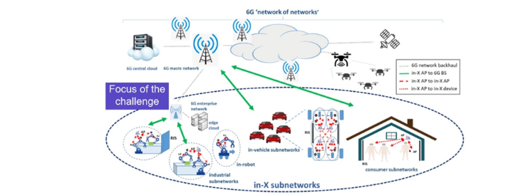
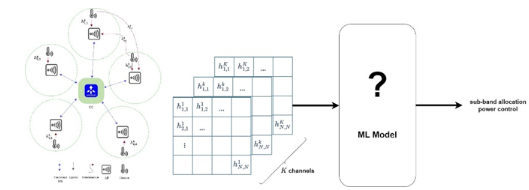

# Radio Resource Management (RRM) for 6G in-X Subnetworks

# Description 
## Introduction

Radio resource management, i.e., selection of relevant transmission parameters such as transmit power, frequency resources, precoder, and modulation, is a complex optimization problem, which is further compounded by the increased densification expected in 6G (a factor of x10 density increase with respect to 5G). The concept of in-X subnetworks has been introduced as a further leap of heterogeneous network, with the aim of providing highly localized wireless coverage for use cases such as in-robot, in-production module, in-vehicle, in-room communication. These subnetworks are anticipated to support diverse services, possibly extreme requirements in terms of ultra-short control cycle time, reliability, and service availability, surpassing the capabilities of 5G and its evolution. As the name suggests, such subnetworks can be part of a larger 6G infrastructure, offloading the broader network of the most demanding services. While the specific characteristics of in-X subnetworks can offer opportunities for efficient radio design, interference can be a major limiting factor in dense deployments. Subnetworks may be then characterized by such high density (e.g., vehicles in a congested road, robots in matrix production), and they can also be mobile, leading to rapid interference fluctuations. As illustrated in Figure 1, these aspects may result in wide and rapidly fluctuating interference patterns (as illustrated in), which make the radio resource management (RRM) problem more challenging than in traditional wireless setups, characterized by static base stations/access points and lower cell densities.
Interference management can operate on the frequency, time, and spatial domains. However, interference coordination schemes based on the time domain are to be disregarded for in-X subnetworks supporting low latency services; similarly, spatial coordination solutions based on beamforming may be ineffective given the limited AP and device form factor and therefore the expected low number of antennas, especially for low carrier frequencies. Interference management for in-X subnetworks should then operate on the frequency domain, by dividing the available spectrum in several frequency chunks to be selected or assigned to the subnetworks so that mutual interference is minimized.

Figure 1. Reprensation of the in-X subnetworks targeted in this challenge.

General Objective: Develop AI/ML-based centralized or distributed techniques for joint sub-band and power allocation in hyper-dense deployments for industrial subnetwork.

The RRM problem usually formulates as an optimization problem for the sake of maximizing average spectral efficiency of the network in the presence of legitimate and malicious interference, with constraints in terms of maximum transmit power and energy consumption at the device and AP.
While traditional optimization methods and heuristics have proven effective in certain contexts, the dynamic and complex nature of In- X subnetworks demand a more adaptive and data-driven approach, necessitating the adoption of advanced AI/ML solutions.
The complexity of the operational scenario characterized by unprecedented densities makes heuristic approaches inefficient as designed for generic environments and conditions rather than being tailored to the effective operational scenario.

## **Problem statement:**
In-X subnetwork can be hyper-dense (e.g., subnetworks installed in vehicles driving in a congested road); moreover, in-X subnetworks can be mobile. It is our hypothesis that AI methods are to be used to deal with such complex scenarios, characterized by large interference patterns. Existing literature on AI for radio resource management is focused on networks of lower densities with static base stations and less challenging requirements in terms of throughput, or latency/reliability. Also, solutions are by design reactive, based on slowly varying channel and interference profile that relax the timing assumptions of the algorithm execution.
This AI/ML challenge as depicted in Figure 2 targets addressing the RRM challenge for in-X subnetworks. In particular, the task calls for the development of machine learning-based solutions that can find the optimized policy for sub-band allocation and power control for a dense in-factory network.

Figure 1. Schematic representation of the input data utilized in this challenge tasks.

## **Evaluation criteria**

The objective is to evaluate the accuracy of the RRM system. To facilitate this, a test dataset will be provided to all competitors before the end of the competition. Participants are required to use their ML algorithms to determine the optimal sub-band and power level for this dataset and submit their results in a specified format. A complete submission must include the following elements:

A CSV File: This file should be named <group_name>_subband_power.csv and must contain two columns: subband and power. These columns are to record the sub-band index and power level, respectively.
A Compressed (ZIP) File: Titled <group_name>_code.zip, this file should encompass the evaluation code, any pre-trained models, and a README file explaining how to run the code. This comprehensive package is essential for verification purposes. Any submission that cannot be replicated based on its contents will be disqualified.
A PDF Document: Named <group_name>_document.pdf, this concise document, ranging from 1 to 3 pages, should outline the proposed methodology and provide clear instructions for replication.

## Evaluation Metrics

The submissions will be evaluated based on their performance, which is determined by the following metrics:

- Rate @ Median: This metric evaluates the median bitrate across all subnetworks, indicating the average performance a user might experience. A higher median rate suggests robust and consistent performance under various conditions.
- Rate @ Low Percentile (P=10^(-3) ): This metric measures the bitrate at a very low percentile, assessing the system’s performance under extreme conditions. It ensures the system’s capability to maintain satisfactory performance in the lowest 0.1% of scenarios, which might include poor signal conditions or high interference.

### Unified Evaluation Metric

To achieve a balance between these metrics, the Performance Score (PS) is used as a holistic evaluation metric. It is calculated through a weighted sum of the normalized rates at median and at (P=10^(-3) ), with their respective weights. The PS is defined as:

$$
PS = w_1 \times \text{Normalized Rate @ Median}
+ w_2 \times \text{Normalized Rate @ } (P = 10^{-3})
$$

where:

- Normalized Rate @ Median and Normalized Rate @ (P=10^(-3) ) are calculated by dividing the achieved rates by the maximum observed rates across all solutions. This normalization ensures that the scores range from 0 to 1, with 1 representing the best observed performance.
- (w_1 ) and (w_2 ) are the weights assigned to the median rate and rate at (P=10^(-3) ), respectively, with (w_1=1/3) and (w_2=2/3).

If the performance of the top solutions is nearly identical, the complexity of the solutions will serve as the deciding factor.                |

## Data source
### Simulation Parameters and Dataset Generation
As outlined in the challenge’s objective, the focus is on the industrial application of subnetworks. In the simulated factory environment, a multitude of strategically deployed short-range cells form the backbone of robotic systems, production modules, conveyors, and other industrial machinery. These cells, designated as In-factory subnetworks (InF-S), are comprised of a central communication node serving one or more devices within the subnetwork. Each device is allocated orthogonal resources, with the primary challenge being inter-cell interference affecting spectral efficiency. For simplicity, we assume each subnetwork serves a single device, utilizing the entire available bandwidth for its transmissions.
Within each InF-S, the AP is positioned at the center of a circular coverage area with a radius ( R ), and a device is located at a distance ( d ) with a minimum proximity of (d_min ) meters to the AP. Our system accommodates four available channels for wireless communication.
The wireless communication channel model adheres to 3rd Generation Partnership Project (3GPP) specifications for InF scenarios, encompassing path-loss, shadowing, and small-scale fading. Small-scale fading, assumed to be Rayleigh distributed, exhibits flat fading. For the path-loss model, we consider a dense clutter and low base station height InF scenario, calculating losses based on carrier frequency and the distance between nodes. Probability of a clear Line of Sight (LoS) is determined by distance, size of clutter elements, and clutter density.
Subnetwork links feature correlated shadowing, wherein a source of shadowing affects multiple links simultaneously. Deployment area shadowing is represented in a grid with a stationary and isotropic Gaussian random field characterized by zero mean and exponentially decaying spatial correlation.
The deployment density is specified as 50,000 subnetworks per square kilometer, with a minimum separation distance (d_min=2) meters between subnetworks. InF-S are modeled by circular coverage areas with a radius of(d_r=1) meter. The minimum distance between APs and devices is 0.8 meters. Shadowing standard deviation is 7.2. Clutter element size is 2 meters, and clutter density is 60 %.
For dataset generation, 20 subnetworks are deployed in a factory with a 20×20(m^2 ) are, characterized by dense clutter. Radio resources are sparse, and thus, the number of frequency channels is set to ( K = 4 ), compelling subnetworks to share limited resources. Radio propagation parameters (carrier frequency (f_c=6) GHz, channel bandwidth ( BW = 10 ) MHz, transmit powers (p=0) dBm, noise figure ( NF = 5 ) dB, and decorrelation distance (d_c=5) meters) are fixed for all simulation results, detailed in the table below:

| Parameter                                   | Value       |
|--------------------------------------------|-------------|
| Factory area, $L \times L$                  | 20 m × 20 m |
| Number of subnetworks, $N$                  | 20          |
| Number of sub-bands, $K$                    | 4           |
| Subnetwork radius, $R$                     | 1 m         |
| Number of devices per subnetwork, $J$      | 1           |
| Minimum distance between APs               | 2 m         |
| Device to APs minimum distance, $d_{min}$  | 0.8         |
| Shadowing standard deviation, $\lambda$    | 7.2 dB      |
| DL clutter density, $r$, clutter size, $d_s$ | 0.6, 2      |
| De-correlation distance, $d_c$             | 5 m         |
| Maximum transmit power, $P_{max}$          | 0 dBm       |
| Bandwidth, $B$                             | 40 MHz      |
| Center frequency, $f_c$                    | 6 GHz       |
| Noise figure, $NF$                         | 5 dB        |

We generated n_samp=200,000, snapshots of the subnetwork deployment and saved the location (x and y) of subnetworks and channel gain between subnetworks. Therefore, we have two files with the numpy format: Channel_matrix_gain.npy and Location_mat.npy. The dimension of the first one is n_samp×K×N×N and the second one has the dimension of n_samp×N×2.

## Resources

- Dataset: Available for initial analysis and model training.
- Python script: Utilize this script to generate additional data samples as required.
- Mailing list: for questions and comments related to the challenge.

### Datasets
Simulated Channel state information for In-factory Subnetworks

**Description**

In the simulated factory environment, a multitude of strategically deployed short-range cells forms the backbone of robotic systems, production modules, conveyors, and other industrial machinery. These cells, designated as In-factory subnetworks (InF-S), are comprised of an access point (AP) serving one or more devices within the subnetwork.

Download

https://zenodo.org/records/10908382

## References
1. Berardinelli, Gilberto, et al. “Extreme communication in 6G: Vision and challenges for ‘in-X’ subnetworks.” IEEE Open Journal of the Communications Society 2 (2021): 2516-2535.
2. Adeogun, Ramoni, Gilberto Berardinelli, and Preben Mogensen. “Learning to dynamically allocate radio resources in mobile 6G in-x subnetworks.” 2021 IEEE 32nd annual international symposium on personal, indoor and mobile radio communications (PIMRC). IEEE, 2021.
3. Adeogun, Ramoni, Gilberto Berardinelli, and Preben E. Mogensen. “Enhanced interference management for 6G in-X subnetworks.” IEEE Access 10 (2022): 45784-45798.
4. Adeogun, Ramoni, and Gilberto Berardinelli. “Multi-agent dynamic resource allocation in 6G in-X subnetworks with limited sensing information.” Sensors 22.13 (2022): 5062.

### contact
saehak@es.aau.dk