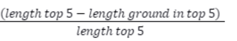

# ‘AIntuition’ Retrieval Augmented Generation (RAG) for Public Services and Administration Tasks by ITU

##  Can you create a RAG solution?

Original on Zindi: http://zindi.africa/competitions/specializing-large-language-models-for-telecom-networks

### Webinar recording with additional details on the challenge is available here - https://aiforgood.itu.int/event/aintuition-unlocking-efficiency-for-public-sector-with-retrieval-augmented-generation-applications/
Large language models (LLMs) have spearheaded a new era marked by sophisticated text generation, advanced comprehension, and dynamic interaction. The evolutionary path of LLMs originates from the early stages of machine learning (ML) and natural language processing (NLP), characterized by the emergence of statistical language models and the gradual evolution of neural networks. Yet, the true transformation came through deep learning (DL) breakthroughs, particularly the rise of transformer architectures. These innovations have paved the way for the birth of language models with an unprecedented ability to process and generate extensive volumes of comprehensive textual content. Among these remarkable strides, OpenAI's generative pre-trained Transformer (GPT) series has emerged as a beacon, outshining its predecessors in both scale and capability. This ascent has empowered these models to achieve human-like language understanding and generation.
The objective of this challenge is to encourage the emergence of better open-source RAG tools and resources that could be leveraged by public institutions to support public administration services and tasks.

The challenge will require participants to work on retrieval solutions and workflows for RAG systems that maximize the accuracy of retrieving relevant data from public institutions' documents.

Specifically, participants are required to submit a functional retrieval solution based on open-source embedding models, databases, and frameworks that takes a user query and a set of text documents (in .pdf and .docx format) as an input and returns five most relevant parts of text extracted from the documents as an output (in CSV format).

For the purposes of this challenge, a "retrieval solution" comprises a combination of one or several components and techniques used in the retrieval part of the RAG process to improve output quality and accuracy, including (but not limited to):

- Query pre-processing;
- Fine-tuning of embedding models;
- Optimization of indexing of content (including parsing, chunking, custom indexing strategies, etc.);
- Optimization of search and retrieval from a vector database;
- Introduction of workflows or algorithms for multi-stage retrieval or reasoning over retrieved content.

Participants should submit solutions that focus on improving at least one of the retrieval components or techniques in a way that leads to a meaningful improvement in accuracy and quality of the retrieval.

For example, a proposed solution could comprise a query pre-processing algorithm (e.g. query expansion or query simplification), a fine-tuned open-source embedding model (trained on a custom dataset), and a dynamic document chunking strategy. Alternatively, participants may choose not to use any query pre-processing and opt for an off-the-shelf embedding model, but instead include a workflow algorithm that leverages a multi-stage retrieval process and a knowledge graph to better understand complex relations between different content parts.

In any case, the proposed solution should be complete enough and self-sufficient to accept a query and a set of documents as an input and return five (5) most relevant content parts as an output.

Other important conditions and requirement include:

- Participants are only allowed to use open-source software: open-source embedding models, open-source LLMs (if used for any pre-processing), open-source vector databases, open-source NLP frameworks, etc.
- Embedding models, LLMs, vector database, and other tools used should have no (known) security issues. If any security issues become known during the competition, these need to be addressed and made known to the organizers.
- Proposed solutions should be designed in a way that allows to run them fully locally and offline. This has implications for size and compute requirements. While larger and more compute-intensive solutions are possible, participants should seek to offer more compact and efficient systems that teams within public sector institutions could install and test on their personal devices.
- For this challenge, if participants opt to use an LLM for query or document pre-processing, they should use a local instance of a llama2 (7b) (see on HuggingFace).
- For this challenge, the output size should be limited to 4,000 tokens (max).
- Any dataset used for fine-tuning embedding models or LLMs needs to be submitted along with proposed solution and made open-source (for the reasons of transparency). Participants are free to use any appropriate open-source dataset. Participants can also develop and use their own datasets for training as long as this does not violate any data privacy regulations that apply.
Importantly, the generative part of the RAG process (i.e. the fetching of the retrieved content along with the user query to a generative LLM to produce output) is not part of this challenge and should not be included in proposed solutions.

### Background Information

Public sector institutions, including government agencies, municipalities, and public service organizations, manage a variety of services that significantly impact citizens' lives. They handle complex administrative tasks such as publishing reports, managing public procurement, issuing certifications, monitoring regulatory compliance, and engaging in public communication, among others.

The quality of public services depends on the efficiency with which public institutions can perform these tasks. AI virtual assistants powered by Large Language Model (LLM) applications have emerged as powerful tools that can help streamline administrative work. They allow for seamless interaction with dispersed data, offer guidance on complex procedures, and enable automated workflows.

Retrieval Augmented Generation (RAG) plays a crucial role in enhancing the capabilities of Language Model (LLM) applications for public administration. LLM-powered virtual assistants need to efficiently access information from vast volumes of administrative and regulatory documents, which are frequently updated. Moreover, as primary aggregators of data, public institutions must seamlessly draw insights from their records to enhance user experiences for both employees and citizens. RAG is instrumental in fulfilling these functions by enabling LLM-powered virtual assistants to effectively query documents and provide accurate, contextually relevant responses.

The quality and effectiveness of RAG heavily rely on the performance and capabilities of text embedding models in capturing and representing the semantic meaning of textual data. By encoding the meaning and context of words and sentences into high-dimension vector representations, text embedding models facilitate efficient retrieval during RAG processes. Additionally, text embedding models enable similarity-based search and retrieval, allowing LLM-powered virtual assistants to provide accurate and contextually relevant responses to user queries.

While the potential use cases for RAG applications are diverse, it remains a relatively new and rapidly developing area of applied research, and several challenges exist that complicate RAG application by public institutions:

- Conducting RAG over public institutions' documentation can be more challenging than other RAG tasks, because of the complexity and diversity of public sector documents and data. Both commercial and open-source models and RAG systems can make mistakes and often fail to retrieve all key information, which can have serious negative consequences in the context of public administration workflow. There is a need for new approaches and techniques to improve the accuracy and effectiveness of RAG systems.
- Popular commercial RAG solutions often rely on external services and cloud infrastructure (e.g., OpenAI and Azure AI), which may not be suitable for many public administration tasks. Institutions may be hesitant to send or process their sensitive data externally, raising concerns about data privacy and security. Fully local systems might be preferred, especially given that many open-source vector embedding models have been shown to outperform the commercial ones (see the MTEB Leaderboard, for example).
- Existing pricing models for commercial RAG applications, where fees scale with the number of tokens and similarity searches run, can pose challenges to some institutions, especially those with limited budgets or strict spending requirements.
- Instead of running a single large, general-purpose RAG system, it might be more beneficial to deploy more customized, smaller systems tailored to the needs of individual teams or departments within institutions. This approach can better accommodate diverse workflows and information retrieval needs. However, individual teams often lack the technical capacity and resources to independently deploy and run RAG systems tailored to their needs.

### Challenges
There are a number of common challenges that arise when applying Retrieval Augmented Generation (RAG) techniques to complex documentation, such as regulatory or administrative texts. Below are just a few examples, that participants are encouraged to address:

- Incomplete Retrieval of Related Content: Complex documentation often contains related content that spans multiple pages or sections, such as lists of exceptions or special cases within a regulation. RAG systems may struggle to recognize that all of this content is related and may only retrieve a subset of the relevant items. Increasing the chunk size or the number of top five results may not be an optimal solution, as it would require expanding the context window of the LLM.
- Failure to Understand Bureaucratic Language: Public sector documents frequently utilize specialized terminology and employ sentence structures that deviate from everyday language. This specialized language and structure can pose challenges for semantic similarity search algorithms, as they may struggle to accurately interpret and match the unique linguistic patterns found in these documents. As a result, this complexity can undermine the quality and accuracy of information retrieval, leading to incomplete or irrelevant search results.
- Failure to Retrieve Referenced Content: Sections of text in regulatory or administrative documents often make references to other documents or sections within the same document. A simple similarity search may successfully identify and retrieve a piece of content that references another part, but it may fail to retrieve the referenced part itself.
- Retrieval and synthesis of data from a large number of documents: Retrieval and synthesis of data from a large number of documents pose significant challenges. For instance, consider a scenario where a user needs to conduct a comparative analysis of government regulations across all countries in a region. This task entails identifying and synthesizing relevant articles and provisions from numerous lengthy documents. However, the limited context window size of LLMs prevents the intake of all this information at once. As a result, RAG systems may need to incorporate techniques to effectively condense the information without losing relevant details before passing it to the LLM for processing.
- Structured Data Integration: Public sector documents typically contain a mix of narrative text and structured data, including tables, lists, or forms. RAG systems may struggle to effectively interpret and retrieve information from these structured data formats, leading to incomplete or inaccurate retrieval results. Failure to do so can result in fragmented or incomplete retrieval results.
- LLM Hallucinations: A significant concern with Language Model (LLM) systems is their potential to make up or fabricate facts (often referred to as 'hallucinations'). LLMs rely on complex statistical patterns and associations to generate text; however, this can lead to the generation of responses that, while fitting these patterns, are incorrect or even non-existent. Participants are encouraged to develop RAG solutions that minimize the noise to reduce the risk of generating misleading responses when no or little context is available.

### Evaluation
The participants to the challenge will be evaluated based on three major criteria:

| Criteria                                              | Weight |
|------------------------------------------------------|--------|
| *Quality* (how complete and relevant is the extracted information?) | 60%   |
| Efficiency (what are the size and compute requirements?) | 30%   |
| Accompanying documentation and ease of use           | 10%   |

Quality will be evaluated on a representative sample of documents (in English) collected from a range of international and government institutions, describing public sector regulations, guidelines, administrative procedures, and protocols.

Each of the submitted solutions will be tested with 10 retrieval tasks (queries) over five different (non-overlapping) collections of documents, with total sizes ranging from 1,000 to 25,000 tokens per collection. Two queries per collection will be provided.

In each test, the list of top five retrieved results will be compared to the list of corresponding ground truths from the reference.

Evaluation will be conducted using the following metrics:

Weighted Score = Σ (w_i × presence_i) / Σ w_i

Where:

w_i - is weight of the i-th ground truth;
presence_i - is 1 if the i-th ground truth appears in the top five retrieved results, 0 otherwise;
n - is the total number of ground truths in the reference

τ(retrieved results, ground truths)

Where: Tau is Kendall's tau calculated between the ranking (or the order of appearance) of ground truths in the retrieved results and the ranking of ground truths in the reference.

Noise:

Where:

length top 5 - is the total combined length of all retrieved results;
length ground in top 5 - is the total combined length of ground truths found in the top 5 retrieved results.
Efficiency will be evaluated using the following two solution parameters (equally weighted): size (memory) and compute requirements (GPU/CPU utilization).

Accompanying documentation will be evaluated by hackathon organizers based on structure, clarity, and the quality of user guidance provided.

The top 10 performing solutions will undergo further review by a jury composed of representatives from international and public sector institutions, who represent the intended end-users of the solution.

The test data will be made available to all participants on the last day of the challenge. Participants will be required to download the documents, ingest them, and run their solutions to generate their lists of top five retrieval results per query. Before the challenge closes, participants will be asked to submit their packaged solutions (as files or links to GitHub repositories), the solution parameters (size and compute requirements), the results of the tests (top five retrieved results per query in CSV format), and accompanying documentation. More detailed instructions (including the mode of submission) will be provided later.

During the week following the initial submission, participants may be contacted selectively to provide additional information or to run a demo of their solutions.

### Prizes
st place: $750 USD

2nd place: $450 USD

3rd place: $300 USD

Additionally, the winning team will be given the opportunity to present at the Open-Source AI Session at the ITU [AI for Good Global Summit 2024](https://aiforgood.itu.int/summit24/).

There are 3 000 Zindi points available. You can read more about Zindi points [here](https://zindi.africa/discussions/13959?utm_source=zindi&utm_medium=blog&utm_campaign=challenge_resources&utm_id=CR).

### Timeline
Webinar recording with additional details on the challenge is available here - https://aiforgood.itu.int/event/aintuition-unlocking-efficiency-for-public-sector-with-retrieval-augmented-generation-applications/

The test set for you to make your predictions on will be available on 16 May 2024 at 23:59 GMT.

The challenge closes on 17 May 2024 at 23:59 GMT.

The Winners will be announced by 24 May 2024 and the workshop and awards ceremony will be held on 31 May 2024.

We reserve the right to update the contest timeline if necessary.

## Examples of open-source tools and resources

Open-source text embedding models:

- Huggingface: https://huggingface.co/
- See also MTEB Leaderboard and MTEB article for details on performance of embedding models

Vector databases:
- Chroma DB: https://www.trychroma.com/
- Faiss: https://ai.meta.com/tools/faiss/

Frameworks and applications:

- LangChain: https://www.langchain.com
- Ollama: https://ollama.com
- LM Studio: https://lmstudio.ai
- LlamaIndex: Open source — LlamaIndex, Data Framework for LLM Applications

An example of a local RAG system using LangChain, Ollama, and an open-source text embedding (GPT4All):

- https://python.langchain.com/docs/templates/rag-chroma-private/

### Rules

- Languages and tools: You may only use open-source languages and tools in building models for this challenge.
- Who can compete: Open to all, except for those who contributed to the creation of the challenge.
- Submission Limits: 10 submissions per day, 300 submissions overall.
- Team size: Max team size of 4
- Public-Private Split: Zindi maintains a public leaderboard and a private leaderboard for each challenge. The Public Leaderboard includes approximately 30% of the test dataset. The private leaderboard will be revealed at the close of the challenge and contains the remaining 70% of the test set.
- Data Sharing: CC-BY SA 4.0 license
- Code Review: Top 10 on the private leaderboard will receive an email requesting their code at the close of the challenge. You will have 48 hours to submit your code.
Code sharing: Multiple accounts, or sharing of code and information across accounts not in teams, is not allowed and will lead to disqualification.
- Solutions of value: Solutions handed over to clients must be of value to the client, regardless of leaderboard ranking.

ENTRY INTO THIS CHALLENGE CONSTITUTES YOUR ACCEPTANCE OF THESE OFFICIAL CHALLENGE RULES.

### Full Challenge Rules
This challenge is open to all, except for those who contributed to the creation of the challenge.

#### Teams and collaboration

You may participate in challenges as an individual or in a team of up to four people. When creating a team, the team must have a total submission count less than or equal to the maximum allowable submissions as of the formation date. A team will be allowed the maximum number of submissions for the challenge, minus the total number of submissions among team members at team formation. Prizes are transferred only to the individual players or to the team leader.

Multiple accounts per user are not permitted, and neither is collaboration or membership across multiple teams. Individuals and their submissions originating from multiple accounts will be immediately disqualified from the platform.

Code must not be shared privately outside of a team. Any code that is shared, must be made available to all challenge participants through the platform. (i.e. on the discussion boards).

The Zindi data scientist who sets up a team is the default Team Leader but they can transfer leadership to another data scientist on the team. The Team Leader can invite other data scientists to their team. Invited data scientists can accept or reject invitations. Until a second data scientist accepts an invitation to join a team, the data scientist who initiated a team remains an individual on the leaderboard. No additional members may be added to teams within the final 5 days of the challenge or last hour of a hackathon.

The team leader can initiate a merge with another team. Only the team leader of the second team can accept the invite. The default team leader is the leader from the team who initiated the invite. Teams can only merge if the total number of members is less than or equal to the maximum team size of the challenge.

A team can be disbanded if it has not yet made a submission. Once a submission is made individual members cannot leave the team.

All members in the team receive points associated with their ranking in the challenge and there is no split or division of the points between team members.

#### Datasets, packages and general principles

The solution must use publicly-available, open-source packages only.

You may use only the datasets provided for this challenge.

You may use pretrained models as long as they are openly available to everyone.

Automated machine learning tools such as automl are not permitted.

If the error metric requires probabilities to be submitted, do not set thresholds (or round your probabilities) to improve your place on the leaderboard. In order to ensure that the client receives the best solution Zindi will need the raw probabilities. This will allow the clients to set thresholds to their own needs.

You are allowed to access, use and share challenge data for any commercial, non-commercial, research or education purposes, under a CC-BY SA 4.0 license.

You must notify Zindi immediately upon learning of any unauthorised transmission of or unauthorised access to the challenge data, and work with Zindi to rectify any unauthorised transmission or access.

Your solution must not infringe the rights of any third party and you must be legally entitled to assign ownership of all rights of copyright in and to the winning solution code to Zindi.

#### Submissions and winning

You may make a maximum of 10 submissions per day.

You may make a maximum of 300 submissions for this challenge.

Before the end of the challenge you need to choose 2 submissions to be judged on for the private leaderboard. If you do not make a selection your 2 best public leaderboard submissions will be used to score on the private leaderboard.

During the challenge, your best public score will be displayed regardless of the submissions you have selected. When the challenge closes your best private score out of the 2 selected submissions will be displayed.

Zindi maintains a public leaderboard and a private leaderboard for each challenge. The Public Leaderboard includes approximately 30% of the test dataset. While the challenge is open, the Public Leaderboard will rank the submitted solutions by the accuracy score they achieve. Upon close of the challenge, the Private Leaderboard, which covers the other 70% of the test dataset, will be made public and will constitute the final ranking for the challenge.

Note that to count, your submission must first pass processing. If your submission fails during the processing step, it will not be counted and not receive a score; nor will it count against your daily submission limit. If you encounter problems with your submission file, your best course of action is to ask for advice on the challenge page.

If you are in the top 10 at the time the leaderboard closes, we will email you to request your code. On receipt of email, you will have 48 hours to respond and submit your code following the Reproducibility of submitted code guidelines detailed below. Failure to respond will result in disqualification.

If your solution places 1st, 2nd, or 3rd on the final leaderboard, you will be required to submit your winning solution code to us for verification, and you thereby agree to assign all worldwide rights of copyright in and to such winning solution to Zindi.

If two solutions earn identical scores on the leaderboard, the tiebreaker will be the date and time in which the submission was made (the earlier solution will win).

The winners will be paid via bank transfer, PayPal if payment is less than or equivalent to $100, or other international money transfer platform. International transfer fees will be deducted from the total prize amount, unless the prize money is under $500, in which case the international transfer fees will be covered by Zindi. In all cases, the winners are responsible for any other fees applied by their own bank or other institution for receiving the prize money. All taxes imposed on prizes are the sole responsibility of the winners. The top winners or team leaders will be required to present Zindi with proof of identification, proof of residence and a letter from your bank confirming your banking details. Winners will be paid in USD or the currency of the challenge. If your account cannot receive US Dollars or the currency of the challenge then your bank will need to provide proof of this and Zindi will try to accommodate this.

Please note that due to the ongoing Russia-Ukraine conflict, we are not currently able to make prize payments to winners located in Russia. We apologise for any inconvenience that may cause, and will handle any issues that arise on a case-by-case basis.

Payment will be made after code review and sealing the leaderboard.

You acknowledge and agree that Zindi may, without any obligation to do so, remove or disqualify an individual, team, or account if Zindi believes that such individual, team, or account is in violation of these rules. Entry into this challenge constitutes your acceptance of these official challenge rules.

Zindi is committed to providing solutions of value to our clients and partners. To this end, we reserve the right to disqualify your submission on the grounds of usability or value. This includes but is not limited to the use of data leaks or any other practices that we deem to compromise the inherent value of your solution.

Zindi also reserves the right to disqualify you and/or your submissions from any challenge if we believe that you violated the rules or violated the spirit of the challenge or the platform in any other way. The disqualifications are irrespective of your position on the leaderboard and completely at the discretion of Zindi.

Please refer to the FAQs and Terms of Use for additional rules that may apply to this challenge. We reserve the right to update these rules at any time.

#### Reproducibility of submitted code

If your submitted code does not reproduce your score on the leaderboard, we reserve the right to adjust your rank to the score generated by the code you submitted.

If your code does not run you will be dropped from the top 10. Please make sure your code runs before submitting your solution.

Always set the seed. Rerunning your model should always place you at the same position on the leaderboard. When running your solution, if randomness shifts you down the leaderboard we reserve the right to adjust your rank to the closest score that your submission reproduces.

Custom packages in your submission will not be accepted.

All data manipulation must be done in code, manual manipulation via manual labelling or Excel will lead to disqualification.

You may only use tools available to everyone i.e. no paid services or free trials that require a credit card.

Read this [article](https://zindi.africa/learn/documentation-guideline) on how to prepare your documentation and this article on how to ensure a successful code review.

#### Consequences of breaking any rules of the challenge or submission guidelines:

First offence: No prizes for 6 months and 2000 points will be removed from your profile (probation period). If you are caught cheating, all individuals involved in cheating will be disqualified from the challenge(s) you were caught in and you will be disqualified from winning any challenges for the next six months and 2000 points will be removed from your profile. If you have less than 2000 points to your profile your points will be set to 0.
Second offence: Banned from the platform. If you are caught for a second time your Zindi account will be disabled and you will be disqualified from winning any challenges or Zindi points using any other account.
Teams with individuals who are caught cheating will not be eligible to win prizes or points in the challenge in which the cheating occurred, regardless of the individuals’ knowledge of or participation in the offence.

Teams with individuals who have previously committed an offence will not be eligible for any prizes for any challenges during the 6-month probation period.

#### Monitoring of submissions

We will review the top 10 solutions of every challenge when the challenge ends.
We reserve the right to request code from any use