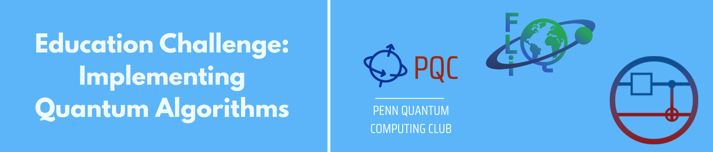

# FLIQ Education Track - Implementing Quantum Algorithms

## Overview

### Challenge Overview

Rather than simply presenting a finished quantum circuit, your task is to break down a **quantum algorithm step by step**, explaining the math, intuition, and reasoning behind each part. The tutorial should be written **as if guiding a newcomer**, helping them build a deep understanding of how the algorithm works both in theory and in practice.

This is not just about code — it’s about education, clarity, and connection between **math, circuits, and implementation.**

### Challenge Curators

 

### Difficulty Level

Intermediate to Advanced

## Challenge Details

### Challenge Format

The goal of this challenge is to create an educational tutorial that teaches how to implement a quantum algorithm from the ground up, focusing on how to guide someone through the process as if they are encountering the algorithm for the first time. Rather than simply presenting a finished circuit, your task is to break down the algorithm step by step, explaining the reasoning behind each part and connecting the mathematical ideas to the actual quantum circuit construction. The tutorial should help learners build intuition about why the algorithm works and how each component contributes to its overall function, while anticipating common points of confusion and clearly explaining why each step is necessary.

Submissions should demonstrate awareness of how the algorithm maps onto real quantum hardware, addressing considerations such as qubit connectivity, circuit depth, and noise. The focus is on making quantum algorithms accessible, understandable, and implementable through clear explanations that emphasize both the theoretical foundation and practical implementation. These tutorials should be written as Jupyter Notebooks, which rely on Qiskit code to showcase the algorithm and its underlying quantum principles. You can find more details on the specific deliverables in the section below.

*(Image Credits: Image by pch.vector on Freepik)*

### Examples of Possible Algorithms

Below is a selection of quantum algorithms that you can use for your tutorial. However, feel free to choose other well-known algorithms if you think they are interesting and educational.

* **Search & Speedup**
    * Grover’s Search Algorithm
    * Bernstein-Vazirani Algorithm
    * Deutsch-Jozsa Algorithm
    * Simon’s Algorithm
* **Period Finding & Fourier Techniques**
    * Shor’s Algorithm for Factoring
    * Quantum Fourier Transform (QFT)
    * Quantum Phase Estimation (QPE)
* **Entanglement & Communication**
    * Quantum Teleportation
    * Superdense Coding
    * Bell and GHZ State Preparation

### Team Formation

Once you’ve reviewed the challenge format, you should connect with other attendees to form a group!

* Group up in teams of up to 5 members.

### Roles

To make it easier for you to organize your team, we have listed some roles which might be distributed among the team. This is a suggestion & is not required to be used. Of course, it’s still fundamental to discuss, brainstorm, and help the rest of the team, even if you use these roles.

* **Coders**: Implement the algorithm in Qiskit, ensuring the code runs correctly and aligns with the tutorial explanations (2 people).
* **Lectors**: Focus on writing clear, beginner-friendly explanations that break down the algorithm step by step (2 people).
* **Planner**: Coordinate the team’s workflow, keep track of progress, and make sure that the final notebook submission is polished and submitted on time (1 person).

### Project Submission

To enter the judging phase, your project should be submitted as a single Jupyter Notebook that is easy to view and navigate online. We ask that you host your notebook on GitHub and organize your repository clearly so that reviewers can easily follow your work from start to finish.

**Submission Guidelines**

* Your notebook should be self-contained and include all the explanations, code, and results you want to be evaluated.
* Any additional files (such as your testing script) should be included in the same repository.
* Your notebook should render correctly on GitHub without requiring extra setup.
* If needed, include a `README.md` with brief instructions on how to run your notebook locally.
* The purpose of this challenge is to teach, so prioritize clarity, organization, and readability. Judges should be able to follow your thought process, understand your implementation, and interpret your results without needing to dig through external links or additional files.

**Where to Submit**

Submit your GitHub repository link through the submission form provided on the AI for Good website.

**Deadlines**

Please submit your repository between **May 16th and May 18th**. Late submissions will not be accepted.

### Deliverables Required:

Your final submission should take the form of a Jupyter Notebook that teaches and implements your chosen algorithm clearly and thoughtfully. The notebook should balance explanation with working code and include one example that runs on real quantum hardware. The goal is for someone reading your notebook to understand both how the algorithm works and how to apply it themselves.

To make sure your notebook is complete, your submission should include:

* **A fully working Jupyter Notebook**
    * Your notebook should run on local Qiskit installations (Windows and Mac) as well as on qBraid Lab. The code should be clear, reproducible, and easy to follow.
* **An example that runs on real quantum hardware**
    * At least one exercise in your notebook should be designed to execute on an actual quantum device. This should highlight how the algorithm performs on real hardware, not just in simulation.
* **A local testing script**
    * Include a separate Python file (`.py`) that can check whether your code is correct before submitting it to the quantum device. Think of this as a local grader that helps avoid unnecessary queue time.
* **An estimate of hardware runtime**
    * For your submission, provide a clear estimate of how long your job will take to run on your chosen IBM device (excluding queue time), based on the number of qubits, circuit depth, and shots—using Qiskit tools or backend documentation as needed. Your job’s device runtime should preferably not exceed 5 minutes so others can easily reproduce your results. If your job approaches or exceeds this limit, suggest how it could be shortened (such as reducing shots or simplifying the circuit).
* **Code for submitting jobs and retrieving results**
    * Your notebook should include the code needed to submit your job to the quantum device, save the Job ID, and later retrieve the results.
* **Meaningful result visualization**
    * Use plots, charts, or other visual tools to help readers understand what happened when the job ran. The goal is to make your results easy to interpret and easy to share.
* **Clear explanation throughout**
    * Write consistent, beginner-friendly text that explains the use case you chose, walks through the algorithm itself, and describes what your experiment is demonstrating. The explanations should support the reader in connecting the math, the code, and the quantum principles behind the algorithm.

### Recommended Features

These aren’t strict requirements, but including them will make your notebook more engaging and effective.

* **Exercises that build toward the final example**
    * Try adding 1–3 smaller exercises that lead into your final run on real hardware. These should help readers step through the key ideas piece by piece, with clear explanations and (if possible) some way to check that their answers are on track.
* **A tuneable final exercise**
    * Make your final example adjustable. Let readers play with parameters like the number of qubits, shots, or input values. This gives people the chance to explore and compare their results.
* **Design exercises that make readers reflect and understand**
    * Include at least one challenge that teaches a new concept, technique, or trick. Aim for questions that push the reader to reason through the problem. Design something a person needs to solve, and is not solvable by just using an AI autocomplete.
* **Visualizations that clarify, not just decorate**
    * Good plots, diagrams, or circuit sketches can make a huge difference. Use them to show how the algorithm works, what the results mean, or why certain choices matter.
* **Clear, direct language focused on teaching**
    * Write with the goal of helping readers understand the ideas, avoiding language that feels like a pitch or marketing copy. Keep your explanations clear and focused on helping the reader learn.


*(Image Credits: Image by pch.vector on Freepik)*

### Tutorial Aspect:

* Of course, you should still highlight with the use case example etc. how the function helps to solve hard problems.
* Making a pure tutorial which runs without user input. This should be an exercise/challenge to users.
* Naturally, don’t make it too hard since you want people to be able to solve it.

## Judging Criteria

The following criteria will be used by our expert panel to evaluate submissions:

* **Correctness of the code**: Submissions will be judged based on the accuracy of the implementation and how well your test cases and examples demonstrate correctness.
* **Clarity and readability of the tutorial**: How clearly the tutorial explains the algorithm, including the organization of explanations, code, and results.
* **Quality of the learning experience**: How well the tutorial helps readers understand the algorithm, including explanations, reasoning, use of visualizations, and how effectively common points of confusion are addressed.

## Prizes and Awards


## Resources

For more information on Python, Qiskit, and features and libraries we recommend for this implementation, please refer to [**our tutorials and resources page**](https://challenge.aiforgood.itu.int/match/matchitem/TutorialsAndResources.ipynb) in this repository.

### Notebook Made By:

Jimena Olivares Rivera, Penn Quantum Computing Club

# Evaluation Criteria

## Judging Criteria

The following criteria will be used by our expert panel to evaluate submissions:

* **Correctness of the code**: Submissions will be judged based on the accuracy of the implementation and how well your test cases and examples demonstrate correctness.
* **Clarity and readability of the tutorial**: How clearly the tutorial explains the algorithm, including the organization of explanations, code, and results.
* **Quality of the learning experience**: How well the tutorial helps readers understand the algorithm, including explanations, reasoning, use of visualizations, and how effectively common points of confusion are addressed.

---

# Submission

## Title of Your Work

**(Your Title Here)**

## Team Members:

**(List Team Members Here)**

✅ **Reminder**: Alongside this notebook, submit your final local testing script as a `.py` file. This script should help check correctness before sending jobs to real quantum hardware.

## Introduction

Briefly introduce the algorithm you chose.
* What problem does it solve?
* Why is it interesting or important to teach?

## Learning Goals

List what the reader should be able to understand or do by the end of your tutorial.
For example:
* Understand the problem the algorithm addresses.
* Follow the mathematical reasoning behind the algorithm.
* Know how each part of the quantum circuit contributes to the solution.
* Successfully run the algorithm on both a simulator and real quantum hardware.

## Background

Provide the necessary background to understand the algorithm.
Explain any key quantum principles, math concepts, or notation that your audience needs.

## Step-by-Step Algorithm Explanation

Break down the algorithm carefully, step by step.
If helpful, include diagrams, circuits, or pseudocode alongside your explanations.

## Exercises (Recommended)

Include small exercises that help readers engage with the material.
These could be:
* Conceptual questions.
* Code challenges.
* Small tasks to modify a circuit and observe the changes.

These exercises should build toward your final example. Make sure they help reinforce learning without being too difficult.

## Implementation of the Algorithm

Provide your full implementation of the algorithm in Qiskit.
Explain what each part of your code does.
Include comments or markdown cells to clarify key ideas.
Encourage readers to adjust parameters and experiment with the code where appropriate.

```python
# Your algorithm implementation here
# Include code and explanations


# Submission

## Title of Your Work

**(Your Title Here)**

## Team Members:

**(List Team Members Here)**

✅ **Reminder**: Alongside this notebook, submit your final local testing script as a `.py` file. This script should help check correctness before sending jobs to real quantum hardware.

## Introduction

Briefly introduce the algorithm you chose.
* What problem does it solve?
* Why is it interesting or important to teach?

## Learning Goals

List what the reader should be able to understand or do by the end of your tutorial.
For example:
* Understand the problem the algorithm addresses.
* Follow the mathematical reasoning behind the algorithm.
* Know how each part of the quantum circuit contributes to the solution.
* Successfully run the algorithm on both a simulator and real quantum hardware.

## Background

Provide the necessary background to understand the algorithm.
Explain any key quantum principles, math concepts, or notation that your audience needs.

## Step-by-Step Algorithm Explanation

Break down the algorithm carefully, step by step.
If helpful, include diagrams, circuits, or pseudocode alongside your explanations.

## Exercises (Recommended)

Include small exercises that help readers engage with the material.
These could be:
* Conceptual questions.
* Code challenges.
* Small tasks to modify a circuit and observe the changes.

These exercises should build toward your final example. Make sure they help reinforce learning without being too difficult.

## Implementation of the Algorithm

Provide your full implementation of the algorithm in Qiskit.
Explain what each part of your code does.
Include comments or markdown cells to clarify key ideas.
Encourage readers to adjust parameters and experiment with the code where appropriate.

```python
# Your algorithm implementation here
# Include code and explanations
```

## Local Testing Script Explanation
Describe how your separate .py testing script works.

What does the script check?

How can the reader use it to verify correctness before running on real hardware?

```python
# This notebook cell could call your test functions to show how they work
# Your actual testing logic should be in the separate .py file
```
Example Running on Real Quantum Hardware
Demonstrate how to run your algorithm on an actual IBM Quantum backend.

Which backend did you choose?

Why is this backend appropriate (number of qubits, connectivity, etc.)?

Include:

Code for selecting the backend.

Job submission.

Saving the Job ID.

Retrieving and displaying results.

```Python

# Example hardware submission code
Estimate of Hardware Runtime
Provide a clear estimate of the runtime for your job on the chosen backend.
```
Number of qubits:

Circuit depth:

Number of shots:

Estimated device runtime (excluding queue time):

If your estimated runtime is close to or exceeds 5 minutes, suggest ways to reduce it (e.g., fewer shots, smaller problem instance).

Result Visualization
Use clear visualizations to help explain what your results mean. This could include:

Measurement outcome bar plots.

Circuit diagrams.

Comparisons between simulator and hardware results.

```Python

# Example result visualization code
Optional: Tunable Final Example
Consider making your final example adjustable. Encourage readers to modify parameters such as:
```
Number of qubits.

Oracle or input values.

Number of shots.

Let readers explore how these choices affect the results.

Submission Instructions
Host your final Jupyter Notebook on GitHub.

Include all required files (notebook, test script, README if needed).

Ensure your notebook renders correctly on GitHub (no extra setup required).

Submit your GitHub repository link through the official form on the AI for Good website.


# Resources

## Pre-FLIQ Workshops:

* [**Quantum computing 102: Algorithms and applications**](https://www.youtube.com/live/cl02mRpeeU0); Hsin-Yuan Huang, CalTech
* [**How to teach quantum: Tools and strategies that work**](https://www.youtube.com/live/vzH1RohGS4I); Junye Huang, IBM
* [**Quantum meets creativity: Using art and stories to teach quantum**](https://www.youtube.com/live/dMxnHwS23DA); Smitha Vishveshwara, University of Illinois Urbana-Champaign
* [**Playing with possibilities: Teaching quantum through chess**](https://www.youtube.com/live/dMxnHwS23DA); Tamás Varga, q-edu-lab.com

## Reading Material:

* [Tutorials and Resources Notebook (Google Colab)](https://colab.research.google.com/drive/TutorialsAndResources.ipynb)
* [Qiskit Documentation](https://qiskit.org/documentation/)
* [qBraid Lab](https://lab.qbraid.com/)

---

# Prizes

**Best solution in this challenge**
* USD 500 awarded to the top-performing solution based on evaluation criteria.

**Overall Education track winner**
* USD 1,000 awarded to the top-performing solution of the Education track.
* Opportunity to present the challenge as part of the Qiskit Global Summer School.
* Travel grant to present the winning project at the Quantum for Good track of the AI for Good Global Summit.

For team submissions, cash prizes will be awarded per submission and the travel grant will cover one representative (selected by the team).

---

# Contact

Please utilize the education track channel in the [FLIQ Discord](https://discord.gg/7xNepHFwXW) for any questions. *
**The challenge creators:**
* Marcel Pfaffhauser (IBM)
* Jimena Olivares (Penn QC club)
* Jaime Salazar (Penn QC club)
*(These creators will try to be active there.)*

---

# Final Notes

This is an educational challenge—be creative, collaborative, and clear. Your goal is to make quantum computing more accessible by walking others through the process of building a quantum algorithm from scratch.

Good luck!