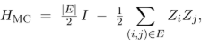
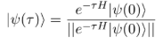
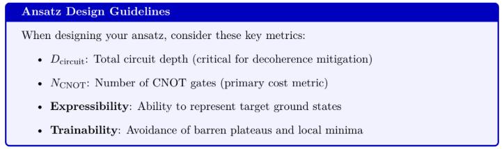
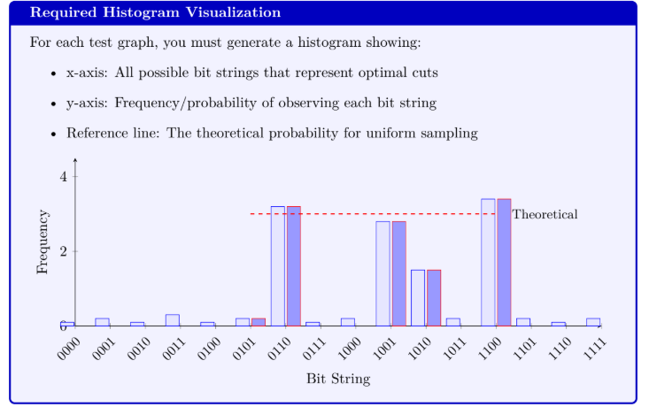

# FLIQ Science Track - MAX-CUT: Ground state at minimum cost

## Overview

MaxCut is often considered the "hello world" of quantum optimization: it's simple to state, NP-hard to solve, and can be naturally expressed as an Ising Hamiltonian. Given a graph $G = (V, E)$, the objective is to partition the vertices into two sets (commonly labeled as $+1$ and $-1$, or “black” and “white”) such that the number of edges connecting these two sets—known as the **cut size**—is maximized.

Encoding this cost function into Pauli-$Z$ operators provides an ideal environment for exploring modern NISQ (Noisy Intermediate-Scale Quantum) algorithms. MaxCut stands as an exemplary benchmark for several compelling reasons:

* **Universality**: MaxCut is capable of encoding numerous practically relevant computational problems.
* **Scalability**: Instances of the problem can be generated at any desired size, allowing for the probing of quantum advantage thresholds.
* **Verifiability**: Solutions to MaxCut instances can be efficiently verified using classical methods.
* **Hardware-friendly**: The Ising model, which MaxCut maps to, directly corresponds to the architecture of actual quantum processors.

This challenge is a component of the **Science Track**, designed to immerse participants in technical and scientific problem-solving across the entire quantum stack.

### Challenge Curators

# Challenge Statement

You receive a fully-worked Jupyter notebook that serves as the foundation for your solution. This notebook includes:

* **MaxCut Hamiltonian construction**: A function `build_maxcut_hamiltonian(graph)` that implements the transformation:

    where $|E|$ is the number of edges in the graph, $\mathbb{I}$ is the identity operator, and $Z_i$ denotes the Pauli-$Z$ operator acting on qubit $i$.

* **Variational Quantum Imaginary Time Evolution (varQITE)**: A class `QITEvolver` implementing a state-of-the-art algorithm for finding ground states. This approach simulates imaginary time evolution:

using variational principles to efficiently approximate this evolution on NISQ hardware.

* Utility functions

## Your Mission

Your task consists of four interconnected challenges:

### 1. Ansatz Engineering

Design a parameterized quantum circuit $U(\theta)$ that can capture MaxCut ground states while minimizing both the circuit depth $D_{\text{circuit}}$ and CNOT count $N_{\text{CNOT}}$. Your ansatz should:

* **Scale efficiently** with graph size and connectivity
* **Maintain expressibility** sufficient to represent MaxCut solutions
* **Exploit problem symmetries** where possible

Consider various ansatz families including:

* Hardware-efficient ansätze (HEA)
* Symmetry-preserving ansätze
* Adaptive/iterative circuit construction

### 2. Algorithm Tuning

Integrate your ansatz with the provided `QITEvolver` class and optimize the learning process. This includes:

* **Hyperparameter optimization**: Select optimal values for:
    * Learning rate (possibly with scheduling)
    * Imaginary time step size $\Delta\tau$
    * Total evolution time $\tau_{\text{max}}$
    * Convergence criteria
* **Optimization improvements**: Consider modifications to the standard varQITE approach:
    * Alternative classical optimizers (SPSA, natural gradient, etc.)
    * Parameter initialization strategies
    * Regularization techniques
    * Shot allocation optimization

# Evaluation Criteria

A critical aspect of this challenge is not just finding a single optimal solution, but characterizing the full solution space through proper sampling. Your final score will be significantly influenced by your ability to generate a representative distribution of all optimal solutions.

## Solution Space Characterization

For each graph instance, you must provide:
* A histogram showing the distribution of bit strings representing all optimal solutions.
* Statistical analysis of the solution space diversity.
* Verification that your quantum algorithm samples from the solution space with the correct theoretical probabilities.

## Prizes

**Best solution in this challenge**
* USD 500 awarded to the top-performing solution based on evaluation criteria.

**Overall Science track winner**
* USD 1,000 awarded to the top-performing solution of the Science track and a travel grant to present the winning project at the Quantum for Good track of the AI for Good Global Summit.

For team submissions, cash prizes will be awarded per submission and the travel grant will cover one representative (selected by the team).

---

# Contact

* **Vadim Karpusenko**, IonQ ([karpusenko@ionq.co](mailto:karpusenko@ionq.co))
* **David Nizovsky**, Vanderbilt Quantum Initiative ([david.nizovsky@vanderbilt.edu](mailto:david.nizovsky@vanderbilt.edu))
* **ITU**: [quantum@itu.int](mailto:quantum@itu.int)