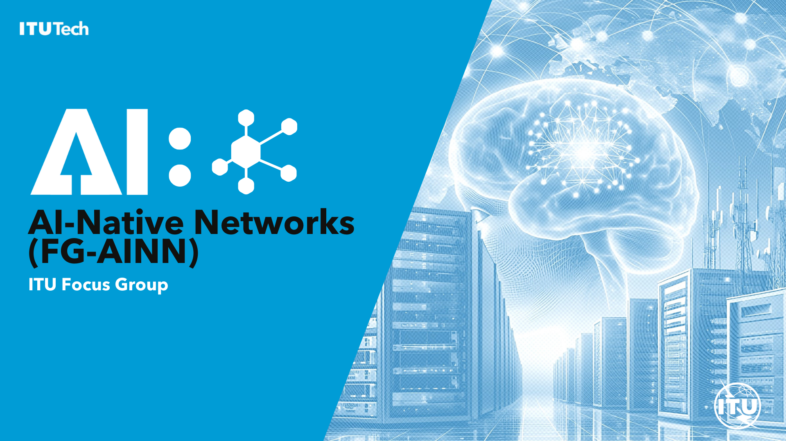

# ITU FG AINN Build-a-thon 2025: Building PoCs and Demos for AI-Native Networks

## Description

### Background

The ITU FG AINN Build-a-thon 2025 aims to develop designs and demonstrations to study key concepts discussed within the Focus Group (FG). The Build-a-thon will document and showcase the feasibility and considerations of these key concepts using currently available design and implementation approaches.

The broad objectives of the Build-a-thon are:

* **Analyze AI Native Use Cases**: Analyze AI Native for telecommunication networks use cases, requirements, and foster awareness on the FG activities.
* **Derive New Contributions**: Derive new contributions for the FG-AINN in the areas of:
    * Standardization Gaps
    * Use Cases
    * Architectures
    * Proofs of Concept (PoCs)
* **Explore Practical Feasibility**: Explore practical feasibility and trade-offs of AI-native networks via PoCs for specific use cases and architecture concepts.
* **Facilitate Hands-on Engagement**: Facilitate hands-on engagement through crowd-sourced coding and development activities.
* **Engage Stakeholders**: Engage stakeholders in discussions and collaborations to advance AI-native networks, especially a crowd-sourced coding activity involving academia, industry, and startups.

### Participation Stages

Participation in the Build-a-thon is divided into the following stages:

* **Stage-1. Demo Proposals**: These are proposals that clearly explain the chosen concept for demonstration, its relation with AI Native networks, including alternatives and trade-offs for studying and implementing them. Background study supporting the proposal should be added, and hypotheses on the target conclusions, based on currently ongoing studies in the domain of AI Native Networks, can be clearly mentioned in the proposal.
* **Stage-2. Implementation Proposals**: These are proposals that clearly explain the implementation approaches in detail, including the test setup, base code to be used (if any), mapped to the demo proposal from Stage 1. Functional and performance requirements corresponding to the demo, any datasets needed, toolsets (including open-source or proprietary), and test cases that correspond to requirements need to be added at this stage.
* **Stage-3. Initial Implementation of the Demo**: These implementations actualize parts of the implementation proposal from Stage 2. The initial implementation may not be complete nor final, but clearly shows progress towards completion. The pass/fail status of the test cases from Stage 2 shall be added in the submission. A plan towards the final demo would be added in relation to the current status of the initial implementation.
* **Stage-4. Final Demo and Report**: A contribution in the template of FG AINN, collating the relevant items from Stages 1, 2, and 3 above, specially highlighting the lessons learned on the feasibility of the design and that of the chosen implementation approach. A demo presentation showcasing the test cases and their results.

### Online Mentoring Sessions

A schedule for online mentoring sessions will support interested parties through the four stages of the Build-a-thon. These sessions are designed to help you shape, implement, and present your demo with expert guidance.

**Note**: The start date for mentoring sessions has passed (May 23, 2025).

**Mentoring Schedule (Past Dates)**:

* **Stage 1: Demo Proposals**
    * Session 1 – Friday, May 23, 2025: Kick-off and overview of demo proposal expectations.
    * Session 2 – Tuesday, May 27, 2025: Feedback and refinement of your demo proposals.
* **Stage 2: Implementation Proposals**
    * Session 3 – Friday, May 30, 2025: Submission and discussion of detailed implementation plans.
* **Stage 3: Initial Implementation**
    * Session 4 – Tuesday, June 3, 2025: Share early implementation progress and receive feedback.
    * Session 5 – Friday, June 6, 2025: Continue with implementation updates. Submit current status and plan for final demo.
* **Stage 4: Final Demo & Report**
    * Session 6 – Friday, June 13, 2025: Final demo presentations and report submission during the in-person Build-a-thon workshop.

**Registration for online mentoring sessions (Past Event)**: [https://itu.zoom.us/meeting/register/Mmn7YcLRRQm0L6kkU4HY6A](https://itu.zoom.us/meeting/register/Mmn7YcLRRQm0L6kkU4HY6A)

# Problem Statements: Build-a-thon 2025 Topics

This is a non-exhaustive list of topics and sample submissions for the first edition of the Build-a-thon 2025. Topics outside of this list, with proper justification, are highly welcome.

---

## a) Use of AI Pipelines to Build and Manage Enhancements in the Network

This category focuses on leveraging AI to drive and oversee improvements within telecommunication networks.

**Examples include:**

* **Anticipating Human Needs**: Uses of AI techniques, such as Natural Language Processing (NLP), to anticipate the needs of humans and produce output more understandable to them.
* **Collaborative Planning and Strategizing**: AI collaborating with humans in planning and strategizing, including comparison of strategies by AI to achieve human needs and external tool usage.
* **AI-Based Simulation Scenario Generation and Management**: Creating and managing simulation scenarios using AI.
* **Intent-to-Workflow Abstraction**: AI-based abstraction and de-abstraction from operator intent into workflows and content generation towards the operator.
* **Automated Network Changes**: AI creating complete step-wise changes needed in the network, including design, code, validations, and translation of operator personnel’s intent to feature-specific workflows. This should be supported with a knowledge base.
* **Validity Analysis**: AI analyzing the reasons for the validity of changes based on the knowledge base.
* **Complex Service Decomposition**: AI performing complex service decomposition.

---

## b) Use of AI Pipelines to Build and Manage New AI Technologies in the Network

This category explores the application of AI in developing and orchestrating novel AI capabilities within the network infrastructure.

**Examples include:**

* **ML Orchestrator**: Training, integration, and management of AI models based on ML orchestrators.
* **AI Agent Creation and Management**: Generating and managing AI agents.
* **Code and Document Generation**: AI generating code and documents.
* **Tool Usage by AI Models**: AI models utilizing tools to interface with non-AI native parts of the network.
* **Knowledge Distillation**: Distillation of knowledge within the network.
* **Reflection as Feedback**: Implementing reflection as a feedback mechanism.
* **Cognitive Functions**: Developing AI for cognitive functions in the network.
* **Standardized Metadata**: Creation and maintenance of standardized metadata.
* **Data and Model Catalogues**: Creation and maintenance of data and model catalogues.
* **Synthetic Data Generation**: Generating synthetic data using AI.

---

## c) Creation and Management of Knowledge Bases in the Network Using AI

This category focuses on AI-driven approaches for building and maintaining robust knowledge bases crucial for network operations.

**Examples include:**

* **Feature-Specific Knowledge Capture**: Capturing feature-specific states, feature-specific action templates, and feature-specific algorithms within the knowledge base.
* **AI Model Fine-Tuning**: Fine-tuning of AI models using such knowledge bases.
* **Specific Features Examples**: Examples of specific features include resource allocation, failure management, and traffic optimization.

---

## d) AI Pipelines are Used to Build and Manage Feature-Specific Applications

This category involves using AI pipelines for the entire lifecycle of developing and managing applications tailored to specific network features.

**Examples include:**

* **Application Design, Code, and Test Case Generation**: Application design, code, and test cases generated using AI.
* **Deployment and Management**: Deployment and management of applications in the network using AI.
* **Monitoring and Optimization**: Monitoring and optimization of applications using AI.

# Evaluation Criteria

Participants will be evaluated based on the following broad criteria. (Note: Specific evaluation metrics were to be published, but the criteria below outline the scoring.)

Each of the following criteria will be scored from 0-10 points, with a total maximum score of 50 points.

* **Clarity of Demo Proposal and AI Native Relation**: Is the aim of the demo proposal clear, and does it have a well-defined relation with AI Native networks (focusing on the non-radio part)? Is the scope clearly explained based on the overall design but focused on specific scenarios for the demo?
* **Mapping of Scope, Requirements, and Objectives**: Is there a clear mapping between the demo scope, functional and non-functional requirements, and demo objectives? Are there practical implementation options and testing options?
* **Clarity of Test Cases**: Are the test cases clear and well documented?
* **Progress of Initial Implementation**: Does the initial implementation show clear progress towards the final demo?
* **Final Demo Alignment and Learnings**: Does the final demo show a clear mapping to the initial design? Are there valuable learnings called out in the final demo?

**Datasets Reference**:
Refer to the ITU CG Datasets document [here](https://www.itu.int/en/ITU-T/studygroups/2022-2024/13/Pages/Correspondence-Groups.aspx).
Further details about the CG datasets are available at the provided link.

---

# Timelines of Build-a-thon 2025 (Past Dates)

**Note**: As of June 19, 2025, these dates have passed.

* **May 10, 2025**: Announcement and registration starts
* **May 30, 2025**: Last date for submission of Stage-1 and Stage-2 proposals
* **June 01, 2025**: Announcement of selected proposals
* **June 11, 2025 & June 12, 2025**: Day-1 and Day-2 of Build-a-thon
* **June 13, 2025**: Final day of Build-a-thon.

Mentoring sessions started from May 10, 2025, and continued till June 13, 2025.

The Build-a-thon culminated on the last day of the 3rd FG AINN meeting:
* **Day 1 (June 11, 2025)**: 2-hour preparatory session during the FG AINN meeting.
* **Day 2 (June 12, 2025)**: 2-hour preparatory session during the FG AINN meeting.
* **Day 3 (June 13, 2025)**: 1-day dedicated session for the workshop presentations, Build-a-thon coding sessions, evaluations, and prize distribution by dignitaries.

---

# Prizes of Build-a-thon 2025

* **1st Prize**: ₹15,000
* **2nd Prize**: ₹12,000
* **3rd Prize**: ₹10,000
* **Special Prize for Women’s Team**: ₹12,000
* **Special Prize for Startups Team**: ₹1,000
* **Mentors’ Prize**: ₹1,000
* All participants will receive **Certificates of Participation**.

**Travel and Accommodation Support**:
Domestic travel for selected teams (maximum 3 members, including mentors), subject to a maximum ceiling limit of ₹15,000/- per head, was supported for the Build-a-thon in New Delhi from June 11-13, 2025. Accommodation in DoT (India) Training Center at Ghaziabad (Delhi National Capital Region) was also provided for those who wished for it.

---

# Resources

* Refer to the ITU FG AINN website here: [https://www.itu.int/en/ITU-T/focusgroups/ainn/Pages/default.aspx](https://www.itu.int/en/ITU-T/focusgroups/ainn/Pages/default.aspx)

**Mentoring**:
Mentoring for the registered teams started from May 10, 2025, and was provided in two parts:
* **Mentoring Part-1**: Until Stage-2 of the Build-a-thon for submissions.
* **Mentoring Part-2**: Until Stage-4 of the Build-a-thon for selected participants.

**Document References**:
* Please see [Annex-1 of document FG-AINN-I-094](https://www.itu.int/en/ITU-T/focusgroups/ainn/Documents/FG-AINN-template.docx) for specific topics and sample submissions. (Note: The provided link leads to a general template, not directly to an annex with specific topics. Participants would typically refer to the full document.)
* Please see [Annex-2 of document FG-AINN-I-093](https://www.itu.int/en/ITU-T/studygroups/2022-2024/13/Documents/TSB/FG-AINN/FG-AINN-I-093-Annex-2.doc) for frequently asked questions. (Note: The provided link leads to a general ITU document search result, not directly to the annex itself. Participants would need to navigate to the specific document.)