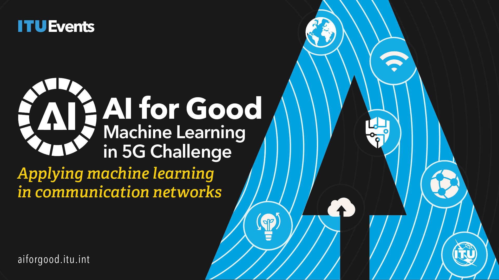

# 🌐 ITU AI Challenges Archive

---

Welcome to the **ITU AI Challenges Archive**! This repository contains a curated collection of AI and ML challenges organized by the International Telecommunication Union (ITU) from 2021 to 2025. Each year features a variety of innovative challenges designed to push the boundaries of AI in telecommunications and beyond.

---

## 📚 How to Use This Archive
- **Browse by Year:** Challenges are organized by year. Click on a year to see its challenges.
- **Explore Challenges:** Each challenge folder contains a `Readme.md` with detailed information, datasets, and instructions.
- **Get Inspired:** Use these challenges for learning, research, or as inspiration for your own projects!

---

## 🗂️ Challenge Index

### 2021
- [ITU-ML5G-PS-016 Location estimation using RSSI of wireless LAN](2021/ITU-ML5G-PS-016%20Location%20estimation%20using%20RSSI%20of%20wireless%20LAN/Readme.md)
- [ITU-ML5G-PS-015 Network failure detection and root cause analysis in 5GC by NFV-based test environment](2021/ITU-ML5G-PS-015%20Network%20failure%20detection%20and%20root%20cause%20analysis%20in%205GC%20by%20NFV-based%20test%20environment/Readme.md)
- [ITU-ML5G-PS-014 Build-a-thon(PoC) Network resource allocation for emergency management based on closed loop analysis](2021/ITU-ML5G-PS-014%20Build-a-thon(PoC)%20Network%20resource%20allocation%20for%20emergency%20management%20based%20on%20closed%20loop%20analysis/Readme.md)
- [ITU-ML5G-PS-012 Radio Link Failure Prediction](2021/ITU-ML5G-PS-012%20Radio%20Link%20Failure%20Prediction/Readme.md)
- [ITU-ML5G-PS-011 Combinatorial Optimization Challenge- Delivery route optimization](2021/ITU-ML5G-PS-011%20Combinatorial%20Optimization%20Challenge-%20Delivery%20route%20optimization/Readme.md)
- [ITU-ML5G-PS-010 Forecasting Model for Service Allocation Network Using Traffic Recognition - Copy](2021/ITU-ML5G-PS-010%20Forecasting%20Model%20for%20Service%20Allocation%20Network%20Using%20Traffic%20Recognition%20-%20Copy/Readme.md)
- [ITU-ML5G-PS-009 RF-Sensor Based Human Activity Recognition](2021/ITU-ML5G-PS-009%20RF-Sensor%20Based%20Human%20Activity%20Recognition/Readme.md)
- [ITU-ML5G-PS-008 ML5G-PHY-Localization Multidevice localization with mmWave signals in a factory environment](2021/ITU-ML5G-PS-008%20ML5G-PHY-Localization%20Multidevice%20localization%20with%20mmWave%20signals%20in%20a%20factory%20environment/Readme.md)
- [ITU-ML5G-PS-007 Lightning-Fast Modulation Classification with Hardware-Efficient Neural Networks](2021/ITU-ML5G-PS-007%20Lightning-Fast%20Modulation%20Classification%20with%20Hardware-Efficient%20Neural%20Networks/Readme.md)
- [ITU-ML5G-PS-006 ML5G-PHY-Reinforcement learning scheduling and resource allocation](2021/ITU-ML5G-PS-006%20ML5G-PHY-Reinforcement%20learning%20scheduling%20and%20resource%20allocation/Readme.md)
- [ITU-ML5G-PS-005 Network anomaly detection based on logs](2021/ITU-ML5G-PS-005%20Network%20anomaly%20detection%20based%20on%20logs/Readme.md)
- [ITU-ML5G-PS-004 Federated Learning for Spatial Reuse in a multi-BSS (Basic Service Set) scenario](2021/ITU-ML5G-PS-004%20Federated%20Learning%20for%20Spatial%20Reuse%20in%20a%20multi-BSS%20(Basic%20Service%20Set)%20scenario/Readme.md)
- [ITU-ML5G-PS-002 WALDO (Wireless Artificial intelligence Location DetectiOn) sensing using mmWave communications and ML](2021/ITU-ML5G-PS-002%20WALDO%20(Wireless%20Artificial%20intelligence%20Location%20DetectiOn)%20sensing%20using%20mmWave%20communications%20and%20ML/Readme.md)
- [ITU-ML5G-PS-001 Graph Neural Networking Challenge 2021 - Creating a Scalable Network Digital Twin](2021/ITU-ML5G-PS-001%20Graph%20Neural%20Networking%20Challenge%202021%20-%20Creating%20a%20Scalable%20Network%20Digital%20Twin/Readme.md)

### 2022
- [Slide Transition Detection and Title Extraction in Lecture Videos](2022/Slide%20Transition%20Detection%20and%20Title%20Extraction%20in%20Lecture%20Videos/Readme.md)
- [Synthetic Observability Data Generation using GANs](2022/Synthetic%20Observability%20Data%20Generation%20using%20GANs/Readme.md)
- [Smart Weather Station](2022/Smart%20Weather%20Station/Readme.md)
- [Non-linear Power Amplifier Behavioral Modeling to achieve higher energy efficiency in 5G RAN](2022/Non-linear%20Power%20Amplifier%20Behavioral%20Modeling%20to%20achieve%20higher%20energy%20efficiency%20in%205G%20RAN/Readme.md)
- [Network failure prediction on CNFs 5GC with Linux eBPF](2022/Network%20failure%20prediction%20on%20CNFs%205GC%20with%20Linux%20eBPF/Readme.md)
- [Multi Modal Beam Prediction Challenge 2022 Towards Generalization](2022/Multi%20Modal%20Beam%20Prediction%20Challenge%202022%20Towards%20Generalization/Readme.md)
- [Machine Learning for Throughput Prediction in Coordinated IEEE 802.11be Wi-Fi networks](2022/Machine%20Learning%20for%20Throughput%20Prediction%20in%20Coordinated%20IEEE%20802.11be%20Wi-Fi%20networks/Readme.md)
- [Location Estimation Using RSSI of Wireless LAN in NLoS Environment](2022/Location%20Estimation%20Using%20RSSI%20of%20Wireless%20LAN%20in%20NLoS%20Environment/Readme.md)
- [IQ-based Beam Classification with the DeepBeam Dataset](2022/IQ-based%20Beam%20Classification%20with%20the%20DeepBeam%20Dataset/Readme.md)
- [Graph Neural Networking Challenge 2022 Improving Network Digital Twins through Data centric AI](2022/Graph%20Neural%20Networking%20Challenge%202022%20Improving%20Network%20Digital%20Twins%20through%20Data%20centric%20AI/Readme.md)
- [Federated Traffic Prediction for 5G and Beyond](2022/Federated%20Traffic%20Prediction%20for%205G%20and%20Beyond/Readme.md)
- [Depth Map Estimation in 6G mmWave systems](2022/Depth%20Map%20Estimation%20in%206G%20mmWave%20systems/Readme.md)
- [Classification of Home Network Users to Improve User Experience](2022/Classification%20of%20Home%20Network%20Users%20to%20Improve%20User%20Experience/Readme.md)
- [BYOC Build your own Closed loop](2022/BYOC%20Build%20your%20own%20Closed%20loop/Readme.md)

### 2023
- [tinyML Hackathon Challenge](2023/tinyML%20Hackathon%20Challenge/Readme.md)
- [Multi Modal V2V Beam Prediction Challenge 2023](2023/Multi%20Modal%20V2V%20Beam%20Prediction%20Challenge%202023/Readme.md)
- [3D Location Estimation Using RSSI of Wireless LAN](2023/3D%20Location%20Estimation%20Using%20RSSI%20of%20Wireless%20LAN/Readme.md)
- [tinyML03 Scalable and High-Performance TinyML Solutions for Wildlife Monitoring](2023/tinyML03%20Scalable%20and%20High-Performance%20TinyML%20Solutions%20for%20Wildlife%20Monitoring/Readme.md)
- [tinyML02 Scalable and High-Performance TinyML](2023/tinyML02%20Scalable%20and%20High-Performance%20TinyML/Readme.md)
- [tinyML01 Next-Gen tinyML Smart Weather Station](2023/tinyML01%20Next-Gen%20tinyML%20Smart%20Weather%20Station/Readme.md)
- [Network failure classification model](2023/Network%20failure%20classification%20model/Readme.md)
- [AIML for 5G-Energy Consumption](2023/AIML%20for%205G-Energy%20Consumption/Readme.md)
- [Graph Neural Networking Challenge 2023](2023/Graph%20Neural%20Networking%20Challenge%202023/Readme.md)
- [Intrusion and Vulnerability Detection in Software-Defined Networks (SDN)](2023/Intrusion%20and%20Vulnerability%20Detection%20in%20Software-Defined%20Networks%20(SDN)/Readme.md)
- [Multi-environment automotive QoS prediction](2023/Multi-environment%20automotive%20QoS%20prediction/Readme.md)
- [Depth Map Estimation in 6G](2023/Depth%20Map%20Estimation%20in%206G/Readme.md)
- [Fault Impact Analysis Towards](2023/Fault%20Impact%20Analysis%20Towards/Readme.md)

### 2024
- [UN Metaverse Think-a-Thon 2024 - Virtual Worlds Revolutionizing Smart Sustainable Cities & Communities](2024/UN%20Metaverse%20Think-a-Thon%202024%20-%20Virtual%20Worlds%20Revolutionizing%20Smart%20Sustainable%20Cities%20&%20Communities/Readme.md)
- [Radio Resource Management (RRM) for 6G in-X Subnetworks [xtended]](2024/Radio%20Resource%20Management%20(RRM)%20for%206G%20in-X%20Subnetworks%20[xtended]/Readme.md)
- [Optimal Multi-user scheduling in massive MIMO mobile channels](2024/Optimal%20Multi-user%20scheduling%20in%20massive%20MIMO%20mobile%20channels/Readme.md)
- [Next-Gen tinyML Smart Weather Station Challenge 2024](2024/Next-Gen%20tinyML%20Smart%20Weather%20Station%20Challenge%202024/Readme.md)
- [Estimation of Site specific radio propagation loss](2024/Estimation%20of%20Site%20specific%20radio%20propagation%20loss/Readme.md)
- [ITU WTSA24 Hackhaton - AI Bharat 5G6G Sandbox](https://github.com/ITU-AI-ML-in-5G-Challenge/Challenge_Archive/tree/main/2024/ITU%20WTSA24%20Hackathon%20-%20AI%20Bharat%205G6G%20Sandbox)
- [Radio Resource Management (RRM) for 6G in-X Subnetworks](2024/Radio%20Resource%20Management%20-%20(RRM)%20for%206G%20in-X%20Subnetworks/README.md)

### 2025
- [Large Wireless Models (LWM) Challenge](2025/Large%20Wireless%20Models%20(LWM)%20Challenge/Readme.md)
- [ITU FG AINN Build-a-thon 2025](2025/ITU%20FG%20AINN%20Build-a-thon%202025/Readme.md)
- [FLIQ Science track - MAX-CUT](2025/FLIQ%20Science%20track%20-%20MAX-CUT/Readme.md)
- [Citiverse Designing Digital Public Infrastructure of Future Cities[student]](2025/Citiverse%20Designing%20Digital%20Public%20Infrastructure%20of%20Future%20Cities[student]/Readme.md)
- [Citiverse Designing Digital Public Infrastructure of Future Cities[startup]](2025/Citiverse%20Designing%20Digital%20Public%20Infrastructure%20of%20Future%20Cities[startup]/Readme.md)

### Zindi
#### 2025
- [Caribbean Voices AI Hackathon by UWI AI Innovation Centre](https://github.com/ITU-AI-ML-in-5G-Challenge/Challenge_Archive/tree/main/Zindi/Caribbean%20Voices%20AI%20Hackathon%20by%20UWI%20AI%20Innovation%20Centre/Readme.md)
- [Classification for Landslide Detection](https://github.com/ITU-AI-ML-in-5G-Challenge/Challenge_Archive/tree/main/Zindi/Classification%20for%20Landslide%20Detection/Readme.md)
- [GeoAI Agricultural Plastic Cover Mapping with Satellite Imagery by ITU](https://github.com/ITU-AI-ML-in-5G-Challenge/Challenge_Archive/tree/main/Zindi/GeoAI%20Agricultural%20Plastic%20Cover%20Mapping%20with%20Satellite%20Imagery%20by%20ITU/Readme.md)
- [Measuring What Matters Proposal Challenge by ITU](https://github.com/ITU-AI-ML-in-5G-Challenge/Challenge_Archive/tree/main/Zindi/Measuring%20What%20Matters%20Proposal%20Challenge%20by%20ITU/Readme.md)

#### 2024
- ['AIntuition' Retrieval Augmented Generation (RAG) for Public Services and Administration Tasks by ITU](https://github.com/ITU-AI-ML-in-5G-Challenge/Challenge_Archive/tree/main/Zindi/'AIntuition'%20Retrieval%20Augmented%20Generation%20(RAG)%20for%20Public%20Services%20and%20Administration%20Tasks%20by%20ITU/Readme.md)
- [GeoAI Amazon Basin Secret Runway Detection Challenge by ITU](https://github.com/ITU-AI-ML-in-5G-Challenge/Challenge_Archive/tree/main/Zindi/GeoAI%20Amazon%20Basin%20Secret%20Runway%20Detection%20Challenge%20by%20ITU/Readme.md)
- [GeoAI Ground-level NO2 Estimation Challenge by ITU](https://github.com/ITU-AI-ML-in-5G-Challenge/Challenge_Archive/tree/main/Zindi/GeoAI%20Ground-level%20NO2%20Estimation%20Challenge%20by%20ITU/Readme.md)
- [INEGI UN-GGIM Human Settlement Detection Challenge by ITU](https://github.com/ITU-AI-ML-in-5G-Challenge/Challenge_Archive/tree/main/Zindi/INEGI%20UN-GGIM%20Human%20Settlement%20Detection%20Challenge%20by%20ITU/Readme.md)
- [INEGI UN-GGIM Vegetation Mapping Challenge by ITU](https://github.com/ITU-AI-ML-in-5G-Challenge/Challenge_Archive/tree/main/Zindi/INEGI%20UN-GGIM%20Vegetation%20Mapping%20Challenge%20by%20ITU/Readme.md)
- [ITU Digital Financial Services Blockchain Secure Authentication Application Challenge](https://github.com/ITU-AI-ML-in-5G-Challenge/Challenge_Archive/tree/main/Zindi/ITU%20Digital%20Financial%20Services%20Blockchain%20Secure%20Authentication%20Application%20Challenge/Readme.md)

#### 2023
- [AIML for 5G-Energy Consumption Modelling by ITU AIML in 5G Challenge](https://github.com/ITU-AI-ML-in-5G-Challenge/Challenge_Archive/tree/main/Zindi/AIML%20for%205G-Energy%20Consumption%20Modelling%20by%20ITU%20AIML%20in%205G%20Challenge/Readme.md)
- [Fault Impact Analysis Towards Service-Oriented Network Operation & Maintenance by ITU](https://github.com/ITU-AI-ML-in-5G-Challenge/Challenge_Archive/tree/main/Zindi/Fault%20Impact%20Analysis%20Towards%20Service-Oriented%20Network%20Operation%20&%20Maintenance%20by%20ITU/Readme.md)
- [GeoAI Challege Location Mention Recognition from Social Media by ITU](https://github.com/ITU-AI-ML-in-5G-Challenge/Challenge_Archive/tree/main/Zindi/GeoAI%20Challege%20Location%20Mention%20Recognition%20from%20Social%20Media%20by%20ITU/Readme.md)
- [GeoAI Challenge for Air Pollution Susceptibility Mapping by ITU](https://github.com/ITU-AI-ML-in-5G-Challenge/Challenge_Archive/tree/main/Zindi/GeoAI%20Challenge%20for%20Air%20Pollution%20Susceptibility%20Mapping%20by%20ITU/Readme.md)
- [GeoAI Challenge for Cropland Mapping by ITU](https://github.com/ITU-AI-ML-in-5G-Challenge/Challenge_Archive/tree/main/Zindi/GeoAI%20Challenge%20for%20Cropland%20Mapping%20by%20ITU/Readme.md)
- [GeoAI Challenge for Landslide Susceptibility Mapping by ITU](https://github.com/ITU-AI-ML-in-5G-Challenge/Challenge_Archive/tree/main/Zindi/GeoAI%20Challenge%20for%20Landslide%20Susceptibility%20Mapping%20by%20ITU/Readme.md)
- [Network Traffic Scenario Prediction Challenge by ITU](https://github.com/ITU-AI-ML-in-5G-Challenge/Challenge_Archive/tree/main/Zindi/Network%20Traffic%20Scenario%20Prediction%20Challenge%20by%20ITU/Readme.md)
- [Next-Gen WiFi Throughput Prediction Challenge by ITU AIML in 5G Challenge](https://github.com/ITU-AI-ML-in-5G-Challenge/Challenge_Archive/tree/main/Zindi/Next-Gen%20WiFi%20Throughput%20Prediction%20Challenge%20by%20ITU%20AIML%20in%205G%20Challenge/Readme.md)
- [QoS Prediction Challenge by ITU AIML in 5G Challenge](https://github.com/ITU-AI-ML-in-5G-Challenge/Challenge_Archive/tree/main/Zindi/QoS%20Prediction%20Challenge%20by%20ITU%20AIML%20in%205G%20Challenge/Readme.md)
- [Smart Energy Supply Scheduling for Green Telecom Challenge by ITU](https://github.com/ITU-AI-ML-in-5G-Challenge/Challenge_Archive/tree/main/Zindi/Smart%20Energy%20Supply%20Scheduling%20for%20Green%20Telecom%20Challenge%20by%20ITU/Readme.md)
- [Spatio-Temporal Beam-Level Traffic Forecasting Challenge by ITU](https://github.com/ITU-AI-ML-in-5G-Challenge/Challenge_Archive/tree/main/Zindi/Spatio-Temporal%20Beam-Level%20Traffic%20Forecasting%20Challenge%20by%20ITU/Readme.md)
- [Specializing Large Language Models for Telecom Networks by ITU AIML in 5G Challenge](https://github.com/ITU-AI-ML-in-5G-Challenge/Challenge_Archive/tree/main/Zindi/Specializing%20Large%20Language%20Models%20for%20Telecom%20Networks%20by%20ITU%20AIML%20in%205G%20Challenge/Readme.md)
- [Title Extraction in Lecture Slides Challenge by ITU AIML in 5G Challenge](https://github.com/ITU-AI-ML-in-5G-Challenge/Challenge_Archive/tree/main/Zindi/Title%20Extraction%20in%20Lecture%20Slides%20Challenge%20by%20ITU%20AIML%20in%205G%20Challenge/Readme.md)

#### 2022
- [GeoAI Challenge Estimating Soil Parameters from Hyperspectral Images by ITU](https://github.com/ITU-AI-ML-in-5G-Challenge/Challenge_Archive/tree/main/Zindi/GeoAI%20Challenge%20Estimating%20Soil%20Parameters%20from%20Hyperspectral%20Images%20by%20ITU/Readme.md)
- [Landslide Prevention and Innovation Challenge](https://github.com/ITU-AI-ML-in-5G-Challenge/Challenge_Archive/tree/main/Zindi/Landslide%20Prevention%20and%20Innovation%20Challenge/Readme.md)
- [Multi-Machine Disruption Prediction Challenge for Fusion Energy by ITU](https://github.com/ITU-AI-ML-in-5G-Challenge/Challenge_Archive/tree/main/Zindi/Multi-Machine%20Disruption%20Prediction%20Challenge%20for%20Fusion%20Energy%20by%20ITU/Readme.md)
- [Runmila AI Institute & minoHealth AI Labs Tuberculosis Classification via X-Rays Challenge](https://github.com/ITU-AI-ML-in-5G-Challenge/Challenge_Archive/tree/main/Zindi/Runmila%20AI%20Institute%20&%20minoHealth%20AI%20Labs%20Tuberculosis%20Classification%20via%20X-Rays%20Challenge/Readme.md)
- [Your Voice, Your Device, Your Language Challenge](https://github.com/ITU-AI-ML-in-5G-Challenge/Challenge_Archive/tree/main/Zindi/Your%20Voice,%20Your%20Device,%20Your%20Language%20Challenge/Readme.md)

---

## 🤖 AI/ML in 5G Challenge
Applying machine learning in communications networks.

The ITU AI/ML in 5G Challenge offers carefully curated problem statements, a mix of real-world and simulated data, technical webinars, mentoring, and hands-on sessions. Teams participating in the Challenge enable, create, train and deploy ML models for communication networks. This enables participants to not only showcase their talent, test their concepts on real data and real-world problems, and compete for global recognition including prize money and certificates, but also enter the world of ITU standards by mapping their solutions to our specifications.

Join the ITU AI/ML in 5G Challenge! Organized by AI for Good, this platform collaboratively addresses problems in applying Artificial Intelligence and Machine Learning (AI/ML) in communication networks including 5G & 6G. The Challenge connects participants (students and professionals) from more than 100 countries, with industry and academia solving real-world problems using AI/ML in communication networks.

[Register for the Challenge!](https://challenge.aiforgood.itu.int/)

## 📬 Contact
For questions or suggestions, please contact: ai5gchallenge@itu.int

---

> _Empowering innovation in AI and telecommunications, one challenge at a time!_ 

