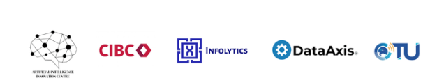

# Caribbean Voices AI Hackathon by UWI AI Innovation Centre

## Can you train an automatic speech recognition model for Caribbean accents?

Link to Zindi: https://zindi.africa/competitions/caribbean-voices-hackathon

Automatic Speech Recognition (ASR) systems like Whisper and others have transformed how we interact with technology — yet they regularly fail for Caribbean accents. This challenge invites data scientists, AI builders, and machine learning engineers from the Caribbean to help close that gap.

You’ll be working with a unique dataset of 28,000 thirty-second audio clips from BBC Caribbean, each manually transcribed. Your goal is to develop or fine-tune an ASR model that best predicts the transcribed text from the audio clips.

The top 5 participants on the final leaderboard will be invited to pitch an innovative application of their ASR model — showing how speech recognition for Caribbean languages could drive social and economic inclusion.

ASR models that perform well on Caribbean voices can open doors to inclusion in education, financial services, agriculture, and digital communication, empowering people and organisations across the region to access and create content in their own language.

<b>About</b> [UWI AI Innovation Centre](https://aiicentre.com/)

The Artificial Intelligence Innovation Centre is the Caribbean's first and largest centre dedicated to advancing research, capacity building, commercialization, and policy and governance in the field of Artificial Intelligence (AI). Established at The University of the West Indies, St. Augustine the AIIC currently partners with 20+ institutions, houses 50+ members and hosts over 35+ projects.

<b> About</b> [CIBC](https://www.cibc.com/en/about-cibc.html)

At CIBC, we aim to help our clients, employees, communities and shareholders achieve theirs. Our purpose drives our ability to create value for all CIBC stakeholders. Inspired by our purpose, we integrate sustainability into everything we do, focusing on environmental, social and governance (ESG) matters of importance to our stakeholders.

<b>About</b> [Infolytics](https://www.infolytics.tech/about)

Pioneering the future of organizational intelligence through innovative data analytics and artificial intelligence solutions that drive evidence-based decision making, ensuring that human needs drive every technological solution we create.

<b>About</b> [Data Axis](https://dataaxis.co/)

DataAxis’ mission is to help the government and private sector harness their data assets internally and help them monetize these data assets externally

<b>About CTU</b> 

The CIYN is a strategic initiative of the CTU to develop the next generation of ICT leaders: regulators, engineers, policymakers and entrepreneurs.

This initiative first began in 2022, following the International Telecommunication Union’s (ITU’s) inaugural Generation Connect Youth Summit in Kigali, Rwanda, for which many Caribbean delegates attended. The CTU’s Secretary General and his Deputy engaged these youth delegates post-summit, and offered them the opportunity to plan the first ever Caribbean Youth Internet Governance Forum (CYIGF) – held virtually in August 2022, preceding the annual Caribbean Internet Governance Forum (CIGF).

### Eligibility
This competition is open ONLY to participants who live in (with a valid proof of address) in the following countries:

1. Anguilla
2. Antigua and Barbuda
3. Bahamas
4. Barbados
5. Belize
6. Bermuda
7. British Virgin Islands
8. Cayman Islands
9. Curaçao
10. Dominica
11. Grenada
12. Guyana
13. Jamaica
14. Montserrat
15. Saint Kitts and Nevis
16. Saint Lucia
17. Saint Vincent and the Grenadines
18. Suriname
19. Trinidad and Tobago
20. Turks and Caicos Islands

### Competition Structure

#### Phase 1 (14 Nov - 7 Dec): Modelling Round

Develop an ASR model that can accurately transcribe audio clips. Submissions will be evaluated on transcription accuracy using the Word Error Rate (WER) metric.

#### Phase 2 ( 8 - 13 Dec): Innovation Round

The top 10 teams on the final leaderboard of Phase 1 (revealed after the challenge closes) will be invited to submit a 3-minute pitch for an impactful application of their ASR model in the Caribbean. Pitch videos must be submitted by 11:59pm AST on 9 December. Pitches can be a demo of a prototype app or slide deck presentation. The top 3 pitches will be selected (and notified by 11 December) to pitch live (virtually or in-person) to the judges at the official launch of the AI Innovation Center at UWI St. Augustine in Trinidad on 13 December 2025.

Your ideas for using the ASR model could address one or more of the following areas:

- Agriculture – e.g., voice-based tools for farmers, language-inclusive knowledge platforms.
- Financial Inclusion – e.g., voice-enabled banking or customer support systems that understand local accents.
- Social Inclusion – e.g., cultural preservation through digital media.
- Marginalized Communities – e.g., accessibility tools, subtitling and captioning for Caribbean content, services for the visually impaired or low literacy communities
- GovTech – e.g., voice-activated public services provided over telephone
You will have 3 minutes to present, and the pitch must be in English. It can incorporate a demo if you have one, but this is not a requirement of the challenge.

This means, if you believe you will be in the top 10 on the PRIVATE leaderboard at the end of the Phase 1, start preparing your concept and pitch.

The top three pitches will be judged live on 13 December, on the criteria of innovation, impact, and feasibility. <b>NB: This challenge is only open to users residing in CARICOM countries (see Eligibility section for full details). Winners will be expected to demonstrate proof of residence or nationality.</b>

### Evaluation
This challenge will be evaluated in two phases:

- Phase 1 winners and leaderboard position will be determined by Word Error Rate (WER) between your predicted transcriptions and the human transcription.
- Phase 2 finalists and winners will be decided based on a panel of judges of the pitch submissions, based on the evaluation rubric below.
The top ten participants in Phase 1 will be asked to submit a pitch in Phase 2.

#### Phase 1: Word Error Rate
In the first round, submissions will be evaluated using Word Error Rate (WER) between your predicted transcriptions and the human transcription.

For every row in the dataset, submission files should contain 2 columns: ID and Sranslation.

Your submission file should look like this:

| ID        | Transcription        |
|-----------|----------------------|
| ID_IJLHYZ | Lucia Labour Party... |
| ID_OFIPGR | Mrs. Trieu made...    |

#### Phase 2: Notebook and Documentation Evaluation

The top 3 shortlisted teams’ pitches will be evaluated by a panel of judges on 13 December, based on the following evaluation criteria:

- Innovation (40%) – Originality and creativity of the idea.
- Impact (40%) – Potential to drive social or economic inclusion.
- Feasibility (20%) – Practicality of implementation.

### Prizes

#### Phase 1:

1st prize: $2500

2nd prize: $1500

3rd prize: $1000

#### Phase 2:

$2500 for the winning pitch

Proof of residence must be provided for payment to be made.

There are 5 000 Zindi points available. You can read more about Zindi points [here](https://zindi.africa/discussions/13959?utm_source=zindi&utm_medium=blog&utm_campaign=challenge_resources&utm_id=CR).

Participants are required to submit:

1. A CSV file containing model predictions (online leaderboard);
2. The developed model code;
3. A report explaining their solution, including the outcomes of their models. The technical report will be used to judge the novelty/originality and usefulness of the proposed methodology
4. Participants will be required to present their solutions to an ITU Challenge Finale session

In evaluating the final submission, both the quality of the report (weighted 40%) and the achieved model score (weighted 60%) will be considered.

### Rules

- Languages and tools: You may only use open-source languages and tools in building models for this challenge.
- Who can compete: This challenge is only open to users residing in CARICOM countries (see Eligibility section for full details). Winners will be expected to demonstrate proof of residence or nationality.
- Submission Limits: 10 submissions per day, 50 submissions overall.
- Team size: Max team size of 4
- Public-Private Split: Zindi maintains a public leaderboard and a private leaderboard for each challenge. The Public Leaderboard includes approximately 30% of the test dataset. The private leaderboard will be revealed at the close of the challenge and contains the remaining 70% of the test set.
- Data Sharing: Priverty property of the client.
- Code Review: Top 10 on the private leaderboard will receive an email requesting their code at the close of the challenge. You will have 1 hour to submit your code.
- Code sharing: Multiple accounts, or sharing of code and information across accounts not in teams, is not allowed and will lead to disqualification.
- Solutions of value: Solutions handed over to clients must be of value to the client, regardless of leaderboard ranking.

ENTRY INTO THIS CHALLENGE CONSTITUTES YOUR ACCEPTANCE OF THESE OFFICIAL CHALLENGE RULES.

### Full Challenge Rules

<b>B: This challenge is only open to users residing in CARICOM countries (see Eligibility section for full details). Winners will be expected to demonstrate proof of residence or nationality.</b>

#### Teams and collaboration

You may participate in challenges as an individual or in a team of up to four people. When creating a team, the team must have a total submission count less than or equal to the maximum allowable submissions as of the formation date. A team will be allowed the maximum number of submissions for the challenge, minus the total number of submissions among team members at team formation. Prizes are transferred only to the individual players or to the team leader.

Multiple accounts per user are not permitted, and neither is collaboration or membership across multiple teams. Individuals and their submissions originating from multiple accounts will be immediately disqualified from the platform.

Code must not be shared privately outside of a team. Any code that is shared, must be made available to all challenge participants through the platform. (i.e. on the discussion boards).

The Zindi data scientist who sets up a team is the default Team Leader but they can transfer leadership to another data scientist on the team. The Team Leader can invite other data scientists to their team. Invited data scientists can accept or reject invitations. Until a second data scientist accepts an invitation to join a team, the data scientist who initiated a team remains an individual on the leaderboard. No additional members may be added to teams within the final 5 days of the challenge or last hour of a hackathon.

The team leader can initiate a merge with another team. Only the team leader of the second team can accept the invite. The default team leader is the leader from the team who initiated the invite. Teams can only merge if the total number of members is less than or equal to the maximum team size of the challenge.

A team can be disbanded if it has not yet made a submission. Once a submission is made individual members cannot leave the team.

All members in the team receive points associated with their ranking in the challenge and there is no split or division of the points between team members.

#### Datasets, packages and general principles

The solution must use publicly-available, open-source packages only.

You may use only the datasets provided for this challenge.

You may use pretrained models as long as they are openly available to everyone.

Automated machine learning tools such as automl are not permitted.

If the error metric requires probabilities to be submitted, do not set thresholds (or round your probabilities) to improve your place on the leaderboard. In order to ensure that the client receives the best solution Zindi will need the raw probabilities. This will allow the clients to set thresholds to their own needs.

You are allowed to access, use and share challenge data for any commercial, non-commercial, research or education purposes, under a CC-BY SA 4.0 license.

You must notify Zindi immediately upon learning of any unauthorised transmission of or unauthorised access to the challenge data, and work with Zindi to rectify any unauthorised transmission or access.

Your solution must not infringe the rights of any third party and you must be legally entitled to assign ownership of all rights of copyright in and to the winning solution code to Zindi.

#### Submissions and winning

You may make a maximum of 10 submissions per day.

You may make a maximum of 300 submissions for this challenge.

Before the end of the challenge you need to choose 2 submissions to be judged on for the private leaderboard. If you do not make a selection your 2 best public leaderboard submissions will be used to score on the private leaderboard.

During the challenge, your best public score will be displayed regardless of the submissions you have selected. When the challenge closes your best private score out of the 2 selected submissions will be displayed.

Zindi maintains a public leaderboard and a private leaderboard for each challenge. The Public Leaderboard includes approximately 30% of the test dataset. While the challenge is open, the Public Leaderboard will rank the submitted solutions by the accuracy score they achieve. Upon close of the challenge, the Private Leaderboard, which covers the other 70% of the test dataset, will be made public and will constitute the final ranking for the challenge.

Note that to count, your submission must first pass processing. If your submission fails during the processing step, it will not be counted and not receive a score; nor will it count against your daily submission limit. If you encounter problems with your submission file, your best course of action is to ask for advice on the challenge page.

If you are in the top 10 at the time the leaderboard closes, we will email you to request your code. On receipt of email, you will have 48 hours to respond and submit your code following the Reproducibility of submitted code guidelines detailed below. Failure to respond will result in disqualification.

If your solution places 1st, 2nd, or 3rd on the final leaderboard, you will be required to submit your winning solution code to us for verification, and you thereby agree to assign all worldwide rights of copyright in and to such winning solution to Zindi.

If two solutions earn identical scores on the leaderboard, the tiebreaker will be the date and time in which the submission was made (the earlier solution will win).

The winners will be paid via bank transfer, PayPal if payment is less than or equivalent to $100, or other international money transfer platform. International transfer fees will be deducted from the total prize amount, unless the prize money is under $500, in which case the international transfer fees will be covered by Zindi. In all cases, the winners are responsible for any other fees applied by their own bank or other institution for receiving the prize money. All taxes imposed on prizes are the sole responsibility of the winners. The top winners or team leaders will be required to present Zindi with proof of identification, proof of residence and a letter from your bank confirming your banking details. Winners will be paid in USD or the currency of the challenge. If your account cannot receive US Dollars or the currency of the challenge then your bank will need to provide proof of this and Zindi will try to accommodate this.

Please note that due to the ongoing Russia-Ukraine conflict, we are not currently able to make prize payments to winners located in Russia. We apologise for any inconvenience that may cause, and will handle any issues that arise on a case-by-case basis.

Payment will be made after code review and sealing the leaderboard.

You acknowledge and agree that Zindi may, without any obligation to do so, remove or disqualify an individual, team, or account if Zindi believes that such individual, team, or account is in violation of these rules. Entry into this challenge constitutes your acceptance of these official challenge rules.

Zindi is committed to providing solutions of value to our clients and partners. To this end, we reserve the right to disqualify your submission on the grounds of usability or value. This includes but is not limited to the use of data leaks or any other practices that we deem to compromise the inherent value of your solution.

Zindi also reserves the right to disqualify you and/or your submissions from any challenge if we believe that you violated the rules or violated the spirit of the challenge or the platform in any other way. The disqualifications are irrespective of your position on the leaderboard and completely at the discretion of Zindi.

Please refer to the FAQs and Terms of Use for additional rules that may apply to this challenge. We reserve the right to update these rules at any time.

#### Reproducibility of submitted code

If your submitted code does not reproduce your score on the leaderboard, we reserve the right to adjust your rank to the score generated by the code you submitted.

If your code does not run you will be dropped from the top 10. Please make sure your code runs before submitting your solution.

Always set the seed. Rerunning your model should always place you at the same position on the leaderboard. When running your solution, if randomness shifts you down the leaderboard we reserve the right to adjust your rank to the closest score that your submission reproduces.

Custom packages in your submission will not be accepted.

All data manipulation must be done in code, manual manipulation via manual labelling or Excel will lead to disqualification.

You may only use tools available to everyone i.e. no paid services or free trials that require a credit card.

Read this [article](https://zindi.africa/learn/documentation-guideline) on how to prepare your documentation and this article on how to ensure a successful code review.

#### Data standards:

- Your submitted code must run on the original train, test, and other datasets provided.
- If external data is allowed, external data must be freely and publicly available, including pre-trained models with standard libraries. If external data is allowed, any data used should be shared with Zindi to be approved and then shared on the discussion forum. Zindi will also make note of the external data available on the data page.
- Packages:
- You must submit a requirements file with all packages and versions used.
- If a requirements file is not provided, solutions will be run on the most recent packages available.
- Custom packages in your submission notebook will not be accepted.
- You may only use tools available to everyone i.e. no paid services or free trials that require a credit card.

#### Consequences of breaking any rules of the challenge or submission guidelines:

- First offence: No prizes for 6 months and 2000 points will be removed from your profile (probation period). If you are caught cheating, all individuals involved in cheating will be disqualified from the challenge(s) you were caught in and you will be disqualified from winning any challenges for the next six months and 2000 points will be removed from your profile. If you have less than 2000 points to your profile your points will be set to 0.
- Second offence: Banned from the platform. If you are caught for a second time your Zindi account will be disabled and you will be disqualified from winning any challenges or Zindi points using any other account.
- Teams with individuals who are caught cheating will not be eligible to win prizes or points in the challenge in which the cheating occurred, regardless of the individuals’ knowledge of or participation in the offence.
- Teams with individuals who have previously committed an offence will not be eligible for any prizes for any challenges during the 6-month probation period.

#### Monitoring of submissions

- We will review the top 10 solutions of every challenge when the challenge ends.
- We reserve the right to request code from any user at any time during a challenge. You will have 24 hours to submit your code following the rules for code review (see above). Zindi reserves the right not to explain our reasons for requesting code. If you do not submit your code within 24 hours you will be disqualified from winning any challenges or Zindi points for the next six months. If you fall under suspicion again and your code is requested and you fail to submit your code within 24 hours, your Zindi account will be disabled and you will be disqualified from winning any challenges or Zindi points with any other account.