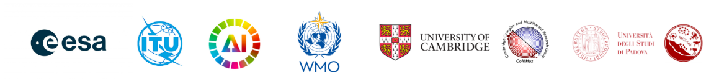

# Classification for Landslide Detection

## can you create a classification model to identify landslides?

Original on Zindi: https://zindi.africa/competitions/classification-for-landslide-detection

Landslides, triggered by natural events like heavy rainfall and earthquakes, pose significant risks to lives, infrastructure, and the environment. Effective monitoring and mapping of landslides are crucial for mitigating these risks, guiding emergency responses, and supporting resilient infrastructure planning.

Using multi-source satellite data, you will work to create an accurate landslide detection model. This model should differentiate landslide-affected areas from unaffected regions, leveraging both optical imagery and Synthetic Aperture Radar (SAR) data. The provided datasets, sourced from Sentinel-1 and Sentinel-2, include RGB and near-infrared bands as well as SAR bands (VV and VH) captured pre- and post-event. These data can reveal landscape changes and offer a unique view of the terrain, combining visual and radar-based insights to detect surface alterations and other indicators of landslides.

While optical data is precise and interpretable, SAR data is invaluable in cloud-covered regions. Combining these datasets can improve detection accuracy, particularly in challenging conditions.

The objective of this challenge is to create a model that effectively leverages SAR for cloud-covered regions while prioritising optical data where available, enabling accurate and reliable landslide detection.

You also need to adhere to trustworthy AI guidelines to create solutions that extend beyond performance metrics, ensuring models are transparent, ethical, and impactful, with tangible benefits for society and disaster resilience efforts.

### About AI for Good - International Telecommunication Union (ITU)

AI for Good is organized by ITU in partnership with 40 UN Sister Agencies. The goal of AI for Good is to identify practical applications of AI to advance the United Nations Sustainable Development Goals and scale those solutions for global impact. It’s the leading action-oriented, global & inclusive United Nations platform on AI.

### About the Global Initiative on Resilience to Natural Hazards through AI Solutions

The Global Initiative on Resilience to Natural Hazards through AI Solutions is a collaborative effort led by various UN agencies, including the International Telecommunication Union (ITU), the UN Environment Programme (UNEP), the UN Framework Convention on Climate Change (UNFCCC), the Universal Postal Union (UPU), and the World Meteorological Organization (WMO). The initiative aims to explore how AI can be effectively used in disaster management, providing expert guidance and support for research, innovation, and the development of standards. Building on previous work, the initiative leverages the outcomes of the ITU/WMO/UNEP Focus Group on Artificial Intelligence for Natural Disaster Management (FG-AI4NDM). To support the implementation of standards, the Global Initiative has developed a series of educational and capacity strengthening activities including this landslide challenge.

#### About the Cambridge Complex and Multihazard Research Group (ComHaz)

We work broadly on multihazard, in particular focusing on landslides, volcanoes, cryospheric hazards, and the interactions between these. We have wide ranging research interests, in particular integrating remote sensing, numerical modelling, AI and fieldwork to understand the interactions between multiple hazards. The objective of our research group is to do societally relevant research understanding the processes, improving our observations, and enabling the mitigation or prevention of complex hazard chains or multihazards. We particularly work on hazards, or hazard interactions that have been previously understudied or overlooked, with a view to better understanding these and preventing associated damage. Multidisciplinary collaboration – with social scientists, engineers, policymakers, etc. – is a core element to our work and is necessary to effectively understand natural hazard risk and ensure any new findings find real-world impact.

### About the Machine Intelligence and Slope Stability Laboratory (MISSLab)

The Machine Intelligence and Slope Stability laboratory, which comprises full and associate professors, researchers, and PhD students, focuses its research on the application of AI methods and the use of remotely sensed data for landslide mapping, monitoring and forecasting. The research team has extensive experience on the use of remote sensing methods, such as radar interferometry, laser scanning, multispectral imaging, and numerical modelling for landslide studies. MISSlab is a leading laboratory in Italy for the application of artificial intelligence methods to ground displacements and other related geo-hazards and has state-of-the-art computational capability with an HPC cluster with a recently acquired GPU-based component (4 DGX H100 NVIDIA machines) fully dedicated to deep learning and machine learning tasks. The research team is constantly involved in research projects at national and international levels and hosts visiting scientists, PhD and visiting PhD students from different countries.

### About the European Space Agency (ESA)

The European Space Agency is Europe’s gateway to space. Its mission is to shape the development of Europe’s space capability and ensure that investment in space continues to deliver benefits to the citizens of Europe and the world. ESA is developing a family of Earth Observation missions delivering an unprecedented amount of data on the state of our planet and its changes, providing scientists with unique insight into how our planet operates as an Earth System, as well as global information supporting policy, decision making and enhancing resilience of our society.

### About the WMO

WMO is the United Nations system's authoritative voice on the state and behaviour of the Earth's atmosphere, its interaction with the land and oceans, the weather and climate it produces and the resulting distribution of water resources. As weather, climate and the water cycle know no national boundaries, international cooperation at a global scale is essential for the development of meteorology and operational hydrology as well as to reap the benefits from their application. WMO provides the framework for such international cooperation for its 193 Member States and Territories. WMO’s mandate relates to the areas of meteorology (weather and climate), operational hydrology and related geophysical sciences. WMO has a powerful role in contributing to the safety and welfare of humanity by fostering collaboration between its Members' National Meteorological and Hydrological Services (NMHSs) and advancing the application of meteorology and hydrology in many societal and economic areas. WMO regulates and facilitates free and unrestricted exchange of data and information, products, and services in real- or near-real time. This is critical for applications relating to the safety and security of society, social and economic welfare, and the protection of the environment. WMO standards and policies contribute to policy formulation in these areas at national and regional levels. The Organization plays a leading role in international efforts to monitor and protect the climate and the environment. In collaboration with other UN agencies and NMHSs, WMO supports the implementation of UNFCCC and a number of environmental conventions and is instrumental in providing advice and assessments to governments on related matters. These activities contribute towards ensuring the sustainable development and well-being of nations.

### Evaluation
The evaluation metric for this competition is F1 Score.

For every row in the dataset, submission files should contain 2 columns: ID and Target.

Your submission file should look like this (numbers to show format only):

The top 10 users will be evaluated by a jury considering the three aspects listed below:

Model Accuracy (50%): Assessed by F1-score on the test set, balancing precision and recall in landslide detection.
AI Trustworthiness (30%): Scored on adherence to ethical guidelines outlined in the "Trustworthiness Evaluation" document, emphasizing transparency, and bias mitigation. See the Trustworthiness Evaluation.docx in the data section.
Innovation and Practicality (20%): Recognition of creative and practical approaches that demonstrate adaptability and robustness for real-world application.

### Prizes
🥇 1st Place: @K_Junior

🥈 2nd Place: @AhmedTambal

🥉 3rd Place: 3B

1st prize: 500 CHF

2nd prize: 300 CHF

3rd prize: 200 CHF

There are 3 000 Zindi points available. You can read more about [Zindi points here](https://zindi.africa/discussions/13959?utm_source=zindi&utm_medium=blog&utm_campaign=challenge_resources&utm_id=CR).

### Rules

- Languages and tools: You may only use open-source languages and tools in building models for this challenge.
- Who can compete: Open to all
- Submission Limits: 10 submissions per day, 300 submissions overall.
- Team size: Max team size of 4
- Public-Private Split: Zindi maintains a public leaderboard and a private leaderboard for each challenge. The Public Leaderboard includes approximately 30% of the test dataset. The private leaderboard will be revealed at the close of the challenge and contains the remaining 70% of the test set.
- Data Sharing: CC-BY SA 4.0 license
- Code Review: Top 10 on the private leaderboard will receive an email requesting their code at the close of the challenge. You will have 48 hours to submit your code.
- Code sharing: Multiple accounts, or sharing of code and information across accounts not in teams, is not allowed and will lead to disqualification.
- Solutions of value: Solutions handed over to clients must be of value to the client, regardless of leaderboard ranking.

ENTRY INTO THIS CHALLENGE CONSTITUTES YOUR ACCEPTANCE OF THESE OFFICIAL CHALLENGE RULES.

### Full Challenge Rules
This challenge is open to all.

#### Teams and collaboration

You may participate in challenges as an individual or in a team of up to four people. When creating a team, the team must have a total submission count less than or equal to the maximum allowable submissions as of the formation date. A team will be allowed the maximum number of submissions for the challenge, minus the total number of submissions among team members at team formation. Prizes are transferred only to the individual players or to the team leader.

Multiple accounts per user are not permitted, and neither is collaboration or membership across multiple teams. Individuals and their submissions originating from multiple accounts will be immediately disqualified from the platform.

Code must not be shared privately outside of a team. Any code that is shared, must be made available to all challenge participants through the platform. (i.e. on the discussion boards).

The Zindi data scientist who sets up a team is the default Team Leader but they can transfer leadership to another data scientist on the team. The Team Leader can invite other data scientists to their team. Invited data scientists can accept or reject invitations. Until a second data scientist accepts an invitation to join a team, the data scientist who initiated a team remains an individual on the leaderboard. No additional members may be added to teams within the final 5 days of the challenge or last hour of a hackathon.

The team leader can initiate a merge with another team. Only the team leader of the second team can accept the invite. The default team leader is the leader from the team who initiated the invite. Teams can only merge if the total number of members is less than or equal to the maximum team size of the challenge.

A team can be disbanded if it has not yet made a submission. Once a submission is made individual members cannot leave the team.

All members in the team receive points associated with their ranking in the challenge and there is no split or division of the points between team members.

#### Datasets, packages and general principles

The solution must use publicly-available, open-source packages only.

You may use only the datasets provided for this challenge.

You may use pretrained models as long as they are openly available to everyone.

Automated machine learning tools such as automl are not permitted.

If the error metric requires probabilities to be submitted, do not set thresholds (or round your probabilities) to improve your place on the leaderboard. In order to ensure that the client receives the best solution Zindi will need the raw probabilities. This will allow the clients to set thresholds to their own needs.

You are allowed to access, use and share challenge data for any commercial, non-commercial, research or education purposes, under a CC-BY SA 4.0 license.

You must notify Zindi immediately upon learning of any unauthorised transmission of or unauthorised access to the challenge data, and work with Zindi to rectify any unauthorised transmission or access.

Your solution must not infringe the rights of any third party and you must be legally entitled to assign ownership of all rights of copyright in and to the winning solution code to Zindi.

#### Submissions and winning

You may make a maximum of 10 submissions per day.

You may make a maximum of 300 submissions for this challenge.

Before the end of the challenge you need to choose 2 submissions to be judged on for the private leaderboard. If you do not make a selection your 2 best public leaderboard submissions will be used to score on the private leaderboard.

During the challenge, your best public score will be displayed regardless of the submissions you have selected. When the challenge closes your best private score out of the 2 selected submissions will be displayed.

Zindi maintains a public leaderboard and a private leaderboard for each challenge. The Public Leaderboard includes approximately 20% of the test dataset. While the challenge is open, the Public Leaderboard will rank the submitted solutions by the accuracy score they achieve. Upon close of the challenge, the Private Leaderboard, which covers the other 80% of the test dataset, will be made public and will constitute the final ranking for the challenge.

Note that to count, your submission must first pass processing. If your submission fails during the processing step, it will not be counted and not receive a score; nor will it count against your daily submission limit. If you encounter problems with your submission file, your best course of action is to ask for advice on the challenge page.

If you are in the top 10 at the time the leaderboard closes, we will email you to request your code. On receipt of email, you will have 48 hours to respond and submit your code following the Reproducibility of submitted code guidelines detailed below. Failure to respond will result in disqualification.

If your solution places 1st, 2nd, or 3rd on the final leaderboard, you will be required to submit your winning solution code to us for verification, and you thereby agree to assign all worldwide rights of copyright in and to such winning solution to Zindi.

If two solutions earn identical scores on the leaderboard, the tiebreaker will be the date and time in which the submission was made (the earlier solution will win).

The winners will be paid via bank transfer, PayPal if payment is less than or equivalent to $100, or other international money transfer platform. International transfer fees will be deducted from the total prize amount, unless the prize money is under $500, in which case the international transfer fees will be covered by Zindi. In all cases, the winners are responsible for any other fees applied by their own bank or other institution for receiving the prize money. All taxes imposed on prizes are the sole responsibility of the winners. The top winners or team leaders will be required to present Zindi with proof of identification, proof of residence and a letter from your bank confirming your banking details. Winners will be paid in USD or the currency of the challenge. If your account cannot receive US Dollars or the currency of the challenge then your bank will need to provide proof of this and Zindi will try to accommodate this.

Please note that due to the ongoing Russia-Ukraine conflict, we are not currently able to make prize payments to winners located in Russia. We apologise for any inconvenience that may cause, and will handle any issues that arise on a case-by-case basis.

Payment will be made after code review and sealing the leaderboard.

You acknowledge and agree that Zindi may, without any obligation to do so, remove or disqualify an individual, team, or account if Zindi believes that such individual, team, or account is in violation of these rules. Entry into this challenge constitutes your acceptance of these official challenge rules.

Zindi is committed to providing solutions of value to our clients and partners. To this end, we reserve the right to disqualify your submission on the grounds of usability or value. This includes but is not limited to the use of data leaks or any other practices that we deem to compromise the inherent value of your solution.

Zindi also reserves the right to disqualify you and/or your submissions from any challenge if we believe that you violated the rules or violated the spirit of the challenge or the platform in any other way. The disqualifications are irrespective of your position on the leaderboard and completely at the discretion of Zindi.

Please refer to the FAQs and Terms of Use for additional rules that may apply to this challenge. We reserve the right to update these rules at any time.

#### Reproducibility of submitted code

If your submitted code does not reproduce your score on the leaderboard, we reserve the right to adjust your rank to the score generated by the code you submitted.

If your code does not run you will be dropped from the top 10. Please make sure your code runs before submitting your solution.

Always set the seed. Rerunning your model should always place you at the same position on the leaderboard. When running your solution, if randomness shifts you down the leaderboard we reserve the right to adjust your rank to the closest score that your submission reproduces.

Custom packages in your submission will not be accepted.

All data manipulation must be done in code, manual manipulation via manual labelling or Excel will lead to disqualification.

You may only use tools available to everyone i.e. no paid services or free trials that require a credit card.

Read this [article](https://zindi.africa/learn/how-to-ensure-success-when-submitting-your-code-for-review) on how to prepare your documentation and this article on how to ensure a successful code review.

#### Consequences of breaking any rules of the challenge or submission guidelines:

First offence: No prizes for 6 months and 2000 points will be removed from your profile (probation period). If you are caught cheating, all individuals involved in cheating will be disqualified from the challenge(s) you were caught in and you will be disqualified from winning any challenges for the next six months and 2000 points will be removed from your profile. If you have less than 2000 points to your profile your points will be set to 0.
Second offence: Banned from the platform. If you are caught for a second time your Zindi account will be disabled and you will be disqualified from winning any challenges or Zindi points using any other account.
Teams with individuals who are caught cheating will not be eligible to win prizes or points in the challenge in which the cheating occurred, regardless of the individuals’ knowledge of or participation in the offence.

Teams with individuals who have previously committed an offence will not be eligible for any prizes for any challenges during the 6-month probation period.

#### Monitoring of submissions

We will review the top 10 solutions of every challenge when the challenge ends.
We reserve the right to request code from any user at any time during a challenge. You will have 24 hours to submit your code following the rules for code review (see above). Zindi reserves the right not to explain our reasons for requesting code. If you do not submit your code within 24 hours you will be disqualified from winning any challenges or Zindi points for the next six months. If you fall under suspicion again and your code is requested and you fail to submit your code within 24 hours, your Zindi account will be disabled and you will be disqualified from winning any challenges or Zindi points with