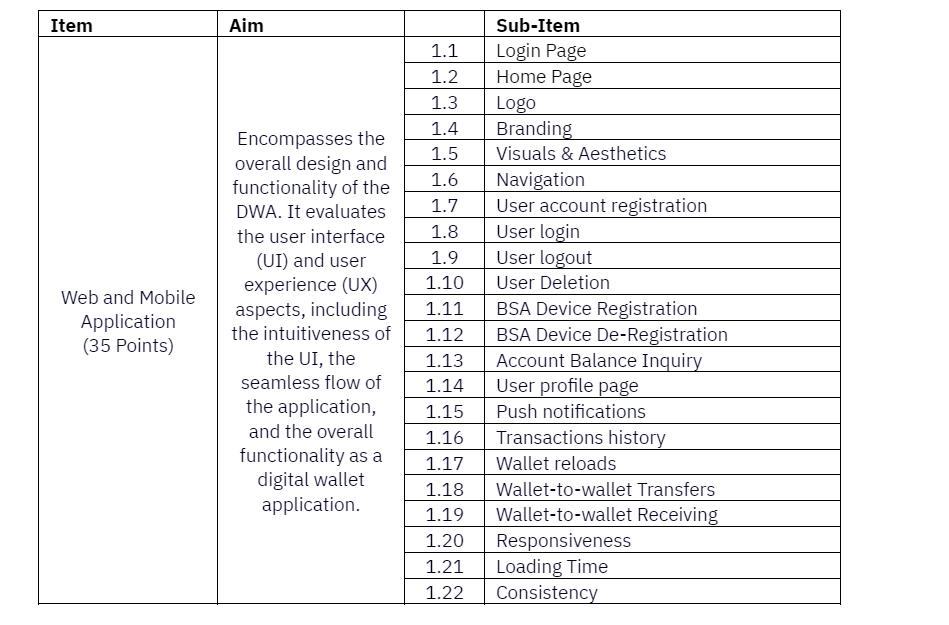
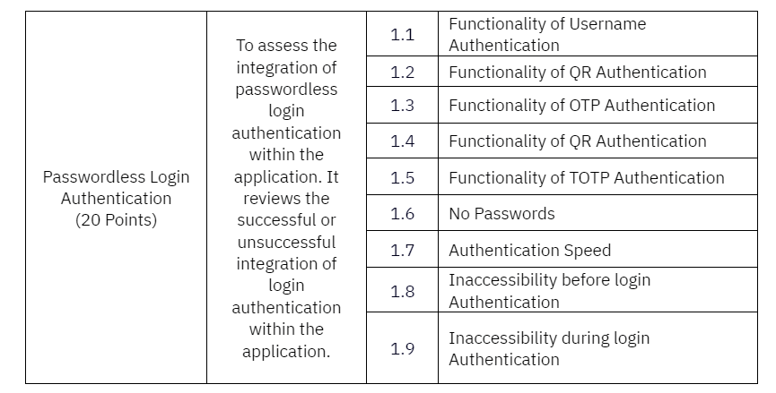
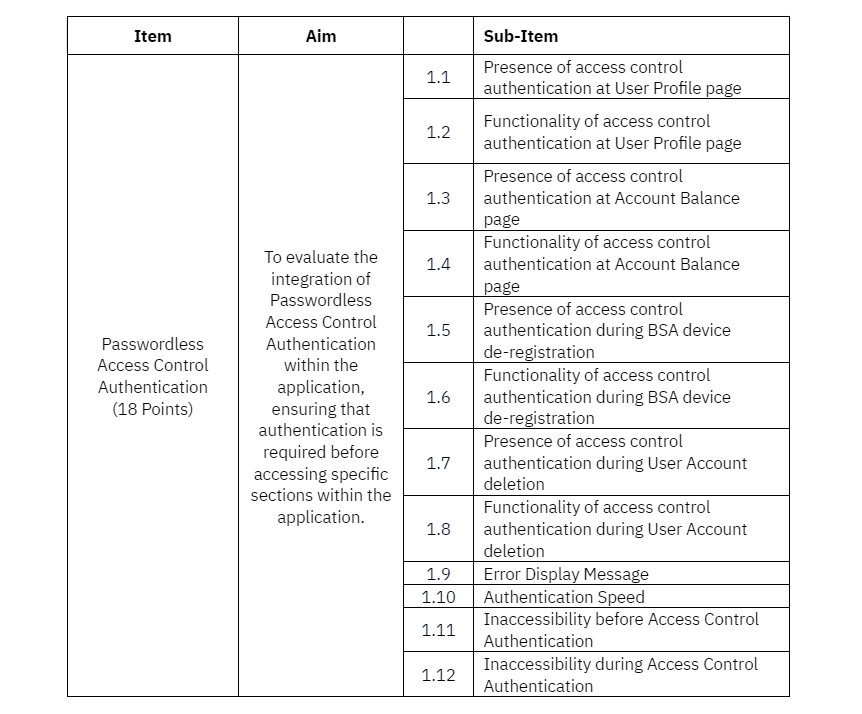

# ITU Digital Financial Services Blockchain Secure Authentication Application Challenge

## Can you build a passwordless authentication application?

Original on Zindi: https://zindi.africa/competitions/itu-digital-financial-services-blockchain-secure-authentication-application-challenge

In today's digital landscape, where safeguarding data is paramount, the reliance on passwords as the primary authentication method poses a significant challenge. Despite their widespread use, passwords often represent a weak point in cybersecurity, vulnerable to various attacks such as phishing, brute force, and credential stuffing. Many individuals opt for simplistic passwords, reuse them across different platforms, or neglect to update them regularly due to the complexity of managing multiple credentials. This behavior heightens the susceptibility of digital financial services (DFS) accounts and systems to unauthorized access and breaches. Hence, it is essential to explore, develop, and embrace innovative authentication technologies and strategies like multi-factor authentication (MFA), biometrics, and blockchain secure authentication (BSA) to fortify cybersecurity defenses, elevate user experience and trust in digital platforms, and address the global password dilemma.

The problem statement for the Challenge is as follows:

Bank A is embarking on a transformative journey in digital banking with the introduction of the Digital Wallet Application (DWA) to be developed. This initiative prioritizes strong authentication methods to enhance customer experience and ensure secure, seamless passwordless authentication using BSA across web and mobile platforms. The DWA will facilitate convenient access to customer profiles and digital wallet services. Bank A is dedicated to providing a secure and user-friendly digital onboarding process, enabling customers to access their accounts anytime, anywhere.

<b>Objective:</b>

To develop or submit an existing fully functional digital wallet application that is compatible with both web and mobile platforms, utilizing Passwordless BSA as the sole authentication method. Additionally, the same mobile application will serve as the application’s authenticator for Passwordless BSA.

<b>Key Digital Wallet Application Requirements:</b>

<b>Basic Functionalities:</b>

UI/UX (including but not limited to home page, splash screen, intuitiveness of the application flow, branding, functioning menus/buttons, overall visuals and aesthetics)
User account registration and account deletion
User account login and logout
Push notifications

<b>Digital Wallet features:</b>
Implement balance inquiry functionality allowing users to check their wallet balance.
Include a transaction history feature enabling users to view their past transactions.
Enable wallet-to-wallet transfers allowing users to send funds to other users' wallets.
Implement wallet reloading functionality enabling users to add funds to their wallets.

<b>Passwordless Blockchain Secure Authentication (BSA) Authentication</b>

1. Device Registration/Deregistration for BSA
2. Mobile application component to function as authenticator for BSA authentication.
3. Implement Passwordless BSA for 3 key components: 

<b>Login:</b> Users must authenticate using BSA to access the digital wallet application.
<b>Access Control:</b> Users must further authenticate to access restricted sections such as the user profile and Account Balances page.
<b>Payment Transactions:</b> BSA authentication is required before executing any 

Here is the outline of Digital Wallet Application (DWA)’s minimum expected functionalities, including but not limited to the list below:

Participants have the freedom to exercise creativity and incorporate additional features into the Digital Wallet Application, as long as they meet the minimum expected functionalities.

The following items will be provided to each participant:

1. BSA Web SDK and documentation
2. BSA Mobile SDK and documentation
3. BSA Documentation (APK Manuals, User Onboarding Manuals, Server Provision guidelines)
FNSPay Demo application and documentation (for reference)

#### Note for participants:

For mobile application development, participants shall develop on Android platforms only.
The BSA-integrated mobile application will serve as the application’s authenticator for Passwordless BSA.
For the web and mobile application, participants can choose to either develop or utilize their own existing DWA.
Participants without infrastructure for the development of the Digital Wallet Application may request for server provisioning after creating/joining a team.

### Tasks for Participants
The problem statement comprises of four tasks, all participants are expected to complete all tasks. The tasks are as follows:

#### Task 1: Develop or utilize their own existing DWA
#### Task 2: Integrate Passwordless Login Authentication for user login
#### Task 3: Integrate Passwordless Access Control Authentication for sections including but not limited to:

User profile page
Account balances page
Transactions history page
User account deletion
Device de-registration
#### Task 4: Integrate Passwordless Transactions Authentication into wallet reload and wallet-to-wallet transfers.

### Implementation Guidelines

### Task 1: Develop or utilize their own existing DWA

<b> Objective</b>

To develop or submit an existing a functional digital wallet application that is compatible with both web and mobile platforms.

<b>Criteria:</b>

Web/Mobile Application

Develop or utilize a web and mobile DWA that includes but not limited to the following functionalities:
Intuitive and seamless UI/UX
User account registration and deletion
User login and logout
BSA device registration and de-registration
Account balance inquiry
User profile page
Push notifications
Transactions history
Wallet reloads
Wallet-to-wallet transfers and receive
Display the participant’s organization logo and branding; if not applicable, use a placeholder logo/branding. Ensure the branding is consistent throughout the application.
Include guides or hints for first time users to help users navigate the application.
Establish a successful connection to the BSA-integrated mobile application through site linking (for the web component of the application).
Note: Participants who submit existing applications must ensure that the application includes the listed functions. While additional functions are acceptable, the application must not lack any of the required features (at least 10 features).

Task 2: Integrate Passwordless Login Authentication for user login
Objective

To achieve successful integration of passwordless BSA for the login process. Participants must build and develop the DWA in web and mobile platforms, where BSA passwordless authentication is the exclusive method for user login.

Criteria:

Passwordless Login Authentication

Include a login page with four methods of BSA authentication:
Username
QR Code
OTP
TOTP
Ensure all authentication methods are working as expected.
The application should not use any passwords.
The application's access must be restricted both prior to and during the authentication process, allowing access only upon successful completion of authentication.
Implement passwordless BSA integration for web component using Web Software Development Kit (SDK).
Implement passwordless BSA integration for mobile component using BSA SDK and Firebase Cloud Messaging (FCM)
Complete the authentication process in under 10 seconds.
Clearly display success and failure messages upon authentication
Task 3: Passwordless Authentication for Access Control
Objective

To successfully integrate passwordless BSA for access control within the application, and to implement BSA authentication as a mandatory requirement for accessing specific functions.

Criteria:

Access Control Authentication

Incorporate passwordless BSA authentication (via biometrics or passcode) for accessing the following functions, including but not limited to:
User profile page
Account balance inquiry
BSA device de-registration
User account deletion
Restrict access to the specific functions until the authentication process is successfully completed.
Upon successful authentication, enable access to the designated functions.
Complete the authentication process in under 20 seconds, including application processing time.
Clearly display success and failure messages upon authentication.
Note: Participants are permitted to integrate passwordless access control authentication into additional functions of the application; however, adherence to the above list of functions is mandatory.

Task 4: Passwordless Authentication for Payment Transactions
Objective

To successfully integrate passwordless BSA for payment transactions, the application is required to initiate an authentication process before executing any transactions.

Criteria:

Payment Transaction Authentication

Implement passwordless BSA authentication (biometrics or passcode) for the execution of payment transactions, such as:
Wallet reloads
Wallet-to-wallet transfers
Restrict the reloading or transferring of wallet credits until the authentication process is successfully completed.
Upon successful authentication, proceed with the complete execution of transactions.
Complete the authentication process in under 20 seconds, including application processing time.
Clearly display success and failure messages upon authentication.
Note: Participants are prohibited from utilizing real money or authentic payment gateways within the application. Instead, they are required to solely employ virtual numbers resembling currency for all transactions.

### Launch and Enrollment
To participate in this competition you need to enroll before 30 April 2024, 11:59 GMT.

To participate you need to ensure your [Zindi profile](https://zindi.africa/me) is up to date, please ensure your name, last name, country, workplace, organisation and education fields are correct. This information is vital to verify you.

The competition will start on <b>13 May 2024</b> and you can expect the following:

Participants will be expected to share an FCM JSON file*. Please join the Induction Bootcamps to learn more and ask questions.
Participants will also receive a client key by email after registration has been validated.
Participants will receive their client key up to 2 weeks after registration and team formation.

<b>*Attention Participants:</b> Please be aware that the Firebase Cloud Messaging (FCM) SDK creates a unique registration token for each client app instance. It is crucial that this token is included in your JSON submission and shared with ITU to facilitate integration with the BSA. See instructions on how to generate the key by downloading the FCM Setting Guide.pdf from the Data page.

There are 10 000 Zindi points available. You can read more about Zindi points here.

### Induction Bootcamps
Participants should attend online bootcamps, organised by ITU in collaboration with FNSV, to learn about using the BSA APIs and the development requirements. FNSV may provide baseline code/SDKs as a starting point for participants. The objectives of the bootcamps are to help participants advance smoothly and submit their solutions.

The bootcamps will guide participants on the following:

1. Challenge guidelines
2. BSA Technology brief
3. Sandbox environment for trial and testing.
4. BSA architecture
5. Pre evaluation requirements
6. Evaluation criteria
7. User access to Virtual Machine – Server Provisioning
8. Documentation on the Web APIs and Mobile SDK
9. Manual Guide BSA/FNSPay APP (for reference)
10. A discussion forum for peer and expert interaction

#### Bootcamp Schedule:

Session 1: May 13-14, 2024 (09:00-11:30 CEST) - [Watch the recording](https://itu.zoom.us/rec/share/DGPFJVIg0ybTUvjmaZnUuMOLg6t4wp5WkC2at7KMYWGSI1deVtMRaxgwtvKsiV4h.GM1RSoKCGhYLGsuv?startTime=1715583919000%20Passcode:%20Me=5LR&?).
Session 2: May 20-21, 2024 (14:30-17:00 CEST) - [Watch the recording](https://itu.zoom.us/rec/share/vkvzIJYnM9vHJJuaV6gjkbdSPEQNKfp17EES4NNZIQQ4YZPt98IdZCMn-h3oBoCd.-LuTGPEIKJ7fpyTX).
Q&A Session 1: June 24, 2024 (09:00-10:00 CEST) - [Watch the recording](https://itu.zoom.us/rec/share/-1WRhIKBXFLMny7v1r4wjuvW_EE2sYllpcjasjqxzJvC-0zL50nuwR1rR5vXApGe.vOpZc6NkPM6iIr_b).
Q&A Session 2: June 24, 2024 (14:30-15:30 CEST) - [Watch the recording](https://itu.zoom.us/rec/share/2EES7lmcQc2x9lMbwUA40ScHLdWmeZYfKmmwFJaTTKb47HxH9DKp-f2amEGG-ws.z06utj27tJ00xQ_N).

Submission requirements webinar - [Watch the recording](https://itu.zoom.us/rec/play/hhyyhegl_UuCwa8KZTzDwRDW87705ifffMEZS_aNhNtdqznm-b0NY_gH6-_LhYWOVBHszB0mFZ_zGduc.WsUSggnQZ2qQ-FTO?canPlayFromShare=true&from=share_recording_detail&continueMode=true&componentName=rec-play&originRequestUrl=https%3A%2F%2Fitu.zoom.us%2Frec%2Fshare%2FBXgjfPBUsr_FJuPW8Oyt34tph4Vw-mxxcYKjYWNEHOwy0lGtQPxJkIqyBHK2rAE.ZzrXYC6-SdRyLOhP).

We look forward to seeing you at the bootcamps and supporting your innovative solutions in the BSA Application Challenge.

Competition Phase
The competition will run from 13 May 2024 to 1 August 2024. Submissions must be submitted by 1 August 2024 at 23:59 GMT.

During this phase, participants will concentrate on developing the solutions outlined in the problem statement.

Upon completion, teams must submit their applications/solutions as per the problem statement requirements, along with the following additional materials:

The Digital Wallet Application mobile APK
The Digital Wallet Application web URL
Provide a comprehensive report in PDF format consisting of the following:
System Architecture
Process Flows
Application Manual or Guidelines
Test Scripts with results
Provide a 5-10 minute video demonstrating the application functionalities and authentication flow
Source Code to be submitted to a centralized GitHub repository.
ITU will also host a midterm bootcamp to gather feedback from teams and provide updates on their solutions to the problem statement.

Evaluation Phase
Your score on the leaderboard will be updated to 0.05 once we have received your FCM Token.

Your score on the leaderboard will be updated to 0.1 once we have received your final submission.

The final leaderboard will be revealed on 13 October.

Preliminary Evaluation
ITU conducts an initial review to verify that each submission is complete. FNSV to conduct preliminary evaluation to shortlist finalists for the final round. Preliminary evaluation will be assessed based on Sections A and B only.

Jury Evaluation
The Jury Panel will meet to evaluate the submissions based on the following criteria, categorized into three sections: Section A, Section B, and Section C. Section B is further segmented into four subsections, B1 to B4.

The maximum total points achievable in this Challenge is 130 points, distributed as follows:

Example: To calculate the final score, let's consider Participant A who received the following scores:

Section A: 25 points
Section B1: 15 points
Section B2: 12 points
Section B3: 10 points
Section B4: 20 points
Section C: 14 points

Participant A's final score is determined by adding up the individual scores as follows: 25 + 15 + 12 + 10 + 20 + 14 = 96 out of 130 points. This translates to a percentage of 73%. Below are the evaluation criteria, crafted to assess the effectiveness, user experience, and overall quality of the BSA integration.

This evaluation criteria are divided into sections: Section A, Section B, and Section C; Section B includes 4 subsections.

### Section A: Task 1 - Develop or utilize an existing DWA

Section B: BSA Integration

This section is divided into 4:

Section B1 – assesses the functionality of Passwordless Login Authentication in the application
Section B2 - assesses the functionality of Passwordless Access Control Authentication in the application
Section B3 - assesses the functionality of Passwordless Transactions Authentication in the application
Section B4 - assesses the integration aspect of the application

### Section B1: Task 2 - Integrate Passwordless Login Authentication for user login

### Section B2: Task 3 - Integrate Passwordless Access Control Authentication

The Jury Panel prepares a shortlist of the top 6 participants based on the above criteria.
Final Presentations:
The top 6 teams will be notified by ITU two weeks before the presentation to the Jury Panel.
Each team will need to prepare a PowerPoint presentation of 20 minutes duration to showcase their work to the Jury Panel.
Finalization of Rankings: The Jury Panel finalize the results of the Challenge after the final presentations.

### Showcase and Award
Solutions from the top three participants will be showcased during the World Telecommunications Standard Assembly (WTSA), and winners will be announced at the ITU Global Standards Symposium (GSS) on 14 October 2024.

1st prize: $5 000 USD

2nd prize: $3 000 USD

3rd prize: $2 000 USD

Certificates will also be issued for other participants that submitted a valid solution but did not rank among the top 3 teams.

### Timeline
Registration: 1st April - 30 April 2024.

Induction Bootcamps: Please view the Induction Bootcamps field. The dates will be updated there.

Competition: 13 May 2024 – 26 August 2024. Submissions must be submitted by 26 August 2024 at 23:59 GMT.

<b>Evaluation</b>

Preliminary evaluation: Second week of August
Jury Evaluation: September 2024
Showcase and Awards

Awards: 13 October 2024
Showcase: 14 – 24 October 2024

### Open Source, Code of Conduct and Benefits
### Open Source
The Challenge encourages the submission of open-source implementations, based on (ITU) standards. Open-source code will enable a broad range of stakeholders to access the outcomes of the Challenge and continue collaborating with relevant participants.

### Code of Conduct
All participants must adhere to the Code of Conduct To Prevent Harassment, Including Sexual Harassment, at UN System Events (available at https://www.un.org/management/sites/www.un.org.management/files/un-system-model-code-conduct.pdf).

### Benefits
- Realize your dreams: Receive expert support to implement use cases and technology ideas using software and access to platforms.
- Shape the future: Opportunity to define, provide inputs and shape the technologies related to DFS authentication.
- Create your network: Network with ITU experts and peers.
- Be practical: Platform to gain hands-on experience related to BSA authentication and concepts related to future networks

### Rules
The Challenge will be open to natural persons, groups of no more than 5 natural persons, and legal persons from all ITU Member States. Participants can form teams comprising 1 - 5 members.

The following persons shall not be eligible for participation in the Challenge:

1. ITU personnel;
2. members of family or household of ITU personnel;
3. individuals holding an offer for future employment with ITU;
4. individuals employed by or related to members of the Challenge Management Board;
5. individuals employed by or related to members of the Jury Panel;
6. FNSV personnel;
7. members of family or household of FNSV personnel; and
8. individuals holding an offer for future employment with FNSV.
ITU reserves the right to verify the eligibility of all participants.

By entering the Challenge, Participants consisting of groups (of no more than 5 natural persons) shall sign an undertaking confirming their agreement to designate and authorize one individual from among each group to accept the disbursement of a prize on its behalf in the event such a prize is awarded to that group.
By registering for participation in the Challenge, Participants accept the Participation Guidelines, including these terms and conditions.
ITU reserves the right to verify the eligibility of all Participants as well as the accuracy of their submitted information. ITU also reserves the right to disqualify Participants if it reasonably considers that the information they have provided and/or their Submissions do not comply with the terms, instructions and guidelines.
By entering the Challenge, Participants warrant that all information submitted by them is true, complete, and up-to-date and that they are authorized to participate on behalf of their institutions/organizations (as the case may be).
Participants acknowledge and agree that their participation in the Challenge is free of charge, but does not entail any right to compensation of any kind or to reimbursement of any expenses incurred.
ITU will not provide any equipment or technical/communication infrastructure necessary to participate in the Challenge.
The Challenge will be organized and administered by ITU.
Participants’ submissions must be provided in English.
Participants’ submissions must not: (a) violate the intellectual property rights of third parties; (b) be illegal under applicable national laws and international law; and (c) depict or incite hatred, defame, abuse, harass, stalk, threaten a specific person or social group, incite violence or conflict or otherwise violate the legal rights of third parties (including those of privacy and publicity).
Participants’ submissions must be original unpublished works that are not currently under review by under another challenge/competition or journal and must be solely owned by participants. Participants may only take credit for their own original work. Where required, Participants shall add citations and give credits to others. Plagiarism will result in immediate disqualification from the Challenge.
ITU shall not be responsible for any lost, late, corrupted, mutilated or misdirected Submissions, or Submissions not received within the established deadlines.
All participants will retain the intellectual property rights on the contents of their submissions. However, by entering the Challenge, each participant grants ITU a limited, non-exclusive, global, royalty-free right and license to use, reproduce, communicate, demonstrate, make available for public, display and distribute the content of the submissions for ITU’s marketing, promotional, informational and educational or awareness purposes, via printed, digital or online media, including ITU’s website. Participants shall represent that they have the legal right to grant such license to ITU. Participants also permit ITU to use their names, likeness, video(s) and/or photograph(s) in connection with the Challenge, in any media, worldwide, at no remuneration. Participants understand and agree that the Organizers may also create content based on their updates, such as success stories, blog posts, photos or social media postings which may be published on ITU’s websites, the Challenge website, as well as other communication channels and made available to the public, at ITU’s discretion.
Participants may not use the ITU’s name, emblems or the logos of any its events in any online or offline communication, without its prior written permission.
In addition to the terms of the general privacy notice of ITU’s website, the following terms shall apply with respect to the collection and processing of Participants’ personal information by ITU and its subcontractors for the Challenge:
Participants hereby provide their consent for the processing and storage by ITU of all contact information submitted by them to ITU (hereinafter, the “Participant Data”), for the purpose of managing their participation requests and enabling and facilitating their participation in the Challenge. Participants acknowledge that, to the extent that it is necessary, ITU may pass such Participant Data to third parties who assist ITU in the organization and management of the Challenge or provide Challenge-related services on behalf of ITU. Prior to sharing Participant Data with third parties, ITU will satisfy itself that such third parties afford appropriate protection with respect to the processing of personal information.
In the event the Challenge is hosted on a third-party platform, access and/or use of the respective platform may be subject to additional terms and conditions as set out by that third party, including such third party’s privacy policy. Participants are encouraged to review these terms and conditions prior to deciding to participate in the Challenge.
ITU may also use the Participant Data to provide Participants with additional information in relation to other upcoming ITU events which ITU reasonably believes could be of interest to Participants, and to carry out surveys in relation to ITU events. Each participant may choose not to receive information related to ITU events by unsubscribing from such communications, using the “unsubscribe” link.
By entering the Challenge, Participants agree to release and hold ITU harmless from and against any and all claims, expenses, and liability, including but not limited to negligence and damages of any kind to persons and property, infringement of trademark, copyright or other intellectual property rights arising out of or relating to their participation in the Challenge and the contents of their submissions.
You acknowledge and agree that the Organizers are entitled to modify the content of the Challenge website and/or the present terms and conditions and to abbreviate, modify, suspend, cancel or terminate the Challenge (partially or in its entirety) without any obligation (present or future).
ITU reserves the right to make all final decisions regarding the Challenge.
Nothing herein shall be considered to be a limitation or a waiver of the privileges and immunities of ITU, which are specifically reserved.

#### Teams and collaboration

You may participate in competitions as an individual or in a team of up to five people. When creating a team, the team must have a total submission count less than or equal to the maximum allowable submissions as of the formation date. A team will be allowed the maximum number of submissions for the competition, minus the total number of submissions among team members at team formation. Prizes are transferred only to the individual players or to the team leader.

Multiple accounts per user are not permitted, and neither is collaboration or membership across multiple teams. Individuals and their submissions originating from multiple accounts will be immediately disqualified from the platform.

Code must not be shared privately outside of a team. Any code that is shared, must be made available to all competition participants through the platform. (i.e. on the discussion boards).

The Zindi data scientist who sets up a team is the default Team Leader but they can transfer leadership to another data scientist on the team. The Team Leader can invite other data scientists to their team. Invited data scientists can accept or reject invitations. Until a second data scientist accepts an invitation to join a team, the data scientist who initiated a team remains an individual on the leaderboard. No additional members may be added to teams within the final 5 days of the competition or last hour of a hackathon.

The team leader can initiate a merge with another team. Only the team leader of the second team can accept the invite. The default team leader is the leader from the team who initiated the invite. Teams can only merge if the total number of members is less than or equal to the maximum team size of the competition.

A team can be disbanded if it has not yet made a submission. Once a submission is made individual members cannot leave the team.

All members in the team receive points associated with their ranking in the competition and there is no split or division of the points between team members.

#### Overarching rules

You acknowledge and agree that Zindi may, without any obligation to do so, remove or disqualify an individual, team, or account if Zindi believes that such individual, team, or account is in violation of these rules. Entry into this competition constitutes your acceptance of these official competition rules.

Zindi is committed to providing solutions of value to our clients and partners. To this end, we reserve the right to disqualify your submission on the grounds of usability or value. This includes but is not limited to the use of data leaks or any other practices that we deem to compromise the inherent value of your solution.

Zindi also reserves the right to disqualify you and/or your submissions from any competition if we believe that you violated the rules or violated the spirit of the competition or the platform in any other way. The disqualifications are irrespective of your position on the leaderboard and completely at the discretion of Zindi.

Please refer to the FAQs and Terms of Use for additional rules that may apply to this competition. We reserve the right to update these rules at any time.

#### Consequences of breaking any rules of the competition or submission guidelines:

- First offence: No prizes for 6 months and 2000 points will be removed from your profile (probation period). If you are caught cheating, all individuals involved in cheating will be disqualified from the challenge(s) you were caught in and you will be disqualified from winning any competitions for the next six months and 2000 points will be removed from your profile. If you have less than 2000 points to your profile your points will be set to 0.

- Second offence: Banned from the platform. If you are caught for a second time your Zindi account will be disabled and you will be disqualified from winning any competitions or Zindi points using any other account.

- Teams with individuals who are caught cheating will not be eligible to win prizes or points in the competition in which the cheating occurred, regardless of the individuals’ knowledge of or participation in the offence.

- Teams with individuals who have previously committed an offence will not be eligible for any prizes for any competitions during the 6-month probation period.

### Monitoring of submissions

We reserve the right to request code from any user at any time during a challenge. You will have 24 hours to submit your code following the rules for code review (see above). Zindi reserves the right not to explain our reasons for requesting code. If you do not submit your code within 24 hours you will be disqualified from winning any competitions or Zindi points for the next six months. If you fall under suspicion again and your code is requested and you fail to submit your code within 24 hours, your Zindi account will be disabled and you will be disqualified from winning any competitions or Zindi points with any other account.