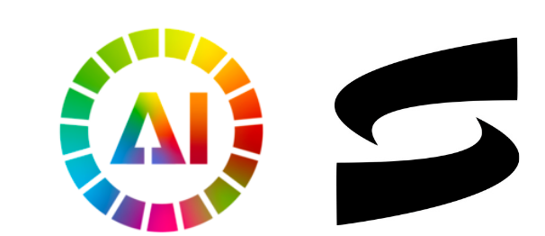

# Your Voice, Your Device, Your Language Challenge

## Can you build a Swahili ASR solution to give a voice to 100 million people?

Voice and language technologies are transforming how people access essential digital services—from healthcare and government support to education and beyond. But for the more than 200 million Kiswahili speakers across East and Central Africa, this revolution is still out of reach.

Two major barriers stand in the way: a lack of large-scale, high-quality annotated Kiswahili datasets, and limited access to the computational resources required to train or deploy modern AI models. While ongoing initiatives have made progress on the data front, the real bottleneck now is infrastructure.

Most cutting-edge speech-to-text (STT) systems rely heavily on cloud services, large GPUs, and high-bandwidth internet—none of which can be guaranteed in many Kiswahili-speaking communities. Beyond technical barriers, this dependence also introduces serious privacy risks. Sensitive voice data—relating to health, finances, or legal matters—must travel across networks and sit on third-party servers, increasing the risk of misuse or unintended exposure.

What’s needed instead are robust, on-device STT models that are fast, secure, and fully offline. That’s where you come in.

In this challenge, your task is to build a Kiswahili automatic speech recognition (ASR) model that works under real-world, conversational conditions—without the cloud. Your solution should be lightweight, efficient, and optimized for real-time inference on edge devices. You may fine-tune an existing open-source model or build one from scratch using any open dataset of your choice. As a bonus, you’re invited to extend your pipeline by generating fluent English text replies using the [pawa-min-alpha](https://huggingface.co/sartifyllc/pawa-min-alpha) language model.

Your Kiswahili STT system has the potential to unlock offline voice-based interfaces, protect user privacy, and expand access to digital services—empowering communities too often left behind by mainstream AI.

#### About AI for Good - International Telecommunication Union (ITU)

AI for Good is organized by ITU in partnership with 40 UN Sister Agencies. The goal of AI for Good is to identify practical applications of AI to advance the United Nations Sustainable Development Goals and scale those solutions for global impact. It’s the leading action-oriented, global & inclusive United Nations platform on AI.

<b>[About Sartify](https://www.sartify.com/)</b>

Sartify is an African‑led AI company focused on inclusive language technologies for low‑resource communities. Our portfolio spans core engines—PAWA‑AI, and the Kinong’ono ASR model—and end‑user applications such as DOCIPRO and TUTOR‑AI. Driven by the motto “AI by Africa, for Africa,” Sartify is committed to developing and scaling homegrown AI solutions across all African countries.

### Evaluation
This challenge will be evaluated in two phases - initial leaderboard position will be determined by error metric, and final winners will be decided based on a performance based on error metric score, real time factor of their code, resource efficiency and documentation of the top ten private scores, based on the evaluation rubric below.

The top ten participants in Phase One will be asked to submit their full model and supporting documentation for evaluation in Phase Two. If you are in the top 10 on the final leaderboard, read this article on how to prepare your documentation and this article on how to ensure a successful code review.

<b>Phase one: Error Metric</b>

The evaluation metric for this challenge is the Word Error Rate.

For every row in the dataset, submission files should contain 2 columns: filename and text.

Your submission file should look like this:

| filename                                   | text               |
|--------------------------------------------|--------------------|
| 451f6d89-9b85-46c3-ad8d-bfcb1c9a4e8f.wav     | mwanadamu Biblia   |
| 507e10f8-0b2b-4bc0-9b69-94f96d907fb6.wav     | upana baina        |

<b>Phase Two: Performance Evaluation</b> The final top 10 solutions will be evaluated based on performance, real-time factor, resource efficieny, and documentation, according to the following rubric:

- Performance (85%): Phase One score
- Real-Time Factor (RTFx) on a single NVIDIA T4 ( 5%): Clip length Mean wall-clock decoding time.
- Resource efficiency (5%): Peak GPU memory (MiB) during end-to-end inference. Measured with nvidia-smi; submissions exceeding the 16 GB limit are removed from top 10 on the private leaderboard, prior to evaluation.
- Documentation & reproducibility (5%): Technical report (≤ 4 pages) clarity, ablation results, code hygiene. Blind reviewers score 1–10, converted linearly to % points.

### Resource Restrictions
To reflect the realities of deploying AI in low-resource environments, your solution must run on a single NVIDIA T4 GPU with ≤16 GB RAM, such as what’s available through Google Colab’s free tier. Submissions exceeding the 16 GB limit are removed from top 10 on the private leaderboard, prior to evaluation.

Bonus points if your complete pipeline—including speech recognition and text generation—can run within 4 GB of memory, making it deployable on mobile devices or single-board computers without internet connectivity.

### Prizes
🥇 1st Place: [@Abdourahamane_](https://zindi.africa/users/Abdourahamane_)

🥈 2nd Place: [Team LAST_HOPE](https://zindi.africa/competitions/your-voice-your-device-your-language-challenge/leaderboard/teams/last_hope)

🥉 3rd Place: @keystats

1st place: 500 CHF

2nd place: 300 CHF

3rd place: 200 CHF

There are 5 000 Zindi points available. You can read more about Zindi points here.

### Extension work
You are encouraged to take this work further.

Turn your Speech-to-Text solution into a Text to Speech solution and share your achievements in the chat.

Building a Text-to-Speech (TTS) system: Swahili TTS Dataset
Creating a full voice assistant prototype or demo
Exploring applications in healthcare, education, or other real-world scenarios

### Rules

- Languages and tools: You may only use open-source languages and tools in building models for this challenge.
- Who can compete: Open to all, except for those who contributed to the creation of the challenge.
- Submission Limits: 10 submissions per day, 300 submissions overall.
- Team size: Max team size of 4
- Public-Private Split: Zindi maintains a public leaderboard and a private leaderboard for each challenge. The Public Leaderboard includes approximately 30% of the test dataset. The private leaderboard will be revealed at the close of the challenge and contains the remaining 70% of the test set.
- Data Sharing: CC-BY SA 4.0 license
- Code Review: Top 10 on the private leaderboard will receive an email requesting their code at the close of the challenge. You will have 48 hours to submit your code.
Code sharing: Multiple accounts, or sharing of code and information across accounts not in teams, is not allowed and will lead to disqualification.
- Solutions of value: Solutions handed over to clients must be of value to the client, regardless of leaderboard ranking.

ENTRY INTO THIS CHALLENGE CONSTITUTES YOUR ACCEPTANCE OF THESE OFFICIAL CHALLENGE RULES.

### Full Challenge Rules
This challenge is open to all, except for those who contributed to the creation of the challenge.

#### Teams and collaboration

You may participate in challenges as an individual or in a team of up to four people. When creating a team, the team must have a total submission count less than or equal to the maximum allowable submissions as of the formation date. A team will be allowed the maximum number of submissions for the challenge, minus the total number of submissions among team members at team formation. Prizes are transferred only to the individual players or to the team leader.

Multiple accounts per user are not permitted, and neither is collaboration or membership across multiple teams. Individuals and their submissions originating from multiple accounts will be immediately disqualified from the platform.

Code must not be shared privately outside of a team. Any code that is shared, must be made available to all challenge participants through the platform. (i.e. on the discussion boards).

The Zindi data scientist who sets up a team is the default Team Leader but they can transfer leadership to another data scientist on the team. The Team Leader can invite other data scientists to their team. Invited data scientists can accept or reject invitations. Until a second data scientist accepts an invitation to join a team, the data scientist who initiated a team remains an individual on the leaderboard. No additional members may be added to teams within the final 5 days of the challenge or last hour of a hackathon.

The team leader can initiate a merge with another team. Only the team leader of the second team can accept the invite. The default team leader is the leader from the team who initiated the invite. Teams can only merge if the total number of members is less than or equal to the maximum team size of the challenge.

A team can be disbanded if it has not yet made a submission. Once a submission is made individual members cannot leave the team.

All members in the team receive points associated with their ranking in the challenge and there is no split or division of the points between team members.

#### Datasets, packages and general principles

The solution must use publicly-available, open-source packages only.

You may use only the datasets provided for this challenge.

You may use pretrained models as long as they are openly available to everyone.

Automated machine learning tools such as automl are not permitted.

If the error metric requires probabilities to be submitted, do not set thresholds (or round your probabilities) to improve your place on the leaderboard. In order to ensure that the client receives the best solution Zindi will need the raw probabilities. This will allow the clients to set thresholds to their own needs.

You are allowed to access, use and share challenge data for any commercial, non-commercial, research or education purposes, under a CC-BY SA 4.0 license.

You must notify Zindi immediately upon learning of any unauthorised transmission of or unauthorised access to the challenge data, and work with Zindi to rectify any unauthorised transmission or access.

Your solution must not infringe the rights of any third party and you must be legally entitled to assign ownership of all rights of copyright in and to the winning solution code to Zindi.

#### Submissions and winning

You may make a maximum of 10 submissions per day.

You may make a maximum of 300 submissions for this challenge.

Before the end of the challenge you need to choose 2 submissions to be judged on for the private leaderboard. If you do not make a selection your 2 best public leaderboard submissions will be used to score on the private leaderboard.

During the challenge, your best public score will be displayed regardless of the submissions you have selected. When the challenge closes your best private score out of the 2 selected submissions will be displayed.

Zindi maintains a public leaderboard and a private leaderboard for each challenge. The Public Leaderboard includes approximately 30% of the test dataset. While the challenge is open, the Public Leaderboard will rank the submitted solutions by the accuracy score they achieve. Upon close of the challenge, the Private Leaderboard, which covers the other 70% of the test dataset, will be made public and will constitute the final ranking for the challenge.

Note that to count, your submission must first pass processing. If your submission fails during the processing step, it will not be counted and not receive a score; nor will it count against your daily submission limit. If you encounter problems with your submission file, your best course of action is to ask for advice on the challenge page.

If you are in the top 10 at the time the leaderboard closes, we will email you to request your code. On receipt of email, you will have 48 hours to respond and submit your code following the Reproducibility of submitted code guidelines detailed below. Failure to respond will result in disqualification.

If your solution places 1st, 2nd, or 3rd on the final leaderboard, you will be required to submit your winning solution code to us for verification, and you thereby agree to assign all worldwide rights of copyright in and to such winning solution to Zindi.

If two solutions earn identical scores on the leaderboard, the tiebreaker will be the date and time in which the submission was made (the earlier solution will win).

The winners will be paid via bank transfer, PayPal if payment is less than or equivalent to $100, or other international money transfer platform. International transfer fees will be deducted from the total prize amount, unless the prize money is under $500, in which case the international transfer fees will be covered by Zindi. In all cases, the winners are responsible for any other fees applied by their own bank or other institution for receiving the prize money. All taxes imposed on prizes are the sole responsibility of the winners. The top winners or team leaders will be required to present Zindi with proof of identification, proof of residence and a letter from your bank confirming your banking details. Winners will be paid in USD or the currency of the challenge. If your account cannot receive US Dollars or the currency of the challenge then your bank will need to provide proof of this and Zindi will try to accommodate this.

Please note that due to the ongoing Russia-Ukraine conflict, we are not currently able to make prize payments to winners located in Russia. We apologise for any inconvenience that may cause, and will handle any issues that arise on a case-by-case basis.

Payment will be made after code review and sealing the leaderboard.

You acknowledge and agree that Zindi may, without any obligation to do so, remove or disqualify an individual, team, or account if Zindi believes that such individual, team, or account is in violation of these rules. Entry into this challenge constitutes your acceptance of these official challenge rules.

Zindi is committed to providing solutions of value to our clients and partners. To this end, we reserve the right to disqualify your submission on the grounds of usability or value. This includes but is not limited to the use of data leaks or any other practices that we deem to compromise the inherent value of your solution.

Zindi also reserves the right to disqualify you and/or your submissions from any challenge if we believe that you violated the rules or violated the spirit of the challenge or the platform in any other way. The disqualifications are irrespective of your position on the leaderboard and completely at the discretion of Zindi.

Please refer to the FAQs and Terms of Use for additional rules that may apply to this challenge. We reserve the right to update these rules at any time.

#### Reproducibility of submitted code

If your submitted code does not reproduce your score on the leaderboard, we reserve the right to adjust your rank to the score generated by the code you submitted.

If your code does not run you will be dropped from the top 10. Please make sure your code runs before submitting your solution.

Always set the seed. Rerunning your model should always place you at the same position on the leaderboard. When running your solution, if randomness shifts you down the leaderboard we reserve the right to adjust your rank to the closest score that your submission reproduces.

Custom packages in your submission will not be accepted.

All data manipulation must be done in code, manual manipulation via manual labelling or Excel will lead to disqualification.

You may only use tools available to everyone i.e. no paid services or free trials that require a credit card.

Read this [article](https://zindi.africa/learn/documentation-guideline) on how to prepare your documentation and this article on how to ensure a successful code review.

#### Consequences of breaking any rules of the challenge or submission guidelines:

First offence: No prizes for 6 months and 2000 points will be removed from your profile (probation period). If you are caught cheating, all individuals involved in cheating will be disqualified from the challenge(s) you were caught in and you will be disqualified from winning any challenges for the next six months and 2000 points will be removed from your profile. If you have less than 2000 points to your profile your points will be set to 0.
Second offence: Banned from the platform. If you are caught for a second time your Zindi account will be disabled and you will be disqualified from winning any challenges or Zindi points using any other account.
Teams with individuals who are caught cheating will not be eligible to win prizes or points in the challenge in which the cheating occurred, regardless of the individuals’ knowledge of or participation in the offence.

Teams with individuals who have previously committed an offence will not be eligible for any prizes for any challenges during the 6-month probation period.

#### Monitoring of submissions

We will review the top 10 solutions of every challenge when the challenge ends.
We reserve the right to request code from any user at any time during a challenge. You will have 24 hours to submit your code following the rules for code review (see above). Zindi reserves the right not to explain our reasons for requesting code. If you do not submit your code within 24 hours you will be disqualified from winning any challenges or Zindi points for the next six months. If you fall under suspicion again and your code is requested and you fail to submit your code within 24 hours, your Zindi account will be disabled and you will be disqualified from winning any challenges or Zindi points with any other account.